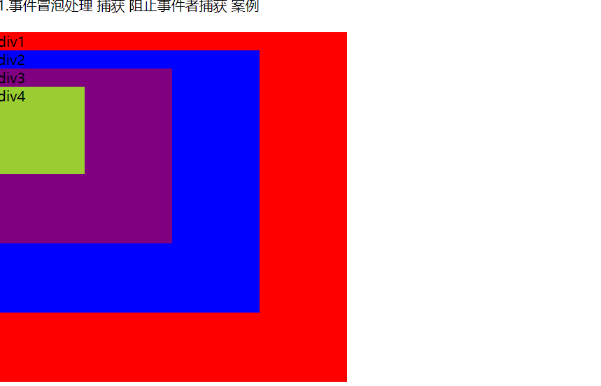

# 一. JavaScript

## 1. 基础部分

### 1. var let const

**1. 不写修饰符的 b 在window上, 在全局声明的a也在window上**

```js
 var a = 123;;
 const fn = () => {
 console.info('箭头函数',this)      '' window
}
function hdms() {
   b = 456;
   var a = 456;
   console.info('普通函数',this);	'' window
  }
 fn();
 hdms();
 console.info(this === window);    '' true
```

**2. 预解析**

```js
  var web = 'beidaqingniao.com'
  console.log(web);        '' 并不是输出web之后再报错 关键字Class  js会进行预解析  直接报错
  var class='hdcms';    
```

**3. 变量提升**

```js
  console.info(web);        	'' undefined
  var web='hdms.com';
```

**4. let const 简单使用**

```js
 console.info(web,hdms);        '' Uncaught ReferenceError: Cannot access 'web' before initialization
 let web='hdms.com'
 const hdms='hdms.com'
```

**5. 暂存性死区**

```js
 let web = 'hdms.com';     
   function func() {
     console.log(web);		    '' Uncaught ReferenceError: Cannot access 'web' before initialization
     let web = 'hdms.com'
   }
 func();
```

**6. 可怕的全局污染**

```js
  web = 5  不声明直接使用
```

**7. var的弊端**

```js
 var i = 99;
 for (var i = 0; i < 5; i++) {
   console.log(i);     '' 0 1 2 3 4
 }
 console.log(i);       '' 5
```

**8. 块级作用域**

```js
let i = 99;
for (let i = 0; i < 5; i++) {
	console.log(i);     '' 0 1 2 3 4
}
console.log(i);         '' 99
```

**9. 块级作用域2**

```js
{
	let web='hdms.com';
}
console.log(web);      '' 访问不到
```

**10 .const 一探究竟    作用域问题可以 可以重复声明**

```js
const url = 'https://houdunren.com';
function show() {
	const url = 'https://houdunre.com'
}
show();
```

**11. 总结 let const var**

```js
1. var
	1.变量提升 
    2.可以重复声明 
    3.在全局声明的变量属于window(非常可怕)
2. let/const 
	1.同一作用域不能重复声明  
    2.都具有块级作用域  
    3.都具有暂存性死区  
    4.不能先使用在声明
3. const   
	1.引用类型的地址改变那么报错 
    2.基本类型不能更改
```

### 2. null和undefined

```js
let web;
console.log(web);         		'' undefined
console.log(typeof null);     	'' object
console.log(typeof undefined);  '' undefined

function show(name){
	console.log(name);      没有传参为 undefined
}
console.log(show());        没有返回值为 undefined

null===undefined  // false
null==undefined   // true
```

### 3. this指向

**this的指向在函数定义的时候是确定不了的，只有函数执行的时候才能确定，this最终指向调用它的对象。**

#### 1. 函数调用模式

```js
   
    当一个函数并非一个对象的属性时，那么它就是被当做函数来调用的。在此种模式下，
    this被绑定为全局对象，在浏览器环境下就是window对象

    function a(){
        var a = 'hello';
        console.log(this.hello);        // undefined
        console.log(this);              // window
    }
    a();
```

#### 2. 方法模式调用

```js
 	当函数被保存为一个对象的属性时，它就可称为这个对象的方法。当一个方法被调用时，this被绑定到这个对象上。
 	如果调用表达式包含一个提取属性的动作（. 或 []），那么它被称为方法调用

    let o = {
        name:'hello',
        sayName(){
            console.log(this,this.name);     // {name: 'hello', sayName: ƒ}     hello
        }
    }
    o.sayName();
    这里的this指向的对象是o，因为调用这个sayName()函数是通过o.sayName()执行的。
  
  
  
  
    let o={
            name:'hello',
            b:{
                name:"world", 
                sayName:function(){
                console.log(this,this.name);     //{name: 'world', sayName: ƒ}     world
            }
            }

        }
       o.b.sayName();
       因为是o.b调用的这个函数，所以指向b这个对象
     
     
     
     
    let o = {
        name: 'hello',
        b: {
            sayName: function () {
                console.log(this, this.name);     //{ sayName: ƒ}     undefined
            }
        }
    }
    o.b.sayName();
    同理，因为是o.b调用的这个函数，所以指向b这个对象
  
  
  
  
    let name='外层name'
    let o = {
        name: 'hello',
        b: {
            name:'world',
            sayName() {
                console.log(this, this.name);     //window    ''
            }
        }
    }
    var t = o.b.sayName;
    t();
    t是全局变量，在全局环境下执行，this指向window   因为是let修饰的name不属于window 所以是''
```

#### 3. 构造函数模式

```js
 	如果在一个函数前面加上new关键字来调用，那么就会创建一个连接到该函数的prototype成员的新对象，
    同时，this会被绑定到这个新对象上。这种情况下，这个函数就可以成为此对象的构造函数。

    function Fn() {
        console.log(this);          // Fn {}
    }
    new Fn;                         // 带不带括号都是一样的 目前


    function Fn() {
        this.name = 'hello'
    }
    let a = new Fn();
    console.log(a.name);             // hello

    当用new关键字，返回的是一个对象，this指向的就是那个返回的对象；
  
  
     // 如果返回的不是对象，this还是指向函数的实例，虽然null属于对象，但是返回null依然指向函数实例
     // 返回空对象 undefined
     function Fn() {
        this.name = 'hello'
        return {}
    }
    let a = new Fn;
    console.log(a.name);                   // undefined


	// 返回函数 无返回值  
    function Fn() {
        this.name = 'hello'
        return function () {

        }
    }
    var a = new Fn;
    console.log(a, a.name);                    //ƒ(){}   ''


	 // 返回基本类型
     function Fn() {
        this.name = 'hello'
        return 1
     }
    var a = new Fn;
    console.log(a,a.name);                    // {name: 'hello'}    'hello'


    // 返回undefined
    function Fn() {
        this.name = 'hello'
        return undefined
    }
    var a = new Fn;
    console.log(a, a.name);                    // {name: 'hello'}    'hello'


    // 返回数组 
    function Fn() {
        this.name = 'hello'
        return []
    }
    var a = new Fn;
    console.log(a, a.name);                      // [] undefined


    // 返回null 
    function Fn() {
        this.name = 'hello'
        return null
    }
    var a = new Fn;
    console.log(a, a.name);                      //  {name: 'hello'} 'hello'
```

#### 4. apply和call调用模式

```js
	JS中，函数也是对象，所有函数对象都有两个方法：apply 和 call，
    这两个方法可以让我们构建一个参数数组传递给调用函数，也允许我们改变this的值

    var name='winName'
    let o={
        name:'obj'
    }
    function sayName(){
       console.log(this.name);
    }

    sayName();          //winName
    sayName.call();     //winName
    sayName.apply();    //winName
    sayName.call(o);    //obj
    sayName.apply(o);    //obj
    sayName.bind(o)()   //obj


	// 结合前面的列子 一个汇总
    在全局范围内， this指向全局对象（浏览器下指window对象）
    对象函数调用时，this指向当前对象
    全局函数调用时，应该是指向调用全局函数的对象。
    使用new关键字实例化对象时，this指向新创建的对象
    当用apply和call上下文调用的时候指向传入的第一个参数


    var name = 'window';
    function showName() {
        console.log(this.name);
    }

    var person1 = {
        name: "hello",
        sayName: showName
    }

    var person2 = {
        name: 'world',
        sayName: function () {
           return person1.sayName;
          

        }
    }

    person1.sayName();                  //hello
    person2.sayName();                  //window

    在执行person1.sayName()时，方法调用模式，this代表person1这个对象
    在执行person2.sayName()时，方法调用，但是sayName，并没有执行
  


    var color='green';
    var test={
        color:'blue',
        getColor:function(){
            var color='red';
            console.log(this.color);
        }
    }
    var getColor = test.getColor;
    getColor();             //green
    test.getColor();        //blue


  
    var A = { n: 4399 };
    var B = function () {
        this.n = 9999
    }
    var C = function () {
        var n = 8888
    }

    B.prototype = A;
    C.prototype = A;

    var b = new B();
    var c = new C();

    A.n++;
    console.log(b.n);       //9999
    console.log(c.n);       //4400


    执行console.log(b.n)时，b对象有自己的属性n值
    执行console.log(c.n)时，c对象没有自己的属性n值，会向原型上查找，找的A对象中的属性n值
```

### 5. call apply bind

```js
    Function.prototype.call()
    Function.prototype.apply()
    Function.prototype.bind()		这个不确定
  
    // call
    let o = { name: '张三' }
    function f(...args) {
        console.log(this.name, ...args);        // 张三 1 2 3
    }
    f.call(o, 1, 2, 3);
 


    // apply
    let o = { name: '张三' }
    function f(...args) {
        console.log(this.name, args);           // 张三 [1, 2, 3]
    }
    f.apply(o, [1, 2, 3]);


    // 案例
    let max = Math.max.apply(Math,[1,3,2])
    console.log(max);               // 3  求最大值


    // bind 方法           详情参考: 犀牛书195
    function f(y, z) {
        return this.x + y + z
    }
    let g = f.bind({ x: 1 }, 2, 3)
    console.log(g());                 // 6


   
    const f = (x, y, z) => x + y + z;
    const g = f.bind(null)(1,2,3)
    console.log(g);
```

#### 1. 如何实现一个call

```js
 // 2. 实现一个call 函数

    Function.prototype.myCall = function (context, ...args) {
        if (context === undefined || context === null) {
            context = window
        }
        context.fn = this;
      
        let result = context.fn(...args)
        // 删除fn
        delete context.fn
        return result;
    }

    let obj = {
        a: 123
    }

    function f(...rest) {
        console.log(this.a, ...rest)
    }


    f.myCall(obj, 1, 2)   // 123 1 2
```

#### 2. 如何实现一个apply

```js
 Function.prototype.myApply = function (context, args) {
        if (context === undefined || context === null) {
            context = window
        }
        context.fn = this;
        // 需要判断是否存储第二个参数
        // 如果存在,就将第二个参数展开

        const result = context.fn(...args)

        delete context.fn
        return result

    }

    let obj = {
        a: 123
    }

    function f(...rest) {
        console.log(this.a, ...rest)
    }


    f.myApply(obj, [1, 2])   // 123 1 2
```

#### 3. 如何实现一个bind

```js
  Function.prototype.myBind = function (context, ...args) {
        if (context === undefined || context === null) {
            context = window
        }
        if (typeof this !== 'function') {
            throw new TypeError('Error')
        }

        let f = this
        // 返回一个函数
        return (...rest) => f.apply(context, [...args, ...rest])
    }
    let obj = {
        a: 123
    }

    function f(...rest) {
        console.log(this.a, ...rest)
    }

    f.myBind(obj, 1, 2)(3, 4);   // 123 1 2 3 4

```

### 6.Class

```js
class Person {
        constructor(name, age) {
            // 构造器中的this 实例对象
            this.name = name;
            this.age = age;
        }
        speak() {
            // speak 在Person的原型对象身上
            console.log("我的名字叫做" + this.name + "我的年龄是" + this.age)
        }
    }

// student继承Person
    class student extends Person {
        constructor(name, age, hoby) {
            super(name, age)        // 显示调用父类构造器
            this.hoby = hoby;
        }
        speak() {
            console.log("我的名字叫做" + this.name + "我的年龄是" + this.age + "我的爱好是" + this.hoby)

        }
    }
    let stu = new student("张学友", 18, '唱歌');

    // 总结:
    // 1. 类中的构造器不是必须写的,如果要做一些初始化的操作 是要写的
    // 2. 类中的方法都是放在原型上的
```

### 7. JS 中 valueOf() 方法的详解

1. JavaScript 中的 valueOf() 方法用于返回指定对象的原始值，若对象没有原始值，则将返回对象本身。通常由JavaScript内部调用，而不是在代码中显式调用。
2. 默认情况下，valueOf 方法由 Object 后面的每个对象继承。 每个内置的核心对象都会覆盖此方法以返回适当的值。
3. JavaScript 的许多内置对象都重写了该函数，以实现更适合自身的功能需要。因此，不同类型对象的 valueOf() 方法的返回值和返回值类型均可能不同。

```js
**不同类型对象的 valueOf() 方法的返回值：**

**Array：返回数组对象本身。**

**Boolean： 返回布尔值**

**Date：存储的时间是从 1970 年 1 月 1 日午夜开始计的毫秒数 UTC。**

**Function： 返回函数本身。**

**Number： 返回数字值。**

**Object：返回对象本身。这是默认情况。**

**String：返回字符串值。**

**Math 和 Error 对象没有 valueOf 方法。**
```

```js

  
    //1. Array：返回数组对象本身
    var array = ["ABC", true, 12, -5];
    console.log(array.valueOf() === array);   // true


    let arr = new Array(1, 2, 3)
    console.log(
        arr,                    // [1,2,3] 
        arr.valueOf(),          // [1,2,3] 
        arr.valueOf() === arr   // true
    )


    //2. Date：当前时间距1970年1月1日午夜的毫秒数
    // Sun Aug 18 2013 23:11:59 GMT+0800 (中国标准时间)
    var date = new Date(2013, 7, 18, 23, 11, 59, 230);
    console.log(date.valueOf());   // 1376838719230


    //3. Number：返回数字值
    var num = 15.26540;
    console.log(num.valueOf(), num.valueOf() === num);   // 15.2654   true


    //4. 布尔：返回布尔值true或false
    var bool = true;
    console.log(bool.valueOf(), bool.valueOf() === bool);   //true    true

    // new一个Boolean对象
    let newBool = new Boolean(true);
    console.log(
        newBool,                         // Boolean {true} 
        newBool.valueOf(),               // true
        newBool.valueOf() == newBool,    // valueOf()返回的是true，两者的值相等   true
        newBool.valueOf() === newBool    // 但是不全等，两者类型不相等，前者是boolean类型，后者是object类型
    )


    //5. Function：返回函数本身
    function foo() { }
    console.log(foo.valueOf() === foo);         // true

    var foo2 = new Function("x", "y", "return x + y;");
    console.log(foo2.valueOf() === foo2);       // true
    /*
    ƒ anonymous(x,y) {      // anonymous 英文:匿名的
    return x + y;
    }
    */


    //6. Object：返回对象本身
    var obj = { name: "张三", age: 18 };
    console.log(obj.valueOf() === obj);   // true

  


    //7. String：返回字符串值
    var str = "http://www.xyz.com";
    console.log(str.valueOf() === str);   // true

    // new 一个字符串对象
    var str2 = new String("http://www.xyz.com");
    str2.valueOf() // "http://www.xyz.com"
    console.log(
        str2,                      // String {"http://www.xyz.com"}   
        str2.valueOf(),            // http://www.xyz.com
        str2.valueOf() === str2,   // 两者的值相等，但不全等，因为类型不同，前者为string类型，后者为object类型   false
    );  
```

### 8. String

#### 1. String.fromCharCode(i)

根据数字 返回对应的字符

```js
	let arr = []
    for (let i = 65; i < 91; i++) {
        arr.push(String.fromCharCode(i))
    }
    for (let i = 97; i < 123; i++) {
        arr.push(String.fromCharCode(i))
    }

    for (let i = 0; i < 10; i++) {
        arr.push(i)
    }
    console.log(arr)

['A', 'B', 'C', 'D', 'E', 'F', 'G', 'H', 'I', 'J', 'K', 'L', 'M', 'N', 'O', 'P', 'Q', 'R', 'S', 'T', 'U', 'V', 'W', 'X', 'Y', 'Z', 'a', 'b', 'c', 'd', 'e', 'f', 'g', 'h', 'i', 'j', 'k', 'l', 'm', 'n', 'o', 'p', 'q', 'r', 's', 't', 'u', 'v', 'w', 'x', 'y', 'z', 0, 1, 2, 3, 4, 5, 6, 7, 8, 9]
```

#### 2. keyCode 键->值的映射

```js
<input type="text" placeholder="用户名" >
  
document.getElementsByTagName('input')[0].onkeyup=function(e){
console.dir(e.keyCode)  //enter 13  ← ↑ → ↓  37 38 39 40
}
```

#### 3. chaAt()

**查询指定位置的字符串**

```js
   let str = "我的名字我叫做张三";
   str.charAt(3),   //  子
  
    // console.log(
    //  
    //     'z'.,           // a 97  z 122  |   A 65 Z 90


```

#### 4. charCodeAt()

```js
'a'.charCodeAt()   // 97
'z'.charCodeAt()   // 122
'A'.charCodeAt()   // 65
'Z'.charCodeAt()   // 90

```

#### 5. slice跟数组相似 截取

```js
 let str = "我的名字我叫做张三";

console.log(
        str.slice(1),   // 的名字我叫做张三  不改变原字符串
        str             // 我的名字我叫做张三
    )


```

#### 6. concat

连接两个字符串 不改变原字符串

```js
  	let str1 = '我的名字'
    let str2 = "123"
    let str3 = str.concat(str2)
    console.log(str3)   // 我的名字123


```

#### 7. startsWith endsWith

```js
 	   
 		'我的名字叫做张三'.startsWith('我的'),     // true
        '我的名字叫做张三'.endsWith('张三')        // true
```

#### 8. match

```js
   '我的名字叫做张三我'.match(/我/g),       // [我,我] 
```

#### 9. incudes indexOf lastIndexOf

```js
console.log(
     
```

#### 10. repeat

```js
  '我的'.repeat(3) // 我的我的我的 
```

#### 11. search()

方法在字符串中搜索指定值，并返回匹配的位置

```js
'我的名字叫做这姑娘三啊'.search('我的')  0
```

#### 12. substring   substr

```js
 let strTo='我的名字叫做这姑娘三啊'
    console.log(
        strTo.substring(0,3),       // 从0截取到3的位置 不包括3
        strTo,						// 没改变
        strTo.substr(0,3),          // 从0开始 截取3位
        strTo,						// 没改变
     
    )
```

#### 13. toLocaleUpperCase()...

```js
 'Abc'.toLocaleUpperCase(),          // ABC  方法根据主机的当前语言环境将字符串转换为大写字母
 'Abc'.toLocaleLowerCase()           // abc  方法根据主机的当前语言环境将字符串转换为大写字母

```

## 2. 数组 & 对象

### 0. 常用方法

#### 1. splice()

```js
let arr = [1, 2, 3];
let arr2 = arr.splice(1)          //  返回被截取的数组[2,3]  改变原来的数组 
console.log(arr, arr2)            //  [1] [2,3]


```

#### 2. slice()

```js
  
  let arr = [1, 2, 3];
  let arr3 = arr.slice(1)           //  返回被截取的数组[2,3]  不改变原来的数组 
  console.log(arr, arr3)            //  [1，2, 3]  [2,3]


```

#### 3. push()

```js
	let arr = [1, 2, 3];

    let a = arr.push(...[1, 2])            // 返回数组的长度 5  改变原数组  尾部添加
    console.log(arr, a)                    // [1,2,3,1,2] 
```

#### 4. unShift()

```js
    let arr = [2, 3, 1];
    let a = arr.unshift(...[9, 10])           // 返回数组的长度 5  改变原数组   头部添加
    console.log(arr, a)         // [9,10,2,3,1]  5
```

#### 5. pop()

```js
    let arr = [ 2, 3, 1];
    let a = arr.pop()           // 返回删除的数组元素 1  改变原数组   删除末尾
    console.log(arr, a)         // [2, 3]  1
```

#### 6. shift()

```js
 	let arr = [ 2, 3, 1];

    let a = arr.shift()          // 返回删除的数组元素 2  改变原数组	删除开头的
    console.log(arr, a)          // [3,1]  2
```

### 1. Array

  扩展运算符
     Array.from()
     Array.of()
     数组实例的 copyWithin()
     数组实例的 find() 和 findIndex()
     数组实例的 fill()
     数组实例的 entries()，keys() 和 values()
     数组实例的 includes()
     数组实例的 flat()，flatMap()
     数组的空位
     Array.prototype.sort() 的排序稳定

#### 1. 扩展运算符

```js
   展运算符（spread）是三个点（...）。它好比 rest 参数的逆运算，将一个数组转为用逗号分隔的参数序列。

    1.
    function push(array, ...items) {
        array.push(...items);
    }
    function add(x, y) {
        return x + y;
    }
    const numbers = [4, 38];
    add(...numbers) // 42


    2. 扩展运算符与正常的函数参数可以结合使用，非常灵活。
    function f(a, b, c, x, y) {
        console.log(a, b, c, x, y);
    }
    f(-1, ...[1, 2], 5, ...[3])


    3. 可以放表达式
    const arr = [...(6 > 0 ? ['a'] : []), 'b'];
    console.log(arr);            // ['a', 'b']


    4. 空数组不产生任何效果
    [...[], 1]              // [1]


    5. 注意,只有函数调用时,扩展运算符才可以放在圆括号中,否则会报错
    (...[1, 2])              // Uncaught SyntaxError: Unexpected number
    console.log((...[1, 2])) // Uncaught SyntaxError: Unexpected number
    console.log(...[1, 2])   // 1 2


    6. 替代函数的 apply 方法
    由于扩展运算符可以展开数组，所以不再需要apply方法，将数组转为函数的参数了。

    ES5 的写法
    function f(x, y, z) {
        console.log(x + y + z);
    }
    f.apply(null, [0, 1, 2]);            // 3


    ES6写法
    function f(x, y, z) {
        console.log(x + y + z);
    }
    f(...[0, 1, 2]);                    // 3


    7. 下面是扩展运算符取代apply方法的一个实际的例子，应用Math.max方法，简化求出一个数组最大元素的写法。
    ES5 的写法
    Math.max.apply(null, [14, 3, 77])            // 77

    ES6 的写法
    Math.max(...[14, 3, 77])

    等同于
    Math.max(14, 3, 77);


    8. 另一个例子是通过push函数，将一个数组添加到另一个数组的尾部
    let arr = [1, 2, 3];
    let arr2 = [3, 4, 5];

    arr.push(arr2)   [ 1, 2, 3, [ 3, 4, 5 ] ]        并没有追加在末尾

    Es5
    Array.prototype.push.apply(arr,arr2)
    console.log(arr);                       // [ 1, 2, 3, 3, 4, 5 ]

    Es6
    arr.push(...arr2)
    console.log(arr);                       //[ 1, 2, 3, 3, 4, 5 ]


    9. 另外一个例子
    let data1 = new (Date.bind.apply(Date, [null, 2015, 1, 1]))
    let data2 = new Date(...[2015, 1, 1]);
    console.log(data1, data2);   //2015-01-31T16:00:00.000Z 


    *******************************************扩展运算符的使用
    1. 复制数组
    2. 合并数组
    3. 与解构赋值结合
    4. 合并数组


    1. 复制数组

    es5
    let a = [1, 2];
    let b = a.concat();
    console.log(b, a === b);               // [1, 2] false

    es6
    let a = [1, 2];
    let b = [...a];
    console.log(b, a === b);               // [1, 2] false


    2. 合并数组
    let a = [1, 2];
    let b = [3, 4];
    Es5
    let c = a.concat(b);
    console.log(c);             // 1 2 3 4
    Es6
    let d = [...a, ...b];
    console.log(d);             // 1 2 3 4


    注意: 不过，这两种方法都是浅拷贝，使用的时候需要注意。
    let a = [{ a: 1 }];
    let b = [{ b: 2 }];
    //es5
    let c = a.concat(b);
    console.log(c);            //[ { a: 1 }, { b: 2 } ]
    //es6
    let d = [...a, ...b];
    console.log(d);            //[ { a: 1 }, { b: 2 } ]

    console.log(c[0] === a[0]);     //true
    console.log(d[0] === a[0]);     //true


    3. 与结构赋值结合 

    const [first, ...rest] = [1, 2, 3, 4, 5];
    console.log(
        first,              // 1
        rest                // [2, 3, 4, 5]
    );

    const [first, ...rest] = [];
    console.log(
        first,              // undefined
        rest                // []
    );

    const [first, ...rest] = ["foo"];
    console.log(
        first,  // "foo"
        rest    // []
    );


    注意: 如果将扩展运算符用于数组赋值，只能放在参数的最后一位，否则会报错
    const [...butLast, last] = [1, 2, 3, 4, 5];                  // 报错
    const [first, ...middle, last] = [1, 2, 3, 4, 5];            // 报错


    4. 字符串转换成真正的数组
    let str = 'hello';
    let arr = [...str];
    console.log(arr);                           //[ 'h', 'e', 'l', 'l', 'o' ]


    5. 实现了 Iterator 接口的对象
    const go = function* () {
        yield 1;
        yield 2;
        yield 3;
    };
    console.log([...go()]);                    // [1, 2, 3]


```

#### 2. Array.from()

```js
	Array.from方法用于将两类对象转为真正的数组：类似数组的对象（array-like object）和可遍历（iterable）的对象（包括 ES6    	 新增的数据结构 Set 和 Map）。
     

    1. 下面是一个类似数组的对象，Array.from将它转为真正的数组。
    let arrayLike = {
        '0': 'a',
        '1': 'b',
        '2': 'c',
        length: 3
    };

    // ES5的写法
    var arr1 = [].slice.call(arrayLike); 
    console.log(arr1);                // ['a', 'b', 'c']

    // ES6的写法
    let arr2 = Array.from(arrayLike); // ['a', 'b', 'c']
    console.log(arr2);


    2. 实际应用中,常见的类似数组的对象是 
    DOM 操作返回的 NodeList 集合和函数内部的arguments对象 Array.from都可以将它们转为真正的数组。
    (1) NodeList对象
    const divList = document.querySelectorAll('div')
    console.log(divList);                          // NodeList(3) [div.div, div.div, div.div]
    divList.map(item => console.log(item))         // divList.map is not a function   divList不是真正的数组

    for (const item of divList) {      
            console.log(item);                         // 输出三个div Dom元素
    }

    Array.from(divList).map(item => {
        console.log(item);                             // 输出三个div Dom元素
    })

    console.log(...divList);                           // 输出三个div Dom元素

    for (const key in divList) {
        console.log(key);                              // 0 1 2 entries keys values forEach length
    }

    (2) arguments 对象
    function agrs() {
        console.log(arguments);// Arguments(3) [123, 456, Array(3), callee: ƒ,  Symbol(Symbol.iterator): ƒ]
        console.log(Array.from(arguments));     // [123, 456, Array(3)]
    }
    agrs(123,456,[1,2,3])


    3. 字符串和 Set 结构都具有 Iterator 接口，因此可以被Array.from转为真正的数组。 
    如果参数是一个真正的数组，Array.from会返回一个一模一样的新数组。
    Array.from('hello')                  // ['h', 'e', 'l', 'l', 'o']
    let namesSet = new Set(['a', 'b'])
    Array.from(namesSet)                 // ['a', 'b']
    Array.from([1, 2, 3])                // [ 1, 2, 3]


    提醒: 扩展运算符（...）也可以将某些数据结构转为数组。
    // agruments对象
    function f() {
        console.log([...arguments]);        // [1, 2, 3]
    }
    f(1, 2, 3)
    // NodeList对象
    console.log([...document.querySelectorAll('div')]);  // [div.div, div.div, div.div]


    4. Array.from 还可以接受第二个参数，作用类似于数组的map方法，用来对每个元素进行处理，将处理后的值放入返回的数组。
    let arr = [1, 2, 3];
    let arr2 = Array.from(arr, x => x * x);
    console.log(arr, arr2, arr === arr2);           // [1, 2, 3]  [1, 4, 9] false


    下面的例子是取出一组 DOM 节点的文本内容。
    let spans = document.querySelectorAll('div');
    // Es5
    let names1 = Array.prototype.map.call(spans, s => s.textContent);
    console.log(names1);                    // [' divContext1 ', ' divContext2 ', ' divContext3 ']

    // Es6
    let names2 = Array.from(spans, s => s.textContent)
    console.log(names2);                    // [' divContext1 ', ' divContext2 ', ' divContext3 ']

    将bool值返回为false
    let a = Array.from([1, , 2, , 3], n => n || 0)
    console.log(a);                         // [1, 0, 2, 0, 3]


    5. 另一个例子是返回各种数据的类型。
    function typesOf() {
        return Array.from(arguments, value => Object.prototype.toString.call(value))
    }
    console.log(typesOf(null, [], NaN));        // ['[object Null]', '[object Array]', '[object Number]']


    6.
    let a = Array.from({ length: 2 }, () => 'jack')
    console.log(a);                                 // ['jack', 'jack']
   
```

#### 3. Array.of

```js
    // Array.of()方法用于将一组值,转换为数组。

    Array.of(3, 11, 8)  // [3,11,8]
    Array.of(3)         // [3]
    Array.of(3).length  // 1
    这个方法的主要目的，是弥补数组构造函数Array()的不足。因为参数个数的不同，会导致Array()的行为有差异。
    Array()  			// []
    Array(3) 			// [, , ,]
    Array(3, 11, 8) 	// [3, 11, 8]

    Array.of() 			// []
    Array.of(undefined) // [undefined]
    Array.of(1) 		// [1]
    Array.of(1, 2) 		// [1, 2]
    Array.of()总是返回参数值组成的数组。如果没有参数，就返回一个空数组。

    Array.of()方法可以用下面的代码模拟实现。
    function ArrayOf() {
        return [].slice.call(arguments);
    }
```

#### 4. find() 和 findIndex()

```js
	// 1. Array.prototype.find()
  
    let arr = [1, 5, 10, 15];
    let a = arr.find((value, index, arr) => {
        arr[index] += 1
        return value > 9;
    })
    console.log(a, arr);             // 10   [2, 6, 11, 15]  因为第三次就返回了 所以最后一个没有改变


    // 2. Array.prototype.findIndex()
  
    let arr = [1, 5, 10, 15];
    let a = arr.findIndex((value, index, arr) => {
        return value > 9;
    })
    console.log(a);                  // 2   


    // 3. 可以绑定第二个参数
  
    function f(v) {
        return v > this.age;
    }
    let person = { name: 'John', age: 20 };
    let a = [10, 12, 26, 15].find(f, person);               // findIndex也可以绑定第二个参数
    console.log(a);                                         // 26


    // 4. 和indexOf的区别
  
    console.log([NaN].indexOf(NaN));                        // -1  
    console.log([NaN].findIndex(y => Object.is(NaN, y)));   // 0
    上面代码中，indexOf方法无法识别数组的NaN成员，但是findIndex方法可以借助Object.is方法做到。

```

#### 5. fill()

```js
	console.log(new Array(3));              		// [empty × 3]
    console.log(new Array(3).fill());       		// [undefined, undefined, undefined]
    console.log(new Array(3).fill('from'));         // ['from', 'from', 'from']
    console.log(['a', 'b', 'c'].fill(7));           // [7, 7, 7]
    let arr = ['a', 'b', 'c', 'd'];
    let arrFill = arr.fill(7, 1, 3)
    console.log(arr, arrFill, arr === arrFill);     // ['a', 7, 7, 'd']  ['a', 7, 7, 'd'] true  改变了原数组


    注意，如果填充的类型为对象，那么被赋值的是同一个内存地址的对象，而不是深拷贝对象。
    let arr = new Array(3).fill({ name: "Mike" });
    arr[0].name = "Ben";
    console.log(arr);                // [{name: "Ben"}, {name: "Ben"}, {name: "Ben"}]

    let arr1 = new Array(3).fill([]);
    arr1[0].push(5);
    console.log(arr1);               // [[5], [5], [5]]
```

#### 6. entries()，keys() 和 values()

```js
    for (let index of ['a', 'b'].keys()) {
        console.log(index);
    }
    // 0
    // 1

    for (let elem of ['a', 'b'].values()) {
        console.log(elem);
    }
    // 'a'
    // 'b'

    for (let [index, elem] of ['a', 'b'].entries()) {
        console.log(index, elem);
    }
    // 0 "a"
    // 1 "b"

    // 如果不使用for...of循环，可以手动调用遍历器对象的next方法，进行遍历。
    let letter = ['a', 'b', 'c'];
    let entries = letter.entries();
    console.log(entries.next());            // {value: Array(2), done: false}
    console.log(entries.next());            // {value: Array(2), done: false}
    console.log(entries.next().value);      // [2, 'c']

```

#### 7. includes()

```js
 
         [1, 2, 3].includes(2),        // true
         [1, 2, 3].includes(4),        // false

         [1, 2, NaN].includes(NaN),    // true

         [1, 2, 3].includes(3, 3),     // false
         [1, 2, 3].includes(2, -1),    // false   倒数位置开始

         [NaN].indexOf(NaN),           // -1  使用了严格相等的方式
         [NaN].includes(NaN),          // true


    // 下面代码用来检查当前环境是否支持该方法，如果不支持，部署一个简易的替代版本
    // const contains = (item, value) => {
    //     return Array.prototype.includes
    //         ? item.includes(value)
    //         : item.some(el => el === value);            // some 返回true false 是否符合条件
    // }
    // console.log(contains([1, 2], 3));

```

#### 8. flat()，flatMap()

```js
 		[1, 2, [3, 4]].flat(),          // [1, 2, 3, 4]  
        [1, 2, [3, [4, 5]]].flat(),     // [1, 2, 3, [4, 5]]
        [1, 2, [3, [4, 5]]].flat(2),    // [1, 2, 3, 4, 5] 
      
        如果不管有多少层嵌套，都要转成一维数组，可以用Infinity关键字作为参数。
        [1, [2, [3]]].flat(Infinity),   // [1, 2, 3]
      
        如果原数组有空位，flat()方法会跳过空位。
        [1, 2, , 4, 5].flat(),           // [1, 2, 4, 5]
        Array.from([1, 2, , 4, 5]).flat(),  // [1, 2, undefined, 4, 5]


 flatMap()只能展开一层数组。
        相当于 [[[2]], [[4]], [[6]], [[8]]].flat()
        [1, 2, 3, 4].flatMap(x => [[x * 2]])          // [[2], [4], [6], [8]]
      
        arr.flatMap(function callback(currentValue[, index[, array]]) {
        // ...
    }[, thisArg])
```

#### 9. 数组的空位

```js
 	// forEach(), filter(), reduce(), every() 和some()都, flat() 会跳过空位。
    // map()会跳过空位，但会保留这个值
    // join()和toString()会将空位视为undefined，而undefined和null会被处理成空字符串。
  
    console.log(
        // //forEach方法
        // [, 'a'].forEach((x, i) => console.log(i)), // 1

        // // filter方法
        // ['a', , 'b'].filter(x => true), // ['a','b']

        // // every方法
        // [, 'a'].every(x => x === 'a'), // true

        // // reduce方法
        // [1, , 2].reduce((x, y) => x + y), // 3

        // // some方法
        // [, 'a'].some(x => x !== 'a'), // false

        // // map方法
        // [, 'a'].map(x => 1), // [,1]

        // // join方法
        // [, 'a', undefined, null].join('#'), // "#a##"

        // // toString方法
        // [, 'a', undefined, null].toString(), // ,a,,

    );

    // ******************************** ES6 则是明确将空位转为undefined。******************************
    // Array.from方法会将数组的空位，转为undefined，也就是说，这个方法不会忽略空位。
    // 扩展运算符（...）也会将空位转为undefined。
    // copyWithin()会连空位一起拷贝
    // fill()会将空位视为正常的数组位置
    // for...of循环也会遍历空位。

    // console.log(
    //     Array.from(['a', , 'b']),              // [ "a", undefined, "b" ]
    //     [...['a', , 'b']],                     // [ "a", undefined, "b" ]
    //     [, 'a', 'b', ,].copyWithin(2, 0),      // [,"a",,"a"]
    //     new Array(3).fill('a'),                // ["a","a","a"]
    // );

    // let arr = [, ,];
    // for (let i of arr) {
    //     console.log(1);                        // 1 1
    // }
    // arr.map(item => console.log(item))         // 直接跳过什么都不输出
    // 上面代码中，数组arr有两个空位，for...of并没有忽略它们。如果改成map方法遍历，空位是会跳过的。


    //(2) entries()、keys()、values()、find()和findIndex()会将空位处理成undefined。

    console.log(
        // entries()
        // [...[, 'a'].entries()],         // [[0,undefined], [1, "a"]]

        // // keys()
        // [...[, 'a'].keys()],            // [0, 1]

        // // values()
        // [...[, 'a'].values()],          // [undefined, "a"]

        // // find()
        // [, 'a'].find(x => true),        // undefined

        // // findIndex()
        // [, 'a'].findIndex(x => true)    // 0

    );
```

#### 10. includes(item, finIndex)

includes()，判断数组是否存在有指定元素，参数：查找的值(必填)、起始位置，可以替换 ES5 时代的 indexOf 判断方式。indexOf 判断元素是否为 NaN，会判断错误。

```js
var a = [1, 2, 3];
let bv = a.includes(2); // true
let cv = a.includes(4); // false
```

#### 11. reduce

```js
 function fn(...numbers) {
    return numbers.reduce((pre, current) => {
        return pre + current;
    })
 }
 console.log(fn(1,2,3));			// 计算和
```

### 2. Object

#### 1. 属性的简洁表示法

```js
	1. 基本
    const foo = 'bar';
    const foo2 = 'bar2';
    const baz = { foo, foo2 };
    console.log(baz);           // {foo: 'bar', foo2: 'bar2'}
    等同于
    const baz = {foo: foo,foo2: foo2};


    // 2. CommonJS 模块输出一组变量，就非常合适使用简洁写法。
    let ms = {};

    function getItem (key) {
      return key in ms ? ms[key] : null;
    }

    function setItem (key, value) {
      ms[key] = value;
    }

    function clear () {
      ms = {};
    }

    module.exports = { getItem, setItem, clear };
    等同于
    module.exports = {
      getItem: getItem,
      setItem: setItem,
      clear: clear
    };


  
    // 3. 属性的赋值器（setter）和取值器（getter），事实上也是采用这种写法。
    const cart = {
        _wheels: 4,
      
        get wheels() {
            return this._wheels;
        },

        set wheels(value) {
            if (value < this._wheels) {
                throw new Error('数值太小了！');
            }
            this._wheels = value;
        }
    }


  
    // 4.注意，简写的对象方法不能用作构造函数，会报错。
    const obj = {
        f() {
            this.foo = 'bar';
            console.log(this.foo);

        }
    };

    new obj.f() //  Uncaught TypeError: obj.f is not a constructor

```

#### 2. 属性名表达式

```
	// 1. 基本概念
    // 方法一
    obj.foo = true;
    // 方法二
    obj['a' + 'bc'] = 123;


    // 2. 例子
    let lastWord = 'last word';
    const a = {
        'first word': 'hello',
        [lastWord]: 'world'
    };
    console.log(
        a['first word'],    // "hello"
        a[lastWord],        // "world"
        a['last word'],     // "world"
    );


    // 3. 表达式还可以用于定义方法名。
    let obj = {
        ['h' + 'ello']() {
            return 'hi';
        }
    };
  
    obj.hello() // hi

   


    // 4. 注意，属性名表达式与简洁表示法，不能同时使用，会报错。

    // 报错
    const foo = 'bar';
    const bar = 'abc';
    const baz = { [foo] };              // 编译报错

    // 正确
    const foo = 'bar';
    const baz = { [foo]: 'abc' };


   // 5. 注意，属性名表达式如果是一个对象，默认情况下会自动将对象转为字符串[object Object]，这一点要特别小心。

    const keyA = { a: 1 };
    const keyB = { b: 2 };

    const myObject = {
        [keyA]: 'valueA',
        [keyB]: 'valueB'
    };

    console.log(
        myObject // {[object Object]: 'valueB'} 为什么keyA不见了 因为key都是一样的 所以后面覆盖前面
    );
```

#### 3. 方法的name属性

```
	// 1.基本
    const person = {
        sayName() {
            console.log('hello!');
        },
    };

    person.sayName.name         // "sayName"
    // 上面代码中，方法的name属性返回函数名（即方法名）


  
    // 2. 如果对象的方法使用了取值函数（getter）和存值函数（setter），
    // 则name属性不是在该方法上面，而是该方法的属性的描述对象的get和set属性上面，返回值是方法名前加上get和set。

    const obj = {
        get foo() { },
        set foo(x) { }
    };

    obj.foo.name     // TypeError: Cannot read property 'name' of undefined

    const descriptor = Object.getOwnPropertyDescriptor(obj, 'foo');
  
    descriptor.get.name  // "get foo"
    descriptor.set.name  // "set foo"


   
    // 3. 有两种特殊情况:bind方法创造的函数，(1) name属性返回bound加上原函数的名字；
    // (2) Function构造函数创造的函数，name属性返回anonymous。
  
    var doSomething = function () { };
  
    doSomething.bind().name      // "bound doSomething"
  
    new Function().name          // "anonymous"


    // 4. 如果对象的方法是一个 Symbol 值，那么name属性返回的是这个 Symbol 值的描述。

    const key1 = Symbol('description');
    const key2 = Symbol();
    let obj = {
        [key1]() { },
        [key2]() { },
    };
    obj[key1].name // "[description]"
    obj[key2].name // ""


```

#### 4. 属性的可枚举性和遍历

```
	1. 可枚举性
    对象的每个属性都有一个描述对象（Descriptor）,用来控制该属性的行为。
    Object.getOwnPropertyDescriptor方法可以获取该属性的描述对象。

    let obj = { foo: 123, foo2: 456 };
    let descriptor = Object.defineProperty(obj, 'foo')
    console.log(descriptor);
    {
        value: 123,
        writable: true,
        enumerable: true,
        configurable: true
    }


	// (1)
    描述对象的enumerable属性，称为“可枚举性”，如果该属性为false，就表示某些操作会忽略当前属性。
    目前，有四个操作会忽略enumerable为false的属性。

    for...in循环：    只遍历对象自身的和继承的可枚举的属性。
    Object.keys()：   返回对象自身的所有可枚举的属性的键名。
    JSON.stringify()：只串行化对象自身的可枚举的属性。
    Object.assign()： 忽略enumerable为false的属性，只拷贝对象自身的可枚举的属性。

    这四个操作之中，前三个是 ES5 就有的，最后一个Object.assign()是 ES6 新增的。其中，
    只有for...in会返回继承的属性，其他三个方法都会忽略继承的属性，只处理对象自身的属性。
    实际上，引入“可枚举”（enumerable）这个概念的最初目的，就是让某些属性可以规避掉for...in操作，
    不然所有内部属性和方法都会被遍历到。比如，对象原型的toString方法，以及数组的length属性，
    就通过“可枚举性”，从而避免被for...in遍历到。 


	// (2)
    Object.getOwnPropertyDescriptor(Object.prototype, 'toString').enumerable		// false
    Object.getOwnPropertyDescriptor([], 'length').enumerable						// false
  
    上面代码中，toString和length属性的enumerable都是false，因此for...in不会遍历到这两个继承自原型的属性。另外，ES6 规定，	   所有 Class 的原型的方法都是不可枚举的。
  
  
  
	// (3)
    Object.getOwnPropertyDescriptor(class { foo() { } }.prototype, 'foo').enumerable // false
   
    总的来说，操作中引入继承的属性会让问题复杂化，大多数时候，我们只关心对象自身的属性。所以，尽量不要用for...in循环，而用		     Object.keys()代替。
  


     // 2. 属性的遍历
     // ES6 一共有 5 种方法可以遍历对象的属性。

    （1）for...in												(1)对象自身可枚举 (2) 继承可枚举
     for...in循环遍历对象自身的和继承的可枚举属性（不含 Symbol 属性）。 

    （2）Object.keys(obj)										(1)对象自身可枚举
     Object.keys返回一个数组，包括对象自身的（不含继承的）所有可枚举属性（不含 Symbol 属性）的键名。

    （3）Object.getOwnPropertyNames(obj)						(1)对象自身所有属性(包括不可枚举)
     Object.getOwnPropertyNames返回一个数组，包含对象自身的所有属性（不含 Symbol 属性，但是包括不可枚举属性）的键名。

    （4）Object.getOwnPropertySymbols(obj)					(1)对象自身所有Symbol
     Object.getOwnPropertySymbols返回一个数组，包含对象自身的所有 Symbol 属性的键名。

    （5）Reflect.ownKeys(obj)									(1)对象自身(symbol + 不可枚举)
     Reflect.ownKeys返回一个数组，包含对象自身的（不含继承的）所有键名，不管键名是 Symbol 或字符串，也不管是否可枚举。

    以上的 5 种方法遍历对象的键名，都遵守同样的属性遍历的次序规则。

        首先遍历所有数值键，按照数值升序排列。
        其次遍历所有字符串键，按照加入时间升序排列。
        最后遍历所有 Symbol 键，按照加入时间升序排列。
        Reflect.ownKeys({ [Symbol()]: 0, b: 0, 10: 0, 2: 0, a: 0 })
        // ['2', '10', 'b', 'a', Symbol()]
        上面代码中，Reflect.ownKeys方法返回一个数组，包含了参数对象的所有属性。这个数组的属性次序是这样的，
        首先是数值属性2和10，其次是字符串属性b和a，最后是 Symbol 属性。

```

#### 5. super关键字

```js
	1.this关键字总是指向函数所在的当前对象，ES6 又新增了另一个类似的关键字super，指向当前对象的原型对象。
    const proto = {
        foo: 'hello'
    };

    const obj = {
        foo: 'world',
        find() {
            return super.foo;
        }
    };
    Object.setPrototypeOf(obj, proto);
    obj.find() // "hello"
    上面代码中，对象obj.find()方法之中，通过super.foo引用了原型对象proto的foo属性。


    2. 注意,super关键字表示原型对象时，只能用在对象的方法之中，用在其他地方都会报错。
    const obj = {
        foo: super.foo               // 报错
    }

    const obj = {
        foo: () => super.foo         // 报错
    }

    const obj = {
        foo: function () {
            return super.foo         // 报错
        }
    }

    总结: 
    上面三种super的用法都会报错，因为对于 JavaScript 引擎来说，这里的super都没有用在对象的方法之中。
    第一种写法是super用在属性里面，第二种和第三种写法是super用在一个函数里面，然后赋值给foo属性。目前，
    只有对象方法的简写法可以让 JavaScript 引擎确认定义的是对象的方法。
    JavaScript 引擎内部，super.foo等同于Object.getPrototypeOf(this).foo（属性）或 	Object.getPrototypeOf(this).foo.call(this)（方法）。


    3. 一个例子
    const proto = {
        x: 'hello',
        foo() {
            console.log(this.x);
        },
    };

    const obj = {
        x: 'world',
        foo() {
            super.foo();
        }
    }

    Object.setPrototypeOf(obj, proto);
    obj.foo() // "world"
    上面代码中，super.foo指向原型对象proto的foo方法，但是绑定的this却还是当前对象obj,因此输出的就是world。
```

#### 6. 对象的扩展运算符

##### 1. 解构赋值

```
	对象的解构赋值用于从一个对象取值，相当于将目标对象自身的所有可遍历的（enumerable）、但尚未被读取的属性，
    分配到指定的对象上面。所有的键和它们的值，都会拷贝到新对象上面。

    1. 基本
    let { x, y, ...z } = { x: 1, y: 2, a: 3, b: 4 };
    x ==> 1
    y ==> 2
    z ==> { a: 3, b: 4 }
    上面代码中，变量z是解构赋值所在的对象。它获取等号右边的所有尚未读取的键（a和b），将它们连同值一起拷贝过来。


    2. 由于解构赋值要求等号右边是一个对象，所以如果等号右边是undefined或null，就会报错，因为它们无法转为对象。 
    let { ...z } = null;                 // 运行时错误
    let { ...z } = undefined;            // 运行时错误


    3. 解构赋值必须是最后一个参数，否则会报错。
    let { ...x, y, z } = someObject;     // 句法错误
    let { x, ...y, ...z } = someObject;  // 句法错误
    上面代码中，解构赋值不是最后一个参数，所以会报错。


    4. 注意:解构赋值的拷贝是浅拷贝，即如果一个键的值是复合类型的值（数组、对象、函数）、那么解构赋值
       拷贝的是这个值的引用，而不是这个值的副本。
    let obj = { a: { b: 1 } };
    let { ...x } = obj;
    obj.a === x.a  true
    上面代码中，x是解构赋值所在的对象，拷贝了对象obj的a属性。a属性引用了一个对象，修改这个对象的值，会影响到解构赋值对它的引用。


    5. 扩展运算符的解构赋值，不能复制继承自原型对象的属性。
    let o1 = { a: 1 };
    let o2 = { b: 2 };
    o2.__proto__ = o1;
    let { ...o3 } = o2;
    o3       // { b: 2 }
    o3.a     // undefined
    上面代码中，对象o3复制了o2，但是只复制了o2自身的属性，没有复制它的原型对象o1的属性。


    6. 下面是另一个例子。
    const o = Object.create({ x: 1, y: 2 });            // Object.create()==>原型对象
    o.z = 3;
    let { x, ...newObj } = o;
    let { y, z } = newObj;
    console.log(
        x, y, z                                         // 1 undefined 3
    );

    (1).变量x是单纯的解构赋值，所以可以读取对象o继承的属性；(2).变量y和z是扩展运算符的解构赋值只能读取对象o自身的属性
    所以变量z可以赋值成功，变量y取不到值。
    注意 :ES6 规定，变量声明语句之中，如果使用解构赋值，扩展运算符后面必须是一个变量名
         ,而不能是一个解构赋值表达式，所以上面代码引入了中间 变量newObj，如果写成下面这样会报错。

    let { x, ...{ y, z } } = o;
    //SyntaxError: ... must be followed by an identifier in declaration contexts


    7. 解构赋值的一个用处，是扩展某个函数的参数，引入其他操作。
    function baseFunction({ a, b }) {}
    function wrapperFunction({ x, y, ...restConfig }) {
    // 使用 x 和 y 参数进行操作
    // 其余参数传给原始函数
    return baseFunction(restConfig);
    }
    上面代码中，原始函数baseFunction接受a和b作为参数，函数wrapperFunction在baseFunction的基础上进行了扩展，
    能够接受多余的参数，并且保留原始函数的行为。

```

##### 2. 扩展运算符

```
    1. 对象的扩展运算符（...）用于取出参数对象的所有可遍历属性，拷贝到当前对象之中。
    let z = { a: 3, b: 4 };
    let n = { ...z };
    n // { a: 3, b: 4 }


    2.由于数组是特殊的对象，所以对象的扩展运算符也可以用于数组。
    let foo = { ...['a', 'b', 'c'] };
    foo
    // {0: "a", 1: "b", 2: "c"}


    3.如果扩展运算符后面是一个空对象，则没有任何效果。
    {...{ }, a: 1 }
    // { a: 1 }


    4.如果扩展运算符后面不是对象，则会自动将其转为对象。
    // 等同于 {...Object(1)}
    {...1 } // {}
    上面代码中，扩展运算符后面是整数1，会自动转为数值的包装对象Number{ 1 }。由于该对象没有自身属性，所以返回一个空对象。


    5.下面的例子都是类似的道理。
    {...true }       // 等同于 {...Object(true)}          {}
    {...undefined }  // 等同于 {...Object(undefined)}     {}
    {...null }       // 等同于 {...Object(null)}          {}  


    6. 如果扩展运算符后面是字符串，它会自动转成一个类似数组的对象，因此返回的不是空对象。
    {...'hello' }        // {0: "h", 1: "e", 2: "l", 3: "l", 4: "o"}


    7. 对象的扩展运算符等同于使用Object.assign()方法。
    let aClone = { ...a };       // 等同于 let aClone = Object.assign({}, a);
    上面的例子只是拷贝了对象实例的属性，如果想完整克隆一个对象，还拷贝对象原型的属性，可以采用下面的写法。

    // 写法一
    const clone1 = {
        __proto__: Object.getPrototypeOf(obj),
        ...obj
    };

    // 写法二
    const clone2 = Object.assign(
        Object.create(Object.getPrototypeOf(obj)),
        obj
    );

    // 写法三
    const clone3 = Object.create(
        Object.getPrototypeOf(obj),
        Object.getOwnPropertyDescriptors(obj)
    )
    上面代码中，写法一的__proto__属性在非浏览器的环境不一定部署，因此推荐使用写法二和写法三。


    8. 扩展运算符可以用于合并两个对象。
    let ab = { ...a, ...b };         // 等同于 let ab = Object.assign({}, a, b);


    9. 如果用户自定义的属性，放在扩展运算符后面，则扩展运算符内部的同名属性会被覆盖掉。
    let a = { x: 1, y: 2 }
    let aWithOverrides = { ...a, x: 3, y: 4 };
    console.log(aWithOverrides);    //x = 3, y = 4

    等同于 let aWithOverrides = { ...a, ...{ x: 1, y: 2 } };
    等同于 let x = 1, y = 2, aWithOverrides = { ...a, x, y };
    等同于 let aWithOverrides = Object.assign({}, a, { x: 1, y: 2 });
    上面代码中，a对象的x属性和y属性，拷贝到新对象后会被覆盖掉。


    9.1 这用来修改现有对象部分的属性就很方便了。
    let newVersion = {
        ...previousVersion,
        name: 'New Name'         // Override the name property  重写了name属性
    };
    上面代码中，newVersion对象自定义了name属性，其他属性全部复制自previousVersion对象。


    9.2 如果把自定义属性放在扩展运算符前面，就变成了设置新对象的默认属性值。
    let aWithDefaults = { x: 1, y: 2, ...a };
    // 等同于 let aWithDefaults = Object.assign({}, { x: 1, y: 2 }, a);
    // 等同于 let aWithDefaults = Object.assign({ x: 1, y: 2 }, a);


    10. 与数组的扩展运算符一样，对象的扩展运算符后面可以跟表达式。
    const obj = {
        ...(x > 1 ? { a: 1 } : {}),
        b: 2,
    };


    11.扩展运算符的参数对象之中，如果有取值函数get，这个函数是会执行的。
    let a = {
        get x() {
            throw new Error('not throw yet');
        }
    }
    let aWithXGetter = { ...a }; // 报错
    上面例子中，取值函数get在扩展a对象时会自动执行，导致报错。
```

#### 7. AggregateError 错误对象

```js
 	ES2021 标准之中，为了配合新增的Promise.any()方法（详见《Promise 对象》一章），还引入一个新的错误对象AggregateError，	也放在这一章介绍。
     AggregateError 在一个错误对象里面，封装了多个错误。如果某个单一操作，同时引发了多个错误，，需要同时抛出这些错误，
     那么就可以抛出一个 AggregateError 错误对象，把各种错误都放在这个对象里面。


     1. AggregateError 本身是一个构造函数，用来生成 AggregateError 实例对象。
     AggregateError(errors[, message])


     2. AggregateError()构造函数可以接受两个参数。
     errors：数组，它的每个成员都是一个错误对象。该参数是必须的。
     message：字符串，表示 AggregateError 抛出时的提示信息。该参数是可选的。

    const error = new AggregateError([
        new Error('ERROR_11112'),
        new TypeError('First name must be a string'),
        new RangeError('Transaction value must be at least 1'),
        new URIError('User profile link must be https'),
    ], 'Transaction cannot be processed')
    上面示例中，AggregateError()的第一个参数数组里面，一共有四个错误实例。第二个参数字符串则是这四个错误的一个整体的提示。


    3. AggregateError的实例对象有三个属性。
    name：错误名称，默认为“AggregateError”。
    message：错误的提示信息。
    errors：数组，每个成员都是一个错误对象。

    try {
        throw new AggregateError([
            new Error("some error"),
        ], 'Hello');
    } catch (e) {
        console.log(e instanceof AggregateError); // true
        console.log(e.message);                   // "Hello"
        console.log(e.name);                      // "AggregateError"
        console.log(e.errors);                    // [ Error: "some error" ]
```

## 3. 高级部分

### 1. Promise

#### 1. 状态改变成另一个

```js
let p1 = new Promise((resolve, reject) => {
setTimeout(() => {
	reject('456')
}, 3000);
})
  
let p2 = new Promise((resolve, reject) => {
setTimeout(() => {
	resolve(p1)
}, 1000);
})

p2.then(success => {
	console.log(success);
}, err => {
	console.log('err', err);
}).catch(aa => {
	console.log('catch', aa);
})
// err, 456
// p2的状态变成了p1  那么就走then 第二个回调 ，catch因为之前有人解决了这个状态 那么catch就不走了
```

#### 2. resolve 或者reject后面的代码还是会执行

```js
new Promise((resolve, reject) => {
	resolve(1);
	console.log(2);
}).then(r => {
	console.log(r);
});
// 2  1   resolve在当前脚本所有同步任务执行完才会执行  


// 解决上个例子 情况
new Promise((resolve, reject) => {
	return resolve(1);
	// 后面的语句不会执行
	console.log(2);
}).then(r => {
	console.log(r);
});
// 1
```

#### 4. 返回一个Promsie的情况

```js
new Promise((resolve, reject) => {
        setTimeout(() => {
            reject('123')
        }, 2000);
    }).then(fill => { }, err => {
        return new Promise((resolve, reject) => {
            resolve(err)
        });
      
    }).then(a=>{
        console.log("a",a)
    },b=>{
        console.log("b",b)
    })

// 两秒钟之后输出 a 123
// 每个then都是拿到上一个then返回的结果，如果返回的是promise那么就等待他的状态，

```

#### 5. 继上一个例子不写return的情况

```js
new Promise((resolve, reject) => {
    setTimeout(() => {
        reject('123')
    }, 2000);
}).then(fill => { }, err => {
	new Promise((resolve, reject) => {
	reject(err)
	});
}).then(a => {
	console.log('a', a);
}, b => {
	console.log('b', b);
})

// a,undefined
// Uncaught (in promise) 123
```

#### 5.成功状态或者是失败状态

```js
//如果状态是成功 没有处理(没有写then) 默认不会报错 
new Promise(resolve=>{
	resolve('success')
})

//如果状态是失败 没有处理(没有写then或者catch) 默认会报错
new Promise((resolve, reject)=>{
	reject('error')
})
// Uncaught (in promise) error
```

#### 6. 返回一个普通的值

```js
new Promise((resolve, reject)=>{
	resolve('123')
}).then(resolve=>{
	return resolve
}).then(resolve=>{
	console.log(resolve);
})
//返回的是普通的值 那么就一直走第一个
```

#### 7. catch的使用

```js
new Promise((resolve, reject) => {
	reject('123')
}).then(resolve => {
	return resolve
}).catch(err => {
	console.log('err1', err);
}).then(resolve => {
	console.log(resolve);
}).catch(err => {
	console.log('err2', err);
})
// err1 123  
// undefined
// 如果有catch 处理了这个错误 那么后方的catch就不会在处理了 紧接着走下一个then
// 上一个promise什么都没有返回 那么 下一个then就是undefined catch返回的也是要给promise


  // 例子2
    new Promise((resolve, reject) => {
        resolve(123)
    }).then(resolve => {
        throw new Error(resolve)
    }, reject => {
        console.log('reject', reject);
    }).catch(a => console.log("error",a))

// error Error: 123
```

#### 8. promise处理与不处理的情况

```js
//返回了 promsie
new Promise((resolve, reject) => {
        resolve('123')
    }).then(fill => {
        return new Promise((resolve, reject) => {
            setTimeout(() => {
                reject(fill)
            }, 1000)
        }).then(a => { }, b => {
            console.log('b', b);
        })
    }).then(resolve => {
        console.log('resolve', resolve);
    }).catch(error => {
        console.log('error', error);
    })
    // b 123
    // resolve undefined
    // 如果返回的promsie里面的状态自己处理了 ,那么接下来的then就不处理了
  
  
  
    //没有返回promise
    new Promise((resolve, reject) => {
        reject('123')
    }).then(resolve => {},reject=>{
       new Promise((resolve,reject)=>{
           setTimeout(() => {
              reject('456')
           }, 2000);
       })
    }).then(resolve => {
        console.log('a', resolve);
    }).catch(error=>{
        console.log('catch',error);
    })
  
    // a, undefined   Uncaught (in promise) 456 
```

#### 11. then处理与没有处理的情况

```js
// 处理了情况
 new Promise((resolve, reject) => {
        resolve('123')
    }).then(a=>{}).then().then(resolve => {
        console.log(resolve);
    }).catch(a => console.log(a))
  
// undefined
  
// 没有处理的情况
new Promise((resolve, reject) => {
         resolve('123')
    }).then().then().then(resolve => {
         console.log(resolve);
    }).catch(a => console.log(a))

//123  为什么不是undefined  因为第一个then和第二个then都没有处理  
```

#### 12. then默认是成功的

```js
new Promise((resolve, reject) => {
        reject('失败')
    }).then().catch(error => {
        return error
    }).then(a => {
        console.log('a', a);
    }, b => {
        console.log('b', b);
    })     
   // a,失败
   // then默认是成功 虽然走的是catch 但是走的并不是 b回调
```

#### 13. then两种写法区别

```js
// 两个回调函数的写法
const p1 = new Promise((resolve, reject) => {
        resolve('123')
    })
    p1.then(a => {
       return Promise.reject('555')
    },b=>{
        console.log('b',b);
    })
 // then 第一个回调抛出的错误 后续没有处理所以   Uncaught (in promise) 555


// catch的写法
const p2 = new Promise((resolve, reject) => {
		reject('456')
	})
    p2.then(a => {
    	return Promise.reject('555')
    }).catch(error=>{
    	console.log('error',error);
    })

// catch 捕捉了 reject('456') 这个错误

```

#### 14. catch连续问题

```js
const p3 = new Promise((resolve, reject) => {
        reject('456')
    })
    p3.then(fill => {
        return Promise.reject('555')
    },err=>{
        return Promise.reject(err)
    }).catch(error=>{
        console.log('error',error);
        return Promise.reject('失败')
    }).catch(error2=>{
        console.log("error2",error2);
    }).then(success=>{
        console.log('success',success);
    })
   // error 456
   // error2 失败
   // success undefined
   // 第一个catch捕捉了then中第二个回调 紧接着catch又返回一个错误 那么下方的catch又会捕捉到  
   // 如果 第一个then第二个回调函数err返回的是 Promise.resolve('成功') 那么输出 success,成功
   
   
   // 2
   const someAsyncThing = function () {
        return new Promise(function (resolve, reject) {
            // 下面一行会报错，因为x没有声明
            resolve(x + 2);
        });
    };
    someAsyncThing().then(function () {
        return someOtherAsyncThinga();
    }).catch(function (error) {
        console.log('oh no', error);
        // 下面一行会报错，因为 y 没有声明
        y + 2;
    }).then(function () {
        console.log('carry on');
    }).catch(error => {
        console.log('error', error);
    })
    // oh no ReferenceError: x is not defined
    // error ReferenceError: y is not defined
```

#### 15. promise体内状态改变与否 then的输出问题

```js
const promise = new Promise(function (resolve, reject) {
        return 666
    });
    promise.then(a=>{
        console.log('a',a);
    }).catch(error=> {
        console.log(error);
    });
// 因为状态没有改变 那么不会有任何输出	一直是等待中

```

#### 16. promise体内出现错误的问题

```js
    const promise = new Promise((resolve, reject)=> {
        // throw new Error('err')
        // a+1
        // resolve(a+1)
    });
    promise.then(a => {
        console.log('a', a);
    }).catch(error => {
        console.log('错误',error);
    });

    1.如果是自定义抛出错误 throw new Error('err') then第二个回调和catch都可以捕获
    2.如果是promise体内发成错误 a+1  ReferenceError: a is not defined
    3.如果是promise体内发成错误 resolve(a+1)  ReferenceError: a is not defined

```

#### 17. catch捕获的范围更广

```js
  const promise = new Promise((resolve, reject)=> {
      resolve('132')
    });
    promise.then(a => {
        console.log('a', ab);
    }).catch(error => {
        console.log('错误',error);
    });
    // catch不仅可以捕获promise函数体内的错误 也可以捕获then里面的错误
    // '错误',ab is not defined 
  
```

#### 18. 状态一经改变无法回退

```js
    // 1.
    const promise = new Promise((resolve, reject) => {
        throw new Error('test')
        resolve('ok');
    });
    promise.then(value => {}).catch(error => {
        console.log('error', error);
    });
    // error Error: test 状态一经改变 无法回退
  
  
   // 2.
      const promise = new Promise((resolve, reject) => {
        throw new Error('tests')
        setTimeout(() => {
            resolve('ok');
        }, 2000)
    });
    promise.then(value => {
        console.log(value)
    }).catch(error => {
        console.log('error', error);
    });
    // error Error: tests  虽然setTimeout改变了状态 但是promise已经结束了
  
  
    // 3.
     const promise = new Promise((resolve, reject) => {
        resolve('ok');
        setTimeout(() => {
            throw new Error('tests')
        }, 2000)
    });
    promise.then(value => {
        console.log(value)
    }).catch(error => {
        console.log('error', error);
    });

    // ok
    // Uncaught Error: tests  因为promise已经结束了 所以抛出错误没有捕捉(相当于在promise外面写的)

```

#### 19. Promise.all

```js
// cosnt p = Promise.all([p1,p2,p3]) 
// p的状态由p1、p2、p3决定，分成两种情况。
// (1)只有p1、p2、p3的状态都变成fulfilled，p的状态才会变成fulfilled，此时p1 p2 p3的返回值组成一个数组，传递给p的回调函数。
// (2)只要p1、p2、p3之中有一个被rejected， p的状态就变成rejected，此时第一个被reject的实例的返回值，会传递给p的回调函数。
// 总结 全部成功才调用回调   有一个失败就失败 
// 注意，如果作为参数的 Promise 实例，自己定义了catch方法，那么它一旦被rejected，并不会触发Promise.all()的catch方法。
  
    const p1 = new Promise((resolve, reject) => {
        resolve('hello');
    })
        .then(result => result)
        .catch(e => e);

    const p2 = new Promise((resolve, reject) => {
        throw new Error('报错了');
    })
        .then(result => result)
        .catch(e => console.log(e));

    Promise.all([p1, p2])
        .then(result => console.log(result))
        .catch(e => console.log(e.message));
   // Error: 报错了
   // ['hello',undefined]
    // 因为 p2处理了自己的错误 所以Promise.all走的是then  详细的参考阮一峰 promise.all
    // 如果 p2没有处理自己的错误 那么Promise.all走的是catch
```

#### 20. Promise.rice

```js
 // cosnt p = Promise.rice([p1,p2,p3]) 
 // 上面代码中，只要p1、p2、p3之中有一个实例率先改变状态，p的状态就跟着改变。
 // 那个率先改变的 Promise 实例的返回值，就传递给p的回调函数。
    const p = Promise.race([
        fetch('/resource-that-may-take-a-while'),
        new Promise(function (resolve, reject) {
            setTimeout(() => reject(new Error('request timeout')), 5000)
        })
    ]);
    p.then(console.log).catch(console.error);
    上面代码中，如果 5 秒之内fetch方法无法返回结果，变量p的状态就会变为rejected，从而触发catch方法指定的回调函数。
```

#### 21. Promise.allSettled

```js
// Promise.allSettled()方法接受一个数组作为参数，数组的每个成员都是一个 Promise 对象并返回一个新的 Promise 对象。
// 只有等到参数数组的所有 Promise 对象都发生状态变更（不管是fulfilled还是rejected),返回的 Promise 对象才会发生状态变更。
    cosnt p = Promise.allSettled([p1,p2,p3]) 
 	// p1 p2 p3 状态都改变了 p的状态才能改变     //而且状态只可能是fulfilled
    (async _ => {
        const promises = [Promise.reject(1), Promise.reject(2), Promise.resolve(3), Promise.resolve(4)]
        let result = await Promise.allSettled(promises)

        result = result.filter(item => {
            return item.status === 'rejected'
        })
        console.log(result);
    })()
    // 0: {status: 'rejected', reason: 1}
    // 1: {status: 'rejected', reason: 2}
```

#### 22. Promise.any

```js
 cosnt p = Promise.any([p1,p2,p3]) 
    // 只要参数实例有一个变成fulfilled状态，包装实例就会变成fulfilled状态；
    // 如果所有参数实例都变成rejected状态，包装实例就会变成rejected状态。
    var resolved = Promise.resolve(42);
    var rejected = Promise.reject(-1);
    var alsoRejected = Promise.reject(Infinity);

    Promise.any([resolved, rejected, alsoRejected]).then(function (result) {
        console.log(result); // 42
    })
    Promise.any([rejected, alsoRejected]).catch(function (results) {
        console.log(results); // [-1, Infinity]  返回的不是一般的error对象 而是一个封装类
    });
```

#### 23. Promise.prototype.finally()

```js
// Promise.prototype.finally()   // finally不接受任何参数  与状态无关
    Promise.reject('456').then().catch(err=>{
        console.log('err',err);
    }).finally(()=>{
        console.log('fin');
    })
    err, 456
    fin
```

#### 24.  Promise.resolve();

```js
    有时候需要将现有对象转为 Promise 对象，Promise.resolve()方法就起到这个作用  参数分为四种情况
  
    （1）参数是一个 Promise 实例
    	如果参数是 Promise 实例，那么Promise.resolve将不做任何修改、原封不动地返回这个实例。
  
    （2）参数是一个thenable对象
    	thenable对象指的是具有then方法的对象，比如下面这个对象。
  
    （3）参数不是具有then()方法的对象，或根本就不是对象
    	如果参数是一个原始值，或者是一个不具有then()方法的对象，则Promise.resolve()方法返回一个新的 Promise 对象，状态为		resolved。
  
    (4) 不带有任何参数
    	Promise.resolve()方法允许调用时不带参数，直接返回一个resolved状态的 Promise 对象。
    	所以，如果希望得到一个 Promise 对象，比较方便的方法就是直接调用Promise.resolve()方法。


    // 1.参数是一个Promise实例 那么原封不动的返回这个实例
    const p1 = new Promise((resolve, reject) => {
        reject('123')
    })
    Promise.resolve(p1).then(resolve => {
        console.log('resolve', resolve);
    }).catch(err => {
        console.log('err', err);
    })
    // err 123


    // 2. 参数是一个thenable对象
    let thenable = {
        then(resolve, reject) {
            resolve(42);
        }
    };
    let p1 = Promise.resolve(thenable);
    p1.then(function (value) {
        console.log(value);  // 42
    });


    // 3.如果参数是一个原始值，或者是一个不具有then()方法的对象，则Promise.resolve()方法返回一个新的 Promise 对象，状态为		  resolved。
    Promise.resolve('hello').then(e=>console.log(e))            //hello


    需要注意的是，立即resolve()的 Promise 对象，是在本轮“事件循环”（event loop）的结束时执行，而不是在下一轮“事件循环”的开始时。 
    // Promise.resolve().then()是本轮事件的末尾执行的
    // const f = () => console.log('now');
    // Promise.resolve().then(f);
    // console.log('next');
    // next
    // now
  
  
    // const f = () => console.log('now');
    // (
    //     () => new Promise(
    //         resolve => resolve(f())
    //     )
    // )();
    // console.log('next');
    // now
    // next


	// 4. 不带有任何参数
    // Promise.resolve()方法允许调用时不带参数，直接返回一个resolved状态的 Promise 对象。
    const p = Promise.resolve();
    p.then(function (e) {
        console.log(e);     //undefined
    });
```

#### 25. Promise.reject

```js
     Promise.reject(reason)方法也会返回一个新的 Promise 实例，该实例的状态为rejected。
     Promise.reject().catch(e=>console.log(e))           //undefined
     console.log(123456);
  
    // 123456
    // undefined		在本轮事件的末尾执行 resolve也是一样的

```

#### 26. promise 异步加载图片

```js
function loadingIMg(path) {
        return new Promise((resolve, reject) => {
            const image = new Image()
            image.onload = () => {
                resolve(image)
            }
            image.onerror = () => {
                reject('错误')
            }
            image.src = path
            document.body.appendChild(image)
        })
    }
    (async function () {
        try {
            const image = await loadingIMg('./vue.png')
            let width = 10;
            let height = 10;

            setInterval(() => {
                width += 1;
                height += 1;
                image.style.width = width + 'px';
                image.style.height = height + 'px';
            },10);
        } catch (e) {
            console.log(e);
        }
    })()
```

#### 


### 2. 构造函数 、原型、继承

#### 1.1 概述 :

```javascript
// 在典型的oop的语言中(如java)，都存在类的概念,类就是对象的模板,对象就是类的实例,但在es6之前,js中并没有引入类的概念，
// 创建对象的三种方式

1. 对象字面量
	let obj2 = {};

2. new Object()
	let obj = new Object();

3. 自定义构造函数
	function Star(uname, age) {
        this.uname = uname;
        this.age = age;
        this.sing = function () {
            console.log("我会唱歌")
        }
    }

    let ldh = new Star("刘德华", 18);
    let zxy = new Star("张学友", 19);
    console.log(	ldh,	// Star{uname: '刘德华', age: 18, sing: ƒ}}
                	zxy); 	// Star{uname: '张学友', age: 19, sing: ƒ}}
    ldh.sing();				// 我会唱歌
    zxy.sing();				// 我会唱歌

```

#### 1.2 构造函数

**构造函数是一种特殊的函数,主要用来初始化对象,即为对象成员变量赋初始值,它总是与new一起使用,我们可以把对象中一些公共的方法和属性提取出来，然后封装到这个函数里面**

```js

1.在js中,使用构造函数要注意一下两点
	1. 构造函数用于创建一类对象,其首字母要大写
	2. 构造函数要和new一起使用才有意义

2. new 在执行时会做4件事情
	1. 在内存中创建一个空对象
    2. 让this指向这个新的对象
    3. 执行构造函数里面的代码,给这个新对象创建属性和方法
	4. 返回这个新对象(所以构造函数中不需要写return)

3. 静态成员与实例成员
	javaScript的构造函数中可以添加一些成员,可以在构造函数本身上添加,也可以在构造函数内部的this上添加,通过这两种方式添加的成员分别是静态成员和实例成员
	* 静态成员: 在构造函数本身上添加的成员称为静态成员,只能由构造函数本身来访问
	* 实例成员: 在构造函数内部创建的对象称为实例成员,只能由实例化的对象来访问
  
	// 2. 实例成员与静态成员
    // 构造函数中的属性和方法我们称为成员,成员可以添加
    function Star(uname, age) {
        this.uname = uname;
        this.age = age;
        this.sing = function () {
            return "我会唱歌";
        }
    }

    let ldh = new Star("刘德华", 18);
    let zxy = new Star("张学友", 19);
    // 1. 实例成员就是构造函数内部通过this添加的成员, uname age sing 就是实例成员
    // 实例成员只能通过实例化的对象来访问
    console.log(
        ldh.uname,
        ldh.age,
        ldh.sing()
    )
    // console.log(Star.sing)     // undefined  不能通过构造函数来访问实例成员
    // 2. 静态成员 在构造函数本身上添加的成员 sex 就是成成员变量
    Star.sex = "男";
    // 静态成员只能通过构造函数来访问
    console.log(
        Star.sex,				   // 男
        // ldh.sex                 // undefined 不能通过对象来访问
    )
  
  
  
```

#### 1.3 构造函数的问题

**构造函数方法很好用,但是存在内存浪费的问题**


```java
继上面的例子:

console.log(ldh.sing , 
            zxy.sing,
            ldh.sing===zxy.sing);		//false

ƒ () {
            return "我会唱歌";
        }

ƒ () {
            return "我会唱歌";
        } 

false

    * 优化: 那么我们应该怎么避免这种情况呢? 
```

#### 1.4 构造函数和原型 prototype

构造函数通过原型分配的函数是所有函数所`<span style="color:red">`**共享的**

javaScript规定,==每一个构造函数都有一个prototype属性==，指向另一个对象,注意这个prototype就是一个对象,这个对象的所有属性和方法,都被构造函数所拥有.

==我们可以把那些不变的方法,直接定义在prototype对象上,这样所有对象的实例就可以共享这些方法了。==

```js
console.dir(Star);
```


```js
	// 2. 原型对象prototype
    // 每一个构造函数都有一个prototype属性
    function Star(uname, age) {
        this.uname = uname;
        this.age = age;
    }
    Star.prototype.sing=function(){
        return "我会唱歌";
    }

    let ldh = new Star("刘德华", 18);
    let zxy = new Star("张学友", 19);
    Star.sex = "男";

	console.log(ldh.sing);  			// 我会唱歌
    console.log(ldh.sing === zxy.sing); // true

	// 注意: 一般情况下,我们的公共属性定义到构造函数中,公共的方法我们放到原型对象上
```

**问答 ?**

1. 原型是什么?

   一个对象,我们也称为prototype为  `<span style="color:red">`**原型对象**
2. 原型的作用是什么?

   `<span style="color:red">`**共享方法**

#### 1.5 对象原型_ _proto_ _

`<span style="color:red">`**上面例子 sing是定义在构造函数Star的原型对象身上的 为什么实例对象ldh可以访问呢？**

对象都有一个属性_ _proto_ _指向构造函数的prototype原型对象,之所以我们对象可以使用构造函数prototype原型对象的属性和方法,就是因为对象有_ _ _proto_ _的存在

```js
console.info(ldh);
```


```javascript
	// 4. 对象原型__proto__
    // 每一个对象都有一个__proto__属性
    function Star(uname, age) {
        this.uname = uname;
        this.age = age;
    }
    Star.prototype.sing=function(){
        return "我会唱歌";
    }

    let ldh = new Star("刘德华", 18);
    let zxy = new Star("张学友", 19);
    Star.sex = "男";

    console.dir(ldh);   // 对象身上系统自己添加一个__proto__指向我们的原型对象prototype
    console.info(ldh.__proto__===Star.prototype);  	// true
    // 方法的查找规则: 首先查看ldh 对象身上是否有sing方法,如果有就执行对象身上的sing
    // 如果没有sing这个方法,因为有__proto__的存在,就去构造函数原型对象prototype身上去查找sing这个方法
    ldh.sing();         // 我会唱歌

```

* `<span style="color:red">`**_ _proto_ _对象原型和原型对象prototype是等价的**
* `<span style="color:red">`**_ _proto_ _对象原型的意义就在于为对象的查找机制提供了一个方向，或者说一条线路,但是它是一个非标准的属性,因此实际开发中，不可以使用这个属性,他只是内部指向原型对象的prototype**
* **下图说明**


#### 1.6 constructor 构造函数

==对象原型(_ _proto_ _)和构造函数原型对象(prototype)==里面都有一个属性==constructor==属性,constructor我们称为构造函数, 因为它指向构造函数本身

==constructor 主要用于记录该对象引用于哪个构造函数,它可以让原型对象重新指向原来的构造函数==

```js
console.log(ldh.__proto__);
console.log(Star.prototype);

console.log(ldh.__proto__.constructor );				
console.log(Star.prototype.constructor );


```

**返回的结果 :**


**Code :**

```js
	// 5. 构造函数constructor
    function Star(uname, age) {
        this.uname = uname;
        this.age = age;
    }
   
    // Star.prototype.sing=function(){
    //     return "我会唱歌";
    // }
    // Star.prototype.move=function(){
    //     return "我会演电影"
    // }
    // ...

// 这种方式改变了对象 因为是赋值得形式 所以 // 很多情况下,我们需要手动的利用constructor这个属性 指回原来的构造函数
    Star.prototype={
        // 如果修改了原来的原型对象,给原型对象赋值的是一个对象,则必须手动的利用constructor指回原来的构造函数
        constructor:Star,
        sing(){
            return "我会唱歌";
        },
        move(){
            return "我会演电影"
        }
    }

    let ldh = new Star("刘德华", 18);
    let zxy = new Star("张学友", 19);


    console.log(ldh.__proto__);         // {constructor: ƒ, sing: ƒ, move: ƒ}
    console.log(Star.prototype);        // {constructor: ƒ, sing: ƒ, move: ƒ}
    console.log(ldh.__proto__.constructor);  // constructor: ƒ Star(uname, age)
    console.log(Star.prototype.constructor); // constructor: ƒ Star(uname, age)
```

#### 1.7 构造函数 、实例、原型的关系


`<span style="color:red">`**每个构造函数都有一个对象prototype原型对象, 可是原型对象身上又有一个属性constructor又指回了构造函数,构造函数实例化之后产生了一个对象实例,对象实例身上有一个_ _proto_  _对象原型,又指向了prototype原型对象 所以形成了一个铁三角的关系**

#### 1.8 原型链


`<span style="color:red">`**访问一个对象的属性，如果它自身没有，那么他会根据它自身的_ _proto_ _去构造函数的原型对象prototype上去寻找，如果还是没有，那么继续根据构造函数的_ _proto_ _属性继续寻找，直到object的原型对象，还是没有则返回null, 所以查找一个对象的属性 层层递进的_ _proto_ _ 形成了一个链条，这个链条就是原型链**

#### 1.9 javaScript的成员查找机制(规则)

==1. 当访问一个对象的属性(包括方法)时，首先查找这个对象自身有没有这个属性==

==2. 如果没有就查找他的原型(也就是_ _proto_ _指向的是prototype原型对象)==

==3. 如果还没有就查找原型对象的原型(Obj的原型对象).==

==4. 一次类推一直找到Object为止(null)==

==5._ _proto_ _对象原型的意义在于为对象成员查找机制提供一个方向,或者说一条线路==

#### 1.10 在构造函数中this的指向问题

```js
	// 6. 构造函数中this的指向问题
    let that, that2;

    function Star(uname, age) {
        that = this;
        this.uname = uname;
        this.age = age;
    }

    Star.prototype = {
        // 如果修改了原来的原型对象,给原型对象赋值的是一个对象,则必须手动的利用constructor指回原来的构造函数
        constructor: Star,
        sing() {
            that2 = this;
            return "我会唱歌";
        },
        move() {
            return "我会演电影"
        }
    }
    let ldh = new Star("刘德华", 18);
    // 1. 在构造函数中,里面的this指的是对象实例
    // 2. 原型对象函数里的this 指向的是实例对象 ldh
    ldh.sing();
    console.log(ldh === that);      // true
    console.log(ldh === that2)      // true

```

#### 1.11  扩展内置对象

==可以通过原型对象,对原来内置对象进行扩展自定义的方法，比如给数组增加自定义方法的功能==

`<span style="color:red">`**注意: 数组和字符串内置对象不能给原型对象覆盖操作Array.prototype={},只能使用Array.prototype.xxx=function(){}的方式**

```javascript
    Array.prototype.sum = function () {
        let sum = 0;
        for (let i = 0; i < this.length; i++) {
            sum += this[i];
        }
        return sum;
    }

    let arr = [1, 2, 3];
    console.log(arr.sum())			// 6

	let arr2 = new Array(11, 22, 33);
    console.log(arr2.sum());		// 66

```

#### 2. 继承

ES6之前并没有给我们提供extends继承,我们可以通过`<span style="color:red">`**构造函数+原型对象**实现继承，被称为`<span style="color:red">`**组合继承**

`<span style="color:red">`**(其中构造函数继承属性	原型对象继承方法)**

#### 2.1 call()

**调用这个函数,并且修改函数运行时的this**

```js
fun.call(thisArg, arg1, arg2)
```

* thisArg：当前调用函数this的指向对象
* arg1,arg2: 传递的其他参数

```js
 	// 1. call 方法
    function fn(x, y) {
        console.log(this);
        console.log("我想和咖啡")
        console.log(x + y);
    }

    let o = {
        name: 'andy'
    }
    // fn();
    // 1. call() 可以调用函数
    // fn.call();
    // 2. call() 可以改变这个函数的this指向
    fn.call(o, 1, 2);         // {name: 'andy'} 我想喝咖啡 3


```

#### 2.2 借用构造函数继承父类型属性

`<span style="color:red">`**核心原理: 通过call()把父类型的this指向子类型的this,这样就可以实现子类型继承父类性的属性**

```java
	// 2. 借用父构造函数继承属性
    function fu(uname, age) {
        this.uname = uname;
        this.age = age;
    }

    function zi(uname, age, score) {
        fu.call(this, uname, age);      // 通过call把父构造函数中的this改变为子构造函数中的this
        this.score = score;             // 还可以添加自己的属性
    }

    let son = new zi("刘德华", 18, 80);
    console.log(son.uname);
    console.log(son)                    // zi {uname: '刘德华', age: 18, score: 80}


```

#### 2.3 完整继承

```js
	// 2. 借用父构造函数继承属性
    function Fu(uname, age) {
        this.uname = uname;
        this.age = age;
    }

    Fu.prototype.money = function () {
        return 10000;
    }


    function Zi(uname, age, score) {
        Fu.call(this, uname, age);      // 通过call把父构造函数中的this改变为子构造函数中的this
        this.score = score;             // 还可以添加自己的属性
    }


	
    // Zi.prototype = Fu.prototype;       // 这样赋值有问题,直接把父原型对象赋值给子原型对象,那么f身上也有了z的方法
	// Zi.prototype = new Fu(); 			  // 参考 x          // 这种写法 父构造函数执行了两次，	
	Zi.prototype = Object.create(Fu.prototype) ;   // 寄生组合继承这个就是关键的代码   
	
    Zi.prototype.constructor = Zi;			// 一定要把构造器再次只想自己
    Zi.prototype.exam = function () {
        return "考试";
    }

    let son = new Zi("刘德华", 18, 80);
    console.log(son)                    // zi {uname: '刘德华', age: 18, score: 80}

```

**x :**


### 3. 学习Javascript闭包（Closure）

作者： [阮一峰](https://www.ruanyifeng.com/)

日期： [2009年8月30日](https://www.ruanyifeng.com/blog/2009/08/)

闭包（closure）是Javascript语言的一个难点，也是它的特色，很多高级应用都要依靠闭包实现。

下面就是我的学习笔记，对于Javascript初学者应该是很有用的。

**一、变量的作用域**

要理解闭包，首先必须理解Javascript特殊的变量作用域。

变量的作用域无非就是两种：全局变量和局部变量。

Javascript语言的特殊之处，就在于函数内部可以直接读取全局变量。

> 　　var n=999;
>
> 　　function f1(){
> 　　　　alert(n);
> 　　}
>
> 　　f1(); // 999

另一方面，在函数外部自然无法读取函数内的局部变量。

> 　　function f1(){
> 　　　　var n=999;
> 　　}
>
> 　　alert(n); // error

这里有一个地方需要注意，函数内部声明变量的时候，一定要使用var命令。如果不用的话，你实际上声明了一个全局变量！

> 　　function f1(){
> 　　　　n=999;
> 　　}
>
> 　　f1();
>
> 　　alert(n); // 999

**二、如何从外部读取局部变量？**

出于种种原因，我们有时候需要得到函数内的局部变量。但是，前面已经说过了，正常情况下，这是办不到的，只有通过变通方法才能实现。

那就是在函数的内部，再定义一个函数。

> 　　function f1(){
>
> 　　　　var n=999;
>
> 　　　　function f2(){
> 　　　　　　alert(n); // 999
> 　　　　}
>
> 　　}

在上面的代码中，函数f2就被包括在函数f1内部，这时f1内部的所有局部变量，对f2都是可见的。但是反过来就不行，f2内部的局部变量，对f1就是不可见的。这就是Javascript语言特有的"链式作用域"结构（chain scope），子对象会一级一级地向上寻找所有父对象的变量。所以，父对象的所有变量，对子对象都是可见的，反之则不成立。

既然f2可以读取f1中的局部变量，那么只要把f2作为返回值，我们不就可以在f1外部读取它的内部变量了吗！

> 　　function f1(){
>
> 　　　　var n=999;
>
> 　　　　function f2(){
> 　　　　　　alert(n);
> 　　　　}
>
> 　　　　return f2;
>
> 　　}
>
> 　　var result=f1();
>
> 　　result(); // 999

**三、闭包的概念**

上一节代码中的f2函数，就是闭包。

各种专业文献上的"闭包"（closure）定义非常抽象，很难看懂。我的理解是，闭包就是能够读取其他函数内部变量的函数。

由于在Javascript语言中，只有函数内部的子函数才能读取局部变量，因此可以把闭包简单理解成"定义在一个函数内部的函数"。

所以，在本质上，闭包就是将函数内部和函数外部连接起来的一座桥梁。

**四、闭包的用途**

闭包可以用在许多地方。它的最大用处有两个，一个是前面提到的可以读取函数内部的变量，另一个就是让这些变量的值始终保持在内存中。

怎么来理解这句话呢？请看下面的代码。

> 　　function f1(){
>
> 　　　　var n=999;
>
> 　　　　nAdd=function(){n+=1}
>
> 　　　　function f2(){
> 　　　　　　alert(n);
> 　　　　}
>
> 　　　　return f2;
>
> 　　}
>
> 　　var result=f1();
>
> 　　result(); // 999
>
> 　　nAdd();
>
> 　　result(); // 1000

在这段代码中，result实际上就是闭包f2函数。它一共运行了两次，第一次的值是999，第二次的值是1000。这证明了，函数f1中的局部变量n一直保存在内存中，并没有在f1调用后被自动清除。

为什么会这样呢？原因就在于f1是f2的父函数，而f2被赋给了一个全局变量，这导致f2始终在内存中，而f2的存在依赖于f1，因此f1也始终在内存中，不会在调用结束后，被垃圾回收机制（garbage collection）回收。

这段代码中另一个值得注意的地方，就是"nAdd=function(){n+=1}"这一行，首先在nAdd前面没有使用var关键字，因此nAdd是一个全局变量，而不是局部变量。其次，nAdd的值是一个匿名函数（anonymous function），而这个匿名函数本身也是一个闭包，所以nAdd相当于是一个setter，可以在函数外部对函数内部的局部变量进行操作。

**五、使用闭包的注意点**

1）由于闭包会使得函数中的变量都被保存在内存中，内存消耗很大，所以不能滥用闭包，否则会造成网页的性能问题，在IE中可能导致内存泄露。解决方法是，在退出函数之前，将不使用的局部变量全部删除。

2）闭包会在父函数外部，改变父函数内部变量的值。所以，如果你把父函数当作对象（object）使用，把闭包当作它的公用方法（Public Method），把内部变量当作它的私有属性（private value），这时一定要小心，不要随便改变父函数内部变量的值。

**六、思考题**

如果你能理解下面两段代码的运行结果，应该就算理解闭包的运行机制了。

代码片段一。

> 　　var name = "The Window";
>
> 　　var object = {
> 　　　　name : "My Object",
>
> 　　　　getNameFunc : function(){
> 　　　　　　return function(){
> 　　　　　　　　return this.name;
> 　　　　　　};
>
> 　　　　}
>
> 　　};
>
> 　　alert(object.getNameFunc()());

代码片段二。

> 　　var name = "The Window";
>
> 　　var object = {
> 　　　　name : "My Object",
>
> 　　　　getNameFunc : function(){
> 　　　　　　var that = this;
> 　　　　　　return function(){
> 　　　　　　　　return that.name;
> 　　　　　　};
>
> 　　　　}
>
> 　　};
>
> 　　alert(object.getNameFunc()());

### 4. 防抖节流

**1. 防抖**

```js
 const debounce = (fn, delay, middlate) => {
        let dateCha = 0;
        let timer = null;
        let context, args;

        const run = () => {
            timer = setTimeout(() => {
                fn.apply(context, args)
            }, delay)
        }


        return function () {
            context = this;
            args = arguments;
            let now = new Date().getTime();
            if (middlate) {
                fn.apply(context, args)
                middlate = false;
            }
            if (now - dateCha < delay) {
                clearTimeout(timer)
                run();
            }
            else {
                run();
            }
            dateCha = now;
        }
    }

    function moseMove(){
        console.log(this);
        console.log(123);
    }
    document.addEventListener('mousemove', debounce(moseMove, 1000, true))
```

**2.节流**

```js
    function mouseMove() {
        console.log(456);
    }

    const throttling = (fn, delay, middlate) => {
        let timer = null;
        let context, args;

        const run = () => {
            timer = setTimeout(() => {
                fn.apply(context, args);
                clearTimeout(timer);
                timer = null;
            }, delay)
        }

        return function() {
            context = this;
            args = arguments;
            if (middlate) {
                fn.apply(context, args);
                middlate = false;
            }
            if (!timer) run();
        }
    }
    document.addEventListener('mousemove', throttling(mouseMove, 3000, true))
```

### 5. 事件轮询

```js
示例：
 
console.log('start');
 
var intervalA = setInterval(() => {
  console.log('intervalA');
}, 0);
 
setTimeout(() => {
  console.log('timeout');
 
  clearInterval(intervalA);
}, 0);
 
var intervalB = setInterval(() => {
  console.log('intervalB');
}, 0);
 
var intervalC = setInterval(() => {
  console.log('intervalC');
}, 0);
 
new Promise((resolve, reject) => {
  console.log('promise');
 
  for (var i = 0; i < 10000; ++i) {
    i === 9999 && resolve();
  }
 
  console.log('promise after for-loop');
}).then(() => {
  console.log('promise1');
}).then(() => {
  console.log('promise2');
 
  clearInterval(intervalB);
});
 
new Promise((resolve, reject) => {
  setTimeout(() => {
    console.log('promise in timeout');
    resolve();
  });
 
  console.log('promise after timeout');
}).then(() => {
  console.log('promise4');
}).then(() => {
  console.log('promise5');
 
  clearInterval(intervalC);
});
 
Promise.resolve().then(() => {
  console.log('promise3');
});
 
console.log('end');


start
promise
promise after for-loop
promise after timeout
end
promise1
promise3
promise2
intervalA
timeout
intervalC
promise in timeout
promise4
promise5


详细讲解分析：

识别log一般函数方法，输出“start”（1）；
识别intervalA、setTimeout、intervalB、intervalC为特殊的异步方法，依次放入宏任务队列1，并设置了一个 0ms的立即执行标识；
识别new promise的resolve方法为一般方法，输出“promise”（2）、“promise after for-loop”（3）；
识别.then()方法为特殊的异步方法，放入微任务队列1；
识别new promise的resolve方法里面的setTimeout，放入宏任务队列1，输出“promise after timeout”（4）；
识别promise的.then()方法，放入微任务队列1；
识别log一般函数方法，输出“end”（5）；
识别微任务队列1，执行.then()方法，输出“promise1”（6），识别.then()方法，将其放入微任务队列1的队尾；
继续识别微任务队列1，执行promise的.then()方法，输出“promise3”（7），识别微任务队尾，执行.then()方法，输出“promise2”（8）并清除定时器intervalB；
微任务队列1执行完毕，识别宏任务队列1，识别intervalA，输出“intervalA”（9）；识别setTimeout，输出“timeout”（10）并清除定时器intervalA；识别intervalC，输出“intervalC”（11）；执行setTimeout，输出“promise in timeout”（12）。宏任务结束；
识别new promise的resolve方法里面的setTimeout，根据其.then()方法，输出“promise4”（13）；识别.then()方法并将其放置微任务队列队尾，执行并输出“promise5”（14）。
————————————————
版权声明：本文为CSDN博主「今天也要爱小姜」的原创文章，遵循CC 4.0 BY-SA版权协议，转载请附上原文出处链接及本声明。
原文链接：https://blog.csdn.net/m0_63021947/article/details/123462220


```


## 4.flex


# 二. Vue

## 1. Vue基础部分

### 1.属性代理

```js
let person = {
    name: "张三",
    sex: "男",
  }
Object.defineProperty(person, 'age', {
    // value:"18",
    // enumerable: true,       //是否可以枚举(遍历)
    // writable: false,        //修改
    // configurable:true,      //删除
    get() {
      return number;
    },
    set(value) {
      console.info(value)  
      number = value;
    }
  })
```

### 2.事件处理

1.`<span style="color:red">`prevent  stop(冒泡)   once(只触发一次)    self只有event.target是当前操作的元素才触发事件

2.passive 事件的默认行为立即执行 无需等待时间回调执行完毕

3.wheel鼠标滚轮 scoll 滚动条 有点区别

4.enter 回车 delete 删除和退格 退出esc space空格 tab换行 上下左右 up down left right -->

5.系统修饰符 用法特殊 ctrl alt  shift meta

    (1)配合keyup使用按下修饰键的同时 在按下其他键 随后释放其他键 事件才被触发
    
    (2)配合keydown使用 正常触发事件
    
    特殊 tab必须配合 keydown使用 ctrl alt shift meta(win键) 只有ctrl+y才行

`<span style="color:red">`具体的参考Vue 代码 01VueDay==> 事件处理

### 3.计算属性与监听

```js
 computed:{
      // fullName:{
      //   //get什么时候调用 :1.初次调用时 2.所依赖的数据发生改变
      //   get(){
      //     return xxx;
      //   },
      //   //当fullName被修改时
      //   set(value){}
```

注意:

```js
1.初始化时候会调用，所依赖的数据发生改变时调用

2.如果只是读取 那么只用一个get 如果要修改数据 就的用set(){}
3.computed 会有缓存 写法简单
```

```js
//watch  data cumputed都能监听
        // watch: {
        //     info: {
        		   deep:true, 	 	 //深度监听
        //         immediate: true,  //立刻执行
        //         handler(newVal, oldVal) {
        //             console.log(newVal, oldVal);

        //         }
        //     }
        // }
        //简写形式 如果没有 deep 或者immediate等
        // watch:{
        //     isHot(newVal,oldVal){
        //         console.log(newVal,oldVal);
        //     }
        // }
```

如果有异步任务 就得用watch computed貌似不行

### 4.样式

```js
:class='red'  			 //字符串形式
:class="['font','red']"  //数组形式 	或者 :class="classArr"
:class="classObj"	 	 //对象形式
:style='styleObj'		 //style形式   或者 :style='{opacity}'
 		data() {
            return {
            	opacity:1
                red: 'red',
                blue: 'blue',
                font: 'font',
                classArr: ['font', 'blue'],
                classObj: {
                    red: 'red',
                    font: 'font'
                },
                styleObj: {
                    fontSize: 50 + 'px',		
                    backgroundColor: 'skyblue'
                }
            }
        },
```

```
注意:对象中 复合属性 要写成 fontSize backgroundColor 形式 
```

### 5.条件渲染

```vue
		<button @click="n++">n++</button>
	
		//以下三个方法为 可以这样写 跟这个例子无关
		<button @click="sortType=2">升序</button>
        <button @click="sortType=1">降序</button>
        <button @click="sortType=0">原顺序</button>
      
        //v-show
        <div class="div" v-show='n===1'>angular</div> 
     
       	// v-if
        <div class="div" v-if='n===1'>angular</div> 
        <div class="div" v-else-if='n===2'>react</div> 
        <div class="div" v-else-if='n===3'>Vue</div> 
        <div class="div" v-else>VueMax</div> 
      
        <!-- template只能用 v-if  template不破坏数据结构 -->
        <template v-if="n===1">
            <div class="div">angular</div> 
        </template>
```

### 6.过滤器

```js
 {{time | timeFormat}}
 {{time | timeFormat('YYYY-MM-DD') | mySlice}}		//过滤器可以叠加
 {{name | mySlice}}
 		//局部过滤器		//在vue对象里面写
        filters: {
            timeFormat(val, str = 'YYYY-MM-DD HH:mm:ss') {
                return dayjs(val).format(str);
            }
        }
         // 全局过滤器	//在vue外侧
    	Vue.filter('mySlice', val => {
        	return val.slice(0, 4);
    	})
```

### 7.内置指令

```vue
v-text='name'
v-html			//不安全
v-cloak			//v-cloak 可以解决 网速过慢 网页有 没有解析的语法等 配合 css
v-once			//只渲染 一次
v-pre			//v-pre速度更快 不解析

  <div v-text='name'></div>
  
  <div v-html='nameHTml'></div>
  
  <div v-cloak>{{name}} </div>
  
  <span v-once>{{n}}</span><br/>
  
  <span v-pre>{{n}}</span><br>
  
 		data() {
            return {
                n: 1,
                name: '你好,尚硅谷',
                nameHTml: '<h1>你好</h1>'
            }
        },
```

### 8.自定义指令

```vue
<span>{{n}}</span><br />
放大十倍后的值是:<b v-big-number='n'></b><br />
<button @click="n++">n++</button>
<br />
<input type="text" v-fbind:value="n">
      
Vue.directive('big-number', (element, binding) => {
        console.log(this);  //window  指令中的this 时window
        element.innerText = binding.value * 20;
    })
    new Vue({
        el: "#root",
        data() {
            return {
                n: 1,
            }
        },
        directives: {
            //调用时机: 1.指令与元素成功绑定时, 指令所在的模板被重新解析时
            // 'big-number'(element, binding) {
            //     //console.dir()可以显示一个对象所有的属性和方法
            //     //a:<span>放大十倍后的值是:</span>
            //     //b:{name: 'big', rawName: 'v-big', value: 1, expression: 'n', modifiers: {…}, …}
            //     element.innerText = binding.value * 10;

            // },

            fbind: {
                //指令与元素成功绑定时
                bind(element, binding) {
                    console.log(this);  //window  指令中的this 是window
                    element.value = binding.value
                },
                //指令所在元素成功插入页面时候
                inserted(element, binding) {
                    element.focus();
                },
                //指令所在模板被重新解析时
                update(element, binding) {
                    element.focus();
                    element.value = binding.value
                },
            }
        }

    })
```

### 9. 生命周期

```js
 this.$destroy();  调用 beforeDestroy 和destroyed的函数 可以在里面做一些清除定时器 取消订阅消息等等操作
 		
```

### 10. vue检测数组 ，对象的原理

```js
  data() {
      return {
          arr: [1, 2, 3],
          persons: [
              { id: '001', name: '周冬雨', age: 30 },
              { id: '002', name: '马东梅', age: 20 },
              { id: '003', name: '周杰伦', age: 40 },
              { id: '004', name: '温兆伦', age: 25 },
          ],
           student: {
                    name: "tom",
                    age: { a: 1,  b: 2},
                    friends: [
                        { name: 'jerry', age: 25 },
                        { name: 'tony', age: 36 },
                    ]
                }
 			 }
        },
       
          this.arr[0] = 10;         //X  
          this.arr.splice(0,1,10);  //√
          this.$set(this.arr,0,100) //√			//把第0个替换成100
             
            updateMei() {
                let obj = { id: '001', name: '马老师', age: 50 }
                //对象地址 发生了改变 就不行了
                //this.persons[0] = obj;            // X
                //下面也是行的						// √
                this.persons[0].id = '001';
                this.persons[0].name = '马老师';
                this.persons[0].age = 50;
              
                // 这个改变的是原数组 所以地址没有发生改变  所以可以
                // this.persons.splice(0,1,obj);    //√ 

            }
        },
        //对象不牵扯 改变地址什么的
        // this.student={}						 // √
        // this.student.sex='男';     		    // X	添加没有的属性会错误  
        // Vue.set(this.student, 'sex', '男');   // √  添加一个新的属性 sex 值为男
        // this.$set(this.student, 'sex', '男');
```

### 11. 模拟一个数据检测

```js
let data = {
        a: 1,
        b: 2
    }
    const obs = new Observer(data)
    let vm = {}
    vm._data = data = obs;

    function Observer(obj) {
        const keys = Object.keys(obj)
        keys.forEach(k => {
            Object.defineProperty(this, k, {
                get() {
                    return obj[k]
                },
                set(val) {
                    obj[k] = val;
                }
            })
        })
    }
```

## 2. 路由

### 1.路由配置

<!--简陋的路由配置 具体的在 项目中 Vue  router ==> index.js-->

```js
new VueRouter({
  routes:[
     { path: '/', redirect: '/login' },
    {
      path:'/about',
      component:About

    },
    {
      path:'/home',
      component:Home,
      children:[   			//children中 如果有redirect path得写 /  没有则 path中 不写 / 
        {
           path:'news',
           component:News
        },
        {
          path:'message',
          component:Message,
          children:[						query配置
            { 
			   name:'detail',     //给路由命名
              path:'detail',
              component:Detail
            }
          ]
        },
      ]
    },
  ]
})
```

### 2.路由的query传参

1.路由配置

```
{
          path:'message',
          component:Message,
          children:[
            {  
			   name:'detail',     //给路由命名
              path:'detail',   
              component:Detail
            }
          ]
        },
```

2.传递参数:

```
<!-- 跳转并携带query参数, to的字符串写法 -->
<router-link :to="`/home/message/detail?id=${val.id}&title=${val.title}`">{{val.title}}</router-link>

<!-- 跳转并携带query参数, to的对象写法 -->
    <router-link
     :to="{
       path:'/home/message/detail',			//如果路径太长 则用命名路由 把path替换成 name:'detail' 
       query:{
        id:val.id,
        title:val.title
      }
     }"
    \></router-link>
```

    2.接收参数：

```
$route.query.id
$route.query.title
```

### 3.命名路由

1.作用 :可以简化路由的跳转

```
{
          path:'message',
          component:Message,
          children:[
            {  
			   name:'detail',     //给路由命名
              path:'detail',	  //children中的path 都不写/ 
              component:Detail
            }
          ]
        },
```

2.简化跳转

```vue
<!--简化前，需要写完整的路径 -->
<router-link to='/demo/test/welcome'></router-link>

<!--简化后，需要写完整的路径 -->
<router-link :to="{name:'hello'}"></router-link>
```

### 4.路由的params传参

1.路由配置

```json
{
          path:'message',
          component:Message,
          children:[
            {  
			   name:'detail',     //给路由命名
              path:'detail/:id/:title',      //params占位
              component:Detail
            }
          ]
        },
```

2.路由传参

```json
	 <!-- 跳转并携带params参数, to的字符串写法 -->
    <!-- <router-link :to="`/home/message/detail/${val.id}/${val.title}`">{{val.title}}</router-link> -->

    <!-- 跳转并携带params参数, to的字对象写法 -->
    <router-link
     :to="{
       name:'detail',   //params只能用name
       params:{
        id:val.id,
        title:val.title
      }
     }"
    \>跳转</router-link>

```

3.接收参数

```
$route.params.id
$route.params.title
```

**`<span style="color:red">`需要特别注意: 使用params对象写法时候 不能用path 配置项 必须使用name**

### 5. 路由的props配置

作用:让路由组件更方便的接收到参数

```js
{
              name: 'detail',           		//给路由命名
              path: 'detail/:id/:title',       //params占位
              component: Detail,
            
			   //路由的props配置

              //第一种写法 props为对象,该对象中所有的key value 的组合最终都会通过props传递给Detail组件
              // props: { a: 1, b: 2 },
            
			   //第二种写法 props为bool值 bool为true 则把路由收到的所有的params参数值通过props传给Detail组件 注意:只能                //是params的参数
              // props: true,
            
			   //第三种写法 props为函数,该函数返回的对象中每一组key value都会通过props传给detail组件 这个可以是		                  //query,params
            
				props(route) {
                return {
                  id: route.query.id,
                  title: route.query.title,
                  a: 1,
                  b: 2
                }
              }
            }
```

2.组件接收

```js
export default {
 props: ["id", "title"],
 data() {
  return {};
 },
```

### 6. router-link的replace属性

1.作用: 控制路由跳转时 操作浏览器历史记录的模式

2.浏览器的历史记录有两种写入方式 :分别是 push和 replace, push是追加历史记录 replace是替换 当前记录 路由跳转时 默认为push

3.如何开启 replace模式 `<router-link replace to="">`

### 7. 编程式路由导航

1.作用: 不借助 `<router-link></router-link>` 实现路由跳转，让路由跳转更加灵活

2.具体使用

```vue
<button @click='$router.back()'>后退</button>
<button @click="$router.forward()">前进</button>
<button @click="$router.go(0)">go(0)</button>

<!--$router.go(-1) $router.go(-2) $router.go(1) $router.go(0) 后退1步 2步 前进1步 相当于刷新页面-->

 pushShow(m) {
      this.$router.push({
        name: "detail", 
        params: {					//params 传参得用 params接收   //query传参得用 query接收
          id: m.id,
          title: m.title
        }
      });
    },
    replaceShow(m) {
      this.$router.replace({
        name: "detail", 
        params: {
          id: m.id,
          title: m.title
        }
      });
    }
```

### 8.缓存路由组件

1.作用: 让不展示的路由组件挂载 不被销毁

2.使用:

```vue
<!-- keep-alive  include 匹配的是组件的名字(name) 如果不写include 那么就是缓存所有的路由组件 两
	种写法 include='' 或者 :include='["a","b"]'
	缓存了两个路由组件
-->
    <keep-alive :include="['News','Message']">
      <router-view></router-view>
    </keep-alive>
```

### 9.两个新的生命周期钩子

    1.作用: 路由组件所独有的两个钩子，用于捕获路由组件的激状态
    
    2.具体名字:

```
1.activated 路由组件被激活时触发
2.deactivated 路由组件失活时触发
```

### 10. 路由守卫

1.作用: 对路由进行权限控制

2.分类： `<span style="color:red">`全局守卫  `<span style="color:blue">`独享守卫  `<span style="color:green">`组件内守卫

1.`<span style="background-color:red">`**全局守卫**

```
//全局前置守卫 初始化执行 每次路由切换前都执行
router.beforeEach((to, from, next) => {
  if (to.meta.isAuth) {		//判断当前路由是否需要权限控制
    if (localStorage.getItem('school')) {
      next();				//放行
    } else {
      alert("没有权限")
      // next({ name: 'about' })
    }
  }
  else {
    next();
  }
})
//全局前置守卫 初始化执行 每次路由切换后都执行
router.afterEach((to, from) => {
  console.info(to.meta.title)
  document.title = to.meta.title || '硅谷系统';			//修改网页title
})
```

2.`<span style="background-color:blue">`**独享守卫** 

作用: 只是这一个路由需要守卫

用法:这个跟全局后置路由守卫配合

```
 {
          name: 'news',
          path: 'news',
          component: News,
          meta: { isAuth: true, title: '新闻' },
          //路由独享守卫
          beforeEnter: (to, from, next) => {
            if (to.meta.isAuth) {
              if (localStorage.getItem('schools')) {
                next();
              } else {
                alert("没有权限")
              }
            }
            else {
              next();
            }
          },
        },
```

3.`<span style="background-color:green">`**组件内守卫**

作用：某一个组件想用这个守卫 news新闻组件 在组件内写的 也是与afterEach(全局后置守卫配合)

```
 beforeRouteEnter(to, from, next) {
  if (to.meta.isAuth) {
   if (localStorage.getItem("school")) {
    next();
   } else {
    alert("没有权限");
    next("/");
   }
  } else {
   next();
  }
 },

 //组件路由守卫 离开 不写next() 不放行 离开不了
 beforeRouteLeave(to, from, next) {
  next();
 }
```

## 3. Vue脚手架

### 脚手架文件结构

    ├── node_modules
    ├── public
    │   ├── favicon.ico: 页签图标
    │   └── index.html: 主页面
    ├── src
    │   ├── assets: 存放静态资源
    │   │   └── logo.png
    │   │── component: 存放组件
    │   │   └── HelloWorld.vue
    │   │── App.vue: 汇总所有组件
    │   │── main.js: 入口文件
    ├── .gitignore: git版本管制忽略的配置
    ├── babel.config.js: babel的配置文件
    ├── package.json: 应用包配置文件
    ├── README.md: 应用描述文件
    ├── package-lock.json：包版本控制文件

### 关于不同版本的Vue

1. vue.js与vue.runtime.xxx.js的区别：
   1. vue.js是完整版的Vue，包含：核心功能 + 模板解析器。
   2. vue.runtime.xxx.js是运行版的Vue，只包含：核心功能；没有模板解析器。
2. 因为vue.runtime.xxx.js没有模板解析器，所以不能使用template这个配置项，需要使用render函数接收到的createElement函数去指定具体内容。

### vue.config.js配置文件

1. 使用vue inspect > output.js可以查看到Vue脚手架的默认配置。
2. 使用vue.config.js可以对脚手架进行个性化定制，详情见：https://cli.vuejs.org/zh

### ref属性

1. 被用来给元素或子组件注册引用信息（id的替代者）
2. 应用在html标签上获取的是真实DOM元素，应用在组件标签上是组件实例对象（vc）
3. 使用方式：
   1. 打标识：``<h1 ref="xxx">.....</h1>`` 或 ``<School ref="xxx"></School>``
   2. 获取：``this.$refs.xxx``

### props配置项

1. 功能：让组件接收外部传过来的数据
2. 传递数据：``<Demo name="xxx"/>``
3. 接收数据：

   1. 第一种方式（只接收）：``props:['name'] ``
   2. 第二种方式（限制类型）：``props:{name:String}``
   3. 第三种方式（限制类型、限制必要性、指定默认值）：

      ```js
      props:{
      	name:{
      	type:String, //类型
      	required:true, //必要性
      	default:'老王' //默认值
      	}
      }
      ```

   > 备注：props是只读的，Vue底层会监测你对props的修改，如果进行了修改，就会发出警告，若业务需求确实需要修改，那么请复制props的内容到data中一份，然后去修改data中的数据。
   >

### mixin(混入)

1. 功能：可以把多个组件共用的配置提取成一个混入对象
2. 使用方式：

   第一步定义混合：

   ```
   {
       data(){....},
       methods:{....}
       ....
   }
   ```

   第二步使用混入：

       全局混入：``Vue.mixin(xxx)``
       局部混入：``mixins:['xxx']	``

### 插件

1. 功能：用于增强Vue
2. 本质：包含install方法的一个对象，install的第一个参数是Vue，第二个以后的参数是插件使用者传递的数据。
3. 定义插件：

   ```js
   对象.install = function (Vue, options) {
       // 1. 添加全局过滤器
       Vue.filter(....)
   
       // 2. 添加全局指令
       Vue.directive(....)
   
       // 3. 配置全局混入(合)
       Vue.mixin(....)
   
       // 4. 添加实例方法
       Vue.prototype.$myMethod = function () {...}
       Vue.prototype.$myProperty = xxxx
   }
   ```
4. 使用插件：``Vue.use()``

### scoped样式

1. 作用：让样式在局部生效，防止冲突。
2. 写法：``<style scoped>``

### webStorage

1. 存储内容大小一般支持5MB左右（不同浏览器可能还不一样）
2. 浏览器端通过 Window.sessionStorage 和 Window.localStorage 属性来实现本地存储机制。
3. 相关API：

   1. ``xxxxxStorage.setItem('key', 'value');``
      该方法接受一个键和值作为参数，会把键值对添加到存储中，如果键名存在，则更新其对应的值。
   2. ``xxxxxStorage.getItem('person');``

          该方法接受一个键名作为参数，返回键名对应的值。
   3. ``xxxxxStorage.removeItem('key');``

          该方法接受一个键名作为参数，并把该键名从存储中删除。
   4. `` xxxxxStorage.clear()``

          该方法会清空存储中的所有数据。
4. 备注：

   1. SessionStorage存储的内容会随着浏览器窗口关闭而消失。
   2. LocalStorage存储的内容，需要手动清除才会消失。
   3. ``xxxxxStorage.getItem(xxx)``如果xxx对应的value获取不到，那么getItem的返回值是null。
   4. ``JSON.parse(null)``的结果依然是null。

### 组件的自定义事件

1. 一种组件间通信的方式，适用于：`<strong style="color:red">`子组件 ===> 父组件`</strong>`
2. 使用场景：A是父组件，B是子组件，B想给A传数据，那么就要在A中给B绑定自定义事件（`<span style="color:red">`事件的回调在A中）。
3. 绑定自定义事件：

   1. 第一种方式，在父组件中：``<Demo @atguigu="test"/>``  或 ``<Demo v-on:atguigu="test"/>``
   2. 第二种方式，在父组件中：

      ```js
      <Demo ref="demo"/>
      ......
      mounted(){
         this.$refs.xxx.$on('atguigu',this.test)
      }
      ```
   3. 若想让自定义事件只能触发一次，可以使用 ``once``修饰符，或 ``$once``方法。
4. 触发自定义事件：``this.$emit('atguigu',数据)``
5. 解绑自定义事件 ``this.$off('atguigu')``
6. 组件上也可以绑定原生DOM事件，需要使用 ``native``修饰符。
7. 注意：通过 ``this.$refs.xxx.$on('atguigu',回调)``绑定自定义事件时，回调`<span style="color:red">`要么配置在methods中，`<span style="color:red">`要么用箭头函数，否则this指向会出问题！

### 全局事件总线（GlobalEventBus）

1. 一种组件间通信的方式，适用于`<span style="color:red">`任意组件间通信。
2. 安装全局事件总线：

   ```js
   new Vue({
   	......
   	beforeCreate() {
   		Vue.prototype.$bus = this //安装全局事件总线，$bus就是当前应用的vm
   	},
       ......
   }) 
   ```
3. 使用事件总线：

   1. 接收数据：A组件想接收数据，则在A组件中给$bus绑定自定义事件，事件的`<span style="color:red">`回调留在A组件自身。

      ```js
      methods(){
        demo(data){......}
      }
      ......
      mounted() {
        this.$bus.$on('xxxx',this.demo)
      }
      ```
   2. 提供数据：``this.$bus.$emit('xxxx',数据)``
4. 最好在beforeDestroy钩子中，用$off去解绑`<span style="color:red">`当前组件所用到的事件。

### 消息订阅与发布（pubsub）

1. 一种组件间通信的方式，适用于`<span style="color:red">`任意组件间通信。
2. 使用步骤：

   1. 安装pubsub：``npm i pubsub-js``
   2. 引入: ``import pubsub from 'pubsub-js'``
   3. 接收数据：A组件想接收数据，则在A组件中订阅消息，订阅的`<span style="color:red">`回调留在A组件自身。

      ```js
      methods(){
        demo(data){......}
      }
      ......
      mounted() {
        this.pid = pubsub.subscribe('xxx',this.demo) //订阅消息
      }
      ```
   4. 提供数据：``pubsub.publish('xxx',数据)``
   5. 最好在beforeDestroy钩子中，用 ``PubSub.unsubscribe(pid)``去`<span style="color:red">`取消订阅。

### nextTick

1. 语法：``this.$nextTick(回调函数)``
2. 作用：在下一次 DOM 更新结束后执行其指定的回调。
3. 什么时候用：当改变数据后，要基于更新后的新DOM进行某些操作时，要在nextTick所指定的回调函数中执行。

### Vue封装的过度与动画

1. 作用：在插入、更新或移除 DOM元素时，在合适的时候给元素添加样式类名。
2. 图示：``
3. 写法：

   1. 准备好样式：

      - 元素进入的样式：
        1. v-enter：进入的起点
        2. v-enter-active：进入过程中
        3. v-enter-to：进入的终点
      - 元素离开的样式：
        1. v-leave：离开的起点
        2. v-leave-active：离开过程中
        3. v-leave-to：离开的终点
   2. 使用 ``<transition>``包裹要过度的元素，并配置name属性：

      ```vue
      <transition name="hello">
      	<h1 v-show="isShow">你好啊！</h1>
      </transition>
      ```
   3. 备注：若有多个元素需要过度，则需要使用：``<transition-group>``，且每个元素都要指定 ``key``值。

### vue脚手架配置代理

#### 方法一

    在vue.config.js中添加如下配置：

```js
devServer:{
  proxy:"http://localhost:5000"
}
```

说明：

1. 优点：配置简单，请求资源时直接发给前端（8080）即可。
2. 缺点：不能配置多个代理，不能灵活的控制请求是否走代理。
3. 工作方式：若按照上述配置代理，当请求了前端不存在的资源时，那么该请求会转发给服务器 （优先匹配前端资源）

#### 方法二

    编写vue.config.js配置具体代理规则：

```js
module.exports = {
	devServer: {
      proxy: {
      '/api1': {// 匹配所有以 '/api1'开头的请求路径
        target: 'http://localhost:5000',// 代理目标的基础路径
        changeOrigin: true,
        pathRewrite: {'^/api1': ''}
      },
      '/api2': {// 匹配所有以 '/api2'开头的请求路径
        target: 'http://localhost:5001',// 代理目标的基础路径
        changeOrigin: true,
        pathRewrite: {'^/api2': ''}
      }
    }
  }
}
/*
   changeOrigin设置为true时，服务器收到的请求头中的host为：localhost:5000
   changeOrigin设置为false时，服务器收到的请求头中的host为：localhost:8080
   changeOrigin默认值为true
*/
```

说明：

1. 优点：可以配置多个代理，且可以灵活的控制请求是否走代理。
2. 缺点：配置略微繁琐，请求资源时必须加前缀。

### 插槽

1. 作用：让父组件可以向子组件指定位置插入html结构，也是一种组件间通信的方式，适用于 `<strong style="color:red">`父组件 ===> 子组件`</strong>` 。
2. 分类：默认插槽、具名插槽、作用域插槽
3. 使用方式：

   1. 默认插槽：

      ```vue
      父组件中：
              <Category>
                 <div>html结构1</div>
              </Category>
      子组件中：
              <template>
                  <div>
                     <!-- 定义插槽 -->
                     <slot>插槽默认内容...</slot>
                  </div>
              </template>
      ```
   2. 具名插槽：

      ```vue
      父组件中：
              <Category>
                  <template slot="center">
                    <div>html结构1</div>
                  </template>
      
                  <template v-slot:footer>
                     <div>html结构2</div>
                  </template>
              </Category>
      子组件中：
              <template>
                  <div>
                     <!-- 定义插槽 -->
                     <slot name="center">插槽默认内容...</slot>
                     <slot name="footer">插槽默认内容...</slot>
                  </div>
              </template>
      ```
   3. 作用域插槽：

      1. 理解：`<span style="color:red">`数据在组件的自身，但根据数据生成的结构需要组件的使用者来决定。（games数据在Category组件中，但使用数据所遍历出来的结构由App组件决定）
      2. 具体编码：

         ```vue
         父组件中：
         		<Category>
         			<template scope="scopeData">
         				<!-- 生成的是ul列表 -->
         				<ul>
         					<li v-for="g in scopeData.games" :key="g">{{g}}</li>
         				</ul>
         			</template>
         		</Category>
         
         		<Category>
         			<template slot-scope="scopeData">
         				<!-- 生成的是h4标题 -->
         				<h4 v-for="g in scopeData.games" :key="g">{{g}}</h4>
         			</template>
         		</Category>
         子组件中：
                 <template>
                     <div>
                         <slot :games="games"></slot>
                     </div>
                 </template>
         
                 <script>
                     export default {
                         name:'Category',
                         props:['title'],
                         //数据在子组件自身
                         data() {
                             return {
                                 games:['红色警戒','穿越火线','劲舞团','超级玛丽']
                             }
                         },
                     }
                 </script>
         ```

   ```
   
   ```

### Vuex

#### 1.概念

    在Vue中实现集中式状态（数据）管理的一个Vue插件，对vue应用中多个组件的共享状态进行集中式的管理（读/写），也是一种组件间通信的方式，且适用于任意组件间通信。

#### 2.何时使用？

    多个组件需要共享数据时

#### 3.搭建vuex环境

1. 创建文件：``src/store/index.js``

   ```js
   //引入Vue核心库
   import Vue from 'vue'
   //引入Vuex
   import Vuex from 'vuex'
   //应用Vuex插件
   Vue.use(Vuex)
   
   //准备actions对象——响应组件中用户的动作
   const actions = {}
   //准备mutations对象——修改state中的数据
   const mutations = {}
   //准备state对象——保存具体的数据
   const state = {}
   
   //创建并暴露store
   export default new Vuex.Store({
   	actions,
   	mutations,
   	state
   })
   ```
2. 在 ``main.js``中创建vm时传入 ``store``配置项

   ```js
   ......
   //引入store
   import store from './store'
   ......
   
   //创建vm
   new Vue({
   	el:'#app',
   	render: h => h(App),
   	store
   })
   ```

#### 4.基本使用

1. 初始化数据、配置 ``actions``、配置 ``mutations``，操作文件 ``store.js``

   ```js
   //引入Vue核心库
   import Vue from 'vue'
   //引入Vuex
   import Vuex from 'vuex'
   //引用Vuex
   Vue.use(Vuex)
   
   const actions = {
       //响应组件中加的动作
   	jia(context,value){
   		// console.log('actions中的jia被调用了',miniStore,value)
   		context.commit('JIA',value)
   	},
   }
   
   const mutations = {
       //执行加
   	JIA(state,value){
   		// console.log('mutations中的JIA被调用了',state,value)
   		state.sum += value
   	}
   }
   
   //初始化数据
   const state = {
      sum:0
   }
   
   //创建并暴露store
   export default new Vuex.Store({
   	actions,
   	mutations,
   	state,
   })
   ```
2. 组件中读取vuex中的数据：``$store.state.sum``
3. 组件中修改vuex中的数据：``$store.dispatch('action中的方法名',数据)`` 或 ``$store.commit('mutations中的方法名',数据)``

   > 备注：若没有网络请求或其他业务逻辑，组件中也可以越过actions，即不写 ``dispatch``，直接编写 ``commit``
   >

#### 5.getters的使用

1. 概念：当state中的数据需要经过加工后再使用时，可以使用getters加工。
2. 在 ``store.js``中追加 ``getters``配置

   ```js
   ......
   
   const getters = {
   	bigSum(state){
   		return state.sum * 10
   	}
   }
   
   //创建并暴露store
   export default new Vuex.Store({
   	......
   	getters
   })
   ```
3. 组件中读取数据：``$store.getters.bigSum``

#### 6.四个map方法的使用

1. `<strong>`mapState方法：`</strong>`用于帮助我们映射 ``state``中的数据为计算属性

   ```js
   computed: {
       //借助mapState生成计算属性：sum、school、subject（对象写法）
        ...mapState({sum:'sum',school:'school',subject:'subject'}),
   
       //借助mapState生成计算属性：sum、school、subject（数组写法）
       ...mapState(['sum','school','subject']),
   },
   ```
2. `<strong>`mapGetters方法：`</strong>`用于帮助我们映射 ``getters``中的数据为计算属性

   ```js
   computed: {
       //借助mapGetters生成计算属性：bigSum（对象写法）
       ...mapGetters({bigSum:'bigSum'}),
   
       //借助mapGetters生成计算属性：bigSum（数组写法）
       ...mapGetters(['bigSum'])
   },
   ```
3. `<strong>`mapActions方法：`</strong>`用于帮助我们生成与 ``actions``对话的方法，即：包含 ``$store.dispatch(xxx)``的函数

   ```js
   methods:{
       //靠mapActions生成：incrementOdd、incrementWait（对象形式）
       ...mapActions({incrementOdd:'jiaOdd',incrementWait:'jiaWait'})
   
       //靠mapActions生成：incrementOdd、incrementWait（数组形式）
       ...mapActions(['jiaOdd','jiaWait'])
   }
   ```
4. `<strong>`mapMutations方法：`</strong>`用于帮助我们生成与 ``mutations``对话的方法，即：包含 ``$store.commit(xxx)``的函数

   ```js
   methods:{
       //靠mapActions生成：increment、decrement（对象形式）
       ...mapMutations({increment:'JIA',decrement:'JIAN'}),
   
       //靠mapMutations生成：JIA、JIAN（对象形式）
       ...mapMutations(['JIA','JIAN']),
   }
   ```

> 备注：mapActions与mapMutations使用时，若需要传递参数需要：在模板中绑定事件时传递好参数，否则参数是事件对象。

#### 7.模块化+命名空间

1. 目的：让代码更好维护，让多种数据分类更加明确。
2. 修改 ``store.js``

   ```javascript
   const countAbout = {
     namespaced:true,//开启命名空间
     state:{x:1},
     mutations: { ... },
     actions: { ... },
     getters: {
       bigSum(state){
          return state.sum * 10
       }
     }
   }
   
   const personAbout = {
     namespaced:true,//开启命名空间
     state:{ ... },
     mutations: { ... },
     actions: { ... }
   }
   
   const store = new Vuex.Store({
     modules: {
       countAbout,
       personAbout
     }
   })
   ```
3. 开启命名空间后，组件中读取state数据：

   ```js
   //方式一：自己直接读取
   this.$store.state.personAbout.list
   //方式二：借助mapState读取：
   ...mapState('countAbout',['sum','school','subject']),
   ```
4. 开启命名空间后，组件中读取getters数据：

   ```js
   //方式一：自己直接读取
   this.$store.getters['personAbout/firstPersonName']
   //方式二：借助mapGetters读取：
   ...mapGetters('countAbout',['bigSum'])
   ```
5. 开启命名空间后，组件中调用dispatch

   ```js
   //方式一：自己直接dispatch
   this.$store.dispatch('personAbout/addPersonWang',person)
   //方式二：借助mapActions：
   ...mapActions('countAbout',{incrementOdd:'jiaOdd',incrementWait:'jiaWait'})
   ```
6. 开启命名空间后，组件中调用commit

   ```js
   //方式一：自己直接commit
   this.$store.commit('personAbout/ADD_PERSON',person)
   //方式二：借助mapMutations：
   ...mapMutations('countAbout',{increment:'JIA',decrement:'JIAN'}),
   ```

### 路由

1. 理解： 一个路由（route）就是一组映射关系（key - value），多个路由需要路由器（router）进行管理。
2. 前端路由：key是路径，value是组件。

#### 1.基本使用

1. 安装vue-router，命令：``npm i vue-router``
2. 应用插件：``Vue.use(VueRouter)``
3. 编写router配置项:

   ```js
   //引入VueRouter
   import VueRouter from 'vue-router'
   //引入Luyou 组件
   import About from '../components/About'
   import Home from '../components/Home'
   
   //创建router实例对象，去管理一组一组的路由规则
   const router = new VueRouter({
   	routes:[
   		{
   			path:'/about',
   			component:About
   		},
   		{
   			path:'/home',
   			component:Home
   		}
   	]
   })
   
   //暴露router
   export default router
   ```
4. 实现切换（active-class可配置高亮样式）

   ```vue
   <router-link active-class="active" to="/about">About</router-link>
   ```
5. 指定展示位置

   ```vue
   <router-view></router-view>
   ```

#### 2.几个注意点

1. 路由组件通常存放在 ``pages``文件夹，一般组件通常存放在 ``components``文件夹。
2. 通过切换，“隐藏”了的路由组件，默认是被销毁掉的，需要的时候再去挂载。
3. 每个组件都有自己的 ``$route``属性，里面存储着自己的路由信息。
4. 整个应用只有一个router，可以通过组件的 ``$router``属性获取到。

#### 3.多级路由（多级路由）

1. 配置路由规则，使用children配置项：

   ```js
   routes:[
   	{
   		path:'/about',
   		component:About,
   	},
   	{
   		path:'/home',
   		component:Home,
   		children:[ //通过children配置子级路由
   			{
   				path:'news', //此处一定不要写：/news
   				component:News
   			},
   			{
   				path:'message',//此处一定不要写：/message
   				component:Message
   			}
   		]
   	}
   ]
   ```
2. 跳转（要写完整路径）：

   ```vue
   <router-link to="/home/news">News</router-link>
   ```

#### 4.路由的query参数

1. 传递参数

   ```vue
   <!-- 跳转并携带query参数，to的字符串写法 -->
   <router-link :to="/home/message/detail?id=666&title=你好">跳转</router-link>
   
   <!-- 跳转并携带query参数，to的对象写法 -->
   <router-link 
   	:to="{
   		path:'/home/message/detail',
   		query:{
   		   id:666,
               title:'你好'
   		}
   	}"
   >跳转</router-link>
   ```
2. 接收参数：

   ```js
   $route.query.id
   $route.query.title
   ```

#### 5.命名路由

1. 作用：可以简化路由的跳转。
2. 如何使用

   1. 给路由命名：

      ```js
      {
      	path:'/demo',
      	component:Demo,
      	children:[
      		{
      			path:'test',
      			component:Test,
      			children:[
      				{
                            name:'hello' //给路由命名
      					path:'welcome',
      					component:Hello,
      				}
      			]
      		}
      	]
      }
      ```
   2. 简化跳转：

      ```vue
      <!--简化前，需要写完整的路径 -->
      <router-link to="/demo/test/welcome">跳转</router-link>
      
      <!--简化后，直接通过名字跳转 -->
      <router-link :to="{name:'hello'}">跳转</router-link>
      
      <!--简化写法配合传递参数 -->
      <router-link 
      	:to="{
      		name:'hello',
      		query:{
      		   id:666,
                  title:'你好'
      		}
      	}"
      >跳转</router-link>
      ```

#### 6.路由的params参数

1. 配置路由，声明接收params参数

   ```js
   {
   	path:'/home',
   	component:Home,
   	children:[
   		{
   			path:'news',
   			component:News
   		},
   		{
   			component:Message,
   			children:[
   				{
   					name:'xiangqing',
   					path:'detail/:id/:title', //使用占位符声明接收params参数
   					component:Detail
   				}
   			]
   		}
   	]
   }
   ```
2. 传递参数

   ```vue
   <!-- 跳转并携带params参数，to的字符串写法 -->
   <router-link :to="/home/message/detail/666/你好">跳转</router-link>
   
   <!-- 跳转并携带params参数，to的对象写法 -->
   <router-link 
   	:to="{
   		name:'xiangqing',
   		params:{
   		   id:666,
               title:'你好'
   		}
   	}"
   >跳转</router-link>
   ```

   > 特别注意：路由携带params参数时，若使用to的对象写法，则不能使用path配置项，必须使用name配置！
   >
3. 接收参数：

   ```js
   $route.params.id
   $route.params.title
   ```

#### 7.路由的props配置

    作用：让路由组件更方便的收到参数

```js
{
	name:'xiangqing',
	path:'detail/:id',
	component:Detail,

	//第一种写法：props值为对象，该对象中所有的key-value的组合最终都会通过props传给Detail组件
	// props:{a:900}

	//第二种写法：props值为布尔值，布尔值为true，则把路由收到的所有params参数通过props传给Detail组件
	// props:true

	//第三种写法：props值为函数，该函数返回的对象中每一组key-value都会通过props传给Detail组件
	props(route){
		return {
			id:route.query.id,
			title:route.query.title
		}
	}
}
```

#### 8.``<router-link>``的replace属性

1. 作用：控制路由跳转时操作浏览器历史记录的模式
2. 浏览器的历史记录有两种写入方式：分别为 ``push``和 ``replace``，``push``是追加历史记录，``replace``是替换当前记录。路由跳转时候默认为 ``push``
3. 如何开启 ``replace``模式：``<router-link replace .......>News</router-link>``

#### 9.编程式路由导航

1. 作用：不借助 ``<router-link> ``实现路由跳转，让路由跳转更加灵活
2. 具体编码：

   ```js
   //$router的两个API
   this.$router.push({
   	name:'xiangqing',
   		params:{
   			id:xxx,
   			title:xxx
   		}
   })
   
   this.$router.replace({
   	name:'xiangqing',
   		params:{
   			id:xxx,
   			title:xxx
   		}
   })
   this.$router.forward() //前进
   this.$router.back() //后退
   this.$router.go() //可前进也可后退
   ```

#### 10.缓存路由组件

1. 作用：让不展示的路由组件保持挂载，不被销毁。
2. 具体编码：

   ```vue
   <keep-alive include="News"> 
       <router-view></router-view>
   </keep-alive>
   ```

#### 11.两个新的生命周期钩子

1. 作用：路由组件所独有的两个钩子，用于捕获路由组件的激活状态。
2. 具体名字：
   1. ``activated``路由组件被激活时触发。
   2. ``deactivated``路由组件失活时触发。

#### 12.路由守卫

1. 作用：对路由进行权限控制
2. 分类：全局守卫、独享守卫、组件内守卫
3. 全局守卫:

   ```js
   //全局前置守卫：初始化时执行、每次路由切换前执行
   router.beforeEach((to,from,next)=>{
   	console.log('beforeEach',to,from)
   	if(to.meta.isAuth){ //判断当前路由是否需要进行权限控制
   		if(localStorage.getItem('school') === 'atguigu'){ //权限控制的具体规则
   			next() //放行
   		}else{
   			alert('暂无权限查看')
   			// next({name:'guanyu'})
   		}
   	}else{
   		next() //放行
   	}
   })
   
   //全局后置守卫：初始化时执行、每次路由切换后执行
   router.afterEach((to,from)=>{
   	console.log('afterEach',to,from)
   	if(to.meta.title){ 
   		document.title = to.meta.title //修改网页的title
   	}else{
   		document.title = 'vue_test'
   	}
   })
   ```
4. 独享守卫:

   ```js
   beforeEnter(to,from,next){
   	console.log('beforeEnter',to,from)
   	if(to.meta.isAuth){ //判断当前路由是否需要进行权限控制
   		if(localStorage.getItem('school') === 'atguigu'){
   			next()
   		}else{
   			alert('暂无权限查看')
   			// next({name:'guanyu'})
   		}
   	}else{
   		next()
   	}
   }
   ```
5. 组件内守卫：

   ```js
   //进入守卫：通过路由规则，进入该组件时被调用
   beforeRouteEnter (to, from, next) {
   },
   //离开守卫：通过路由规则，离开该组件时被调用
   beforeRouteLeave (to, from, next) {
   }
   ```

#### 13.路由器的两种工作模式

1. ```
   1. 对于一个url来说，什么是hash值？—— #及其后面的内容就是hash值。
   
   2. hash值不会包含在 HTTP 请求中，即：hash值不会带给服务器。
   
   3. hash模式：
      1. 地址中永远带着#号，不美观 。
      2. 若以后将地址通过第三方手机app分享，若app校验严格，则地址会被标记为不合法。
      3. 兼容性较好。
   
   4. history模式：
      1. 地址干净，美观 。
      2. 兼容性和hash模式相比略差。
      3. 应用部署上线时需要后端人员支持，解决刷新页面服务端404的问题。
   ```

# 三. React

**react官方** : https://react.docschina.org/

## 1. 基础部分

引入react库 以及babel 在react官方文档引入的

```html
<script src="https://unpkg.com/react@16/umd/react.development.js" crossorigin></script>
<script src="https://unpkg.com/react-dom@16/umd/react-dom.development.js"></script>
<script src="https://unpkg.com/babel-standalone@6/babel.min.js"></script>
```

### 1. 虚拟Dom和真实DOM

1. 虚拟dom本质是Object类型的对象(一般对象)
2. 虚拟dom比较轻，真实dom比较重，因为虚拟dom是react内部使用，无需真实dom上那么多属性
3. 虚拟dom最终会被react转化为真实dom，呈现在页面上

a. 虚拟dom


b. 真实dom


完整的code

```react

<!DOCTYPE html>
<html lang="en">

<head>
    <meta charset="UTF-8">
    <meta http-equiv="X-UA-Compatible" content="IE=edge">
    <meta name="viewport" content="width=device-width, initial-scale=1.0">
    <title>Document</title>
</head>

<body>
    <div id="div">

    </div>
</body>

</html>

<script src="https://unpkg.com/react@16/umd/react.development.js" crossorigin></script>
<script src="https://unpkg.com/react-dom@16/umd/react-dom.development.js"></script>
<script src="https://unpkg.com/babel-standalone@6/babel.min.js"></script>

<script type="text/babel">
    // 虚拟dom创建
    const VDOM = <h1>Hello,React</h1>
    console.log(VDOM);

    // 渲染
    ReactDOM.render(VDOM, document.getElementById("div"));
    // debugger;
    console.log(typeof VDOM,VDOM instanceof Object);    // Object true

    // 真实dom
    console.dir(document.getElementById("div"));

</script>
  
```

### 2. jsx的规则

```jsx
<!DOCTYPE html>
<html lang="en">

<head>
    <meta charset="UTF-8">
    <meta http-equiv="X-UA-Compatible" content="IE=edge">
    <meta name="viewport" content="width=device-width, initial-scale=1.0">
    <title>Document</title>
    <style>
        .yellow{
            background-color: orange;
        }
    </style>
</head>

<body>
    <div id="div"> </div>
   
</body>

</html>

<script src="https://unpkg.com/react@16/umd/react.development.js" crossorigin></script>
<script src="https://unpkg.com/react-dom@16/umd/react-dom.development.js"></script>
<script src="https://unpkg.com/babel-standalone@6/babel.min.js"></script>

<script type="text/babel">

    const myId = "hello"
    const myData = "hello,React"

    const VDOM = (
        <div>
            <h2 className='yellow' id={myId.toLowerCase()}>
                <span>{myData.toLocaleUpperCase()}</span>
            </h2>
            <h2  id={myId.toLowerCase()}>
                <span style={{color:"skyblue"}}>{myData.toLocaleUpperCase()}</span>
            </h2>
        </div>
    )

    ReactDOM.render(VDOM, document.getElementById("div"));

    /*
        jsx语法规则:
            1. 定义虚拟dom不要写引号.
            2. 标签中混入js表达式时要用{}
            3. 样式的类名指定不要用class,要用className
            4. 内联样式要用 style={{key:value}}的形式去写
            5. 只能有一个根元素
    */

</script>
```

### 3. 函数组件

```react
 function MyComponent() {
        const a = () => console.log("123")
        const b = () => console.log("456");

        const myId = "hello"
        const myData = "hello,React"
        const project = ['Angular', 'React', 'Vue']

        return (
            <div>
                <h2 className='yellow' id={myId.toLowerCase()}>
                    <span style={{ color: "skyblue" }}>{myData.toUpperCase()}</span>
                </h2>
                <ul>
                    {
                        project.map((v, index) => <li key={index}>{v}</li>)
                    }
                </ul>
            </div>
        )
    }

    ReactDOM.render(<MyComponent />, document.getElementById("div"));

/*
    执行了ReactDOM.render(<MyComponent />...之后发生了什么?
        1.react解析组件标签,找到了MyComponent组件
        2.发现组件是使用函数定义的，随后调用该函数,将返回的值虚拟Dom转为真实dom，随后呈现在页面上

*/
```

### 4. 类式组件

**1. es6中的类**

```js

    class Person {
        constructor(name, age) {    //构造器得作用 初始化一些值
            // 构造器中的this 实例对象
            this.name = name;
            this.age = age;
        }
        speak() {
            // speak 在Person的原型对象身上
            console.log("我的名字叫做" + this.name + "我的年龄是" + this.age)
        }
    }


    class student extends Person {
        constructor(name, age, hoby) {
            super(name, age)        // 显示调用父类构造器
            this.hoby = hoby;
        }
        speak() {
            console.log("我的名字叫做" + this.name + "我的年龄是" + this.age + "我的爱好是" + this.hoby)

        }
    }
    let stu = new student("张学友", 18, '唱歌');


    class Car {
        // 没有写构造器
        // 一下代码得含义是 给类得实例身上添加一个属性 a=1
        a = 1;
    }
    let c1 = new Car();
    console.log(c1)     // Car{ a=1 }

    // 总结:
    // 1. 类中的构造器不是必须写的,如果要做一些初始化的操作 是要写的
    // 2. 类中的方法都是放在原型上的


```

**2. 组件编程:**

```jsx
  class MyComponent extends React.Component {
        render() {
            //render再什么地方? render在组件原型对象身上
            console.log("this", this);  // this是MyComponent组件实例对象
            return (
                <div>
                    <h1>你好, 类组件</h1>
                </div>
            )
        }

    }
    ReactDOM.render(<MyComponent />, document.getElementById("div"))
    // ReactDOM.render 之后发生了什么事情
    // 实例化了MyComponent组件,随后调用了其原型上的render方法

```

### 5. 组件中this指向问题

```react

    class Weather extends React.Component {
        constructor(props) {
            super(props)
            this.state = { isHot: true }
            this.changeWeather = this.changeWeather.bind(this)    // 把原型上的changWeather通过bind生成一个新的实例上的方法
        }

        changeWeather() {
            // this.setState({
            //     isHot=!isHot
            // })
            console.log(" changeWeather", this);  	// this是weather实例对象
            this.changeWeather2();
        }

        changeWeather2() {
            console.log(" changeWeather2", this);	// this是weather实例对象
            // this.changeWeather();
        }

        render() {
            console.log(this); 						// this是weather实例对象 因为在类组件的原型上
            const { isHot } = this.state;
            return (
                // onClick={this.changeWeather} 由于changeWeather是通过onClick的回调 
                // 直接调用 所以它里面的this是undefined
                // 相当于  const x =this.changeWeather
                // x();  所以this指向发生了改变 
                // 解决方案  this.changeWeather = this.changeWeather.bind(this)
                <div id="content" onClick={this.changeWeather}>
                    <h1>今天天气很{isHot ? '炎热' : '凉爽'}</h1>
                </div>
            )
        }
    }
    ReactDOM.render(<Weather />, document.getElementById("div"))

```

### 6. state

1. state是组件对象最重要的属性,值是对象(可以包含多个key value的组合)
2. 组件被称为"状态机",通过更新组件的state来更新对应的页面的显示(或者更新渲染组件)
3. 组件中render方法中的this为组件实例对象
4. 组件自定义方法中的this为undefined

   a. 强制绑定this，通过函数对象的bind()

   b. 箭头函数

   **两者区别: bind()只绑定一次 箭头函数会重复创建**
5. 状态数据,不能直接修改或者更新

```react

<!DOCTYPE html>
<html lang="en">

<head>
    <meta charset="UTF-8">
    <title>Title</title>
    <style>
        body,
        html {
            display: flex;
            justify-content: center;
            align-items: center;
            height: 700px;
        }

        #content {
            width: 300px;
            height: 200px;
            display: flex;
            align-items: center;
            justify-content: center;
            color: wheat;
            font-weight: 700;
            border: 1px solid saddlebrown;
        }
    </style>
</head>

<body>
    <div id="div"></div>
</body>

</html>
<script src="https://unpkg.com/react@16/umd/react.development.js" crossorigin></script>
<script src="https://unpkg.com/react-dom@16/umd/react-dom.development.js"></script>
<script src="https://unpkg.com/babel-standalone@6/babel.min.js"></script>

<script type="text/babel">


    class Weather extends React.Component {
        constructor(props) {
            super(props)
            this.state = { isHot: true }
            this.changeWeather = this.changeWeather.bind(this)    // 把原型上的changWeather通过bind生成一个新的实例上的方法
        }

        changeWeather() {
            console.log(" changeWeather", this);     // this是weather实例对象
            let { isHot } = this.state;
            this.setState({ isHot: !isHot })

            this.changeWeather2();  
        }

        changeWeather2() {
            console.log(" changeWeather2", this);    // this是weather实例对象
         
        }

        render() {
            console.log(this); // this是weather实例对象 因为在类组件的原型上
            const { isHot } = this.state;
            return (
                // onClick={this.changeWeather} 由于changeWeather是通过onClick的回调 直接调用 所以它里面的this是undefined
                // 所以得加上 this.changeWeather = this.changeWeather.bind(this)
                //  相当于  const x =this.changeWeather
                //  x();  所以this指向发生了改变 
                <div id="content" onClick={this.changeWeather}>
                    <h1>今天天气很{isHot ? '炎热' : '凉爽'}</h1>
                </div>
            )
        }
    }
    ReactDOM.render(<Weather />, document.getElementById("div"))

</script>

```

**2.简写方式**

```react
	// 2 简写方式
    class Weather extends React.Component {

        state = { isHot: true }
        changeWeather = () => {
            let { isHot } = this.state;
            this.setState({ isHot: !isHot })
        }
        render() {
            const { isHot } = this.state;
            return (
                <div id="content" onClick={this.changeWeather}>
                    <h1>今天天气很{isHot ? '炎热' : '凉爽'}</h1>
                </div>
            )
        }
    }
```

### 7. props

1. 每个组件都有props属性(properties的简写)属性
2. 组件标签的所有属性都包含在props中
3. props是从外部带进去的
4. props是只读的，不要修改props的值

**1. code案列**

```react
<!DOCTYPE html>
<html lang="en">
<head>
    <meta charset="UTF-8">
    <title>Title</title>
</head>

<body>
    <div id="div1"></div>
    <div id="div2"></div>
    <div id="div3"></div>
</body>

</html>
<script src="https://unpkg.com/react@16/umd/react.development.js" crossorigin></script>
<script src="https://unpkg.com/react-dom@16/umd/react-dom.development.js"></script>
<script src="https://unpkg.com/babel-standalone@6/babel.min.js"></script>
<script src="https://cdn.bootcdn.net/ajax/libs/prop-types/15.5.2/prop-types.js"></script>


<script type="text/babel">

    // props是从外部带进去的
    class Person extends React.Component {
      
        constructor(){
            super()
            console.info(props);  // undefend  // 如果要接收到props在初始化的时候判断 则得接受
        }
        render() {
            const { name, age, sex } = this.props;  // props是只读的
            return (
                <ul>
                    <li>{name}</li>
                    <li>{age}</li>
                    <li>{sex}</li>
                </ul>
            )
        }
    }

    Person.propTypes = {
        name: PropTypes.string.isRequired,  //限制name必传,且为字符串
        sex: PropTypes.string,
        age: PropTypes.number,  // 限制age为数字
        speak: PropTypes.func,  // 限制speak为函数
    }
  
    Person.defaultProps = {
        sex: "nan", // 默认值
        age: 18
    }

    function speak() {
        console.log("我会说话");
    }

    ReactDOM.render(<Person name="张三" age={18} sex="女" />, document.getElementById("div1"))  // 18 为数字

    const p = { name: "张三", age: 20, speak }
    ReactDOM.render(<Person {...p} />, document.getElementById("div2"))

</script>
```

**2. 简写方式**

```react
	// 2. 简写方式
    class Person extends React.Component {
      
        static propTypes = {
            name: PropTypes.string.isRequired,  //限制name必传,且为字符串
            sex: PropTypes.string,
            age: PropTypes.number,  // 限制age为数字
            speak: PropTypes.func,  // 限制speak为函数
        }
        static defaultProps = {
            sex: "nan", // 默认值
            age: 18
        }

        render() {
            const { name, age, sex } = this.props;  // props是只读的
            return (
                <ul>
                    <li>{name}</li>
                    <li>{age}</li>
                    <li>{sex}</li>
                </ul>
            )
        }
    }
   
    // Person.propTypes 等价于 static defaultProps

    function speak() {
        console.log("我会说话");
    }

    ReactDOM.render(<Person name="张三" age={18} sex="女" />, document.getElementById("div1"))  // 18 为数字

    const p = { name: "张三", age: 20, speak }
    ReactDOM.render(<Person {...p} />, document.getElementById("div2"))

```

**3. 函数写法**

```react
 	// 3. 函数组件
	// const Person = props =>{} 箭头函数方式
    function Person(props) {
        const { name, age, sex, speak } = props;  // props是只读的
        return (
            <ul>
                <li>{name}</li>
                <li>{age}</li>
                <li>{sex}</li>
                <li>{speak()}</li>
            </ul>
        )
    }
    Person.propTypes = {
        name: PropTypes.string.isRequired,  //限制name必传,且为字符串
        sex: PropTypes.string,
        age: PropTypes.number,  // 限制age为数字
        speak: PropTypes.func,  // 限制speak为函数
    }
    Person.defaultProps = {
        sex: "nan", // 默认值
        age: 100,
        speak: function () {
            return "default speak"
        }
    }
    function speak() {
        return "speak"
    }

    ReactDOM.render(<Person name="张三" age={18} sex="女" />, document.getElementById("div1"))  // 18 为数字

    const p = { name: "张三", speak }
    ReactDOM.render(<Person {...p} />, document.getElementById("div2"))
```

### 8. refs

1. 组件内标签可以定义refs属性来标识自己


```react
    // 状态更新 ref内联写法 会被调用两次 但是问题不大
    class Demo extends React.Component {

        state = { isHot: true }
        showData = () => {
            console.log(this.input1.value)
        }
        // 直接调用方式
        saveInput = c => {
            this.input2 = c;

        }
        showData2 = () => {
            console.log(this.input2.value)
        }

        changeWeather = v => {
            const { isHot } = this.state;
            this.setState({ isHot: !isHot })
        }

        render() {
            const { isHot } = this.state;
            return (
                <div>
                    // 内联方式 
                    <input ref={c => { this.input1 = console.log("@", c) }} type="text" placeholder="请输入人文字" /> 
                    <button onClick={this.showData}>点击我弹出文字</button>
                     
                    {/* 以下ref方式直接调用方式*/}
                    <input onBlur={this.showData2} ref={this.saveInput} type="text" placeholder="失去焦点弹出" />
                    <h2>今天天气很{isHot ? '炎热' : '凉爽'}</h2>
                    <button onClick={this.changeWeather}>点击我跟新组件状态</button>
                </div>
            )
        }
    }

    ReactDOM.render(<Demo />, document.getElementById("div"));
```

**2. createRef形式**

```react
 //  2.  createRef 形式
    class Demo extends React.Component {

        myRef = React.createRef();
        myRef2 = React.createRef();

        showData = () => {
          const {current}=  this.myRef
          console.log(current.value);
        }

        showData2 = () => {
            const {current}=  this.myRef2
          console.log(current.value);
        }

        render() {
            return (
                <div>
                    <input ref={this.myRef} type="text" placeholder="请输入人文字" /> 
                    <button onClick={this.showData}>点击我弹出文字</button>
                     
                    <input onBlur={this.showData2} ref={this.myRef2} type="text" placeholder="失去焦点弹出" />

                </div>
            )
        }
    }

    ReactDOM.render(<Demo />, document.getElementById("div"));
```

### 9. 事件处理

1. 通过onXxx属性指定事件处理函数(注意大小写)

   a. React使用的是自定义(合成)事件,而不是使用原生DOM事件  ————为了更好的兼容性

   b. React中的事件是通过事件委托方式处理的(委托给最外层的元素) ————为了高效
2. 通过event.target得到发生事件的DOM元素对象            ————不要过度使用ref

### 10. 受控/非受控组件


1. 广义上 ： 组件的渲染是否通过 调用者传递的props完全控制，控制则为受控组件，否则为非
2. 狭义上: 在from表单中 使用ref从dom表单来获取数据，为非受控

1. 受控组件: 页面上所有输入类的DOM  随着用户的输入把数据维护状态中去 等用的时候直接从状态中取
2. 非受控组件: 页面上所有输入类的DOM 现用现取， 非受控组件上有时候不可避免的使用ref 但是ref不推荐过多使

**1. 非受控组件**

```react
   class Login extends React.Component {

        handleSubmit = (e) => {
            let { username, password } = this
            console.log(username.value, password.value);
            e.preventDefault();

        }
        render() {
            return (
                <form action="http://www.baidu.com" onSubmit={this.handleSubmit}>
                    <input ref={c => this.username = c} type="text" name="username" />
                    <input ref={c => this.password = c} type="password" name="password" />
                    <button>登录</button>
                </form>
            )
        }
    }
```

**2. 受控组件**

```react
 class Login extends React.Component {

        state = { username: "", password: "" }
        handleSubmit = (e) => {
            let { username, password } = this.state
            console.log(username, password);
            e.preventDefault();

        }
        saveUsername = (event) => {
            this.setState({
                username: event.target.value
            })
        }
        savePassword = (event) => {
            this.setState({
                password: event.target.value
            })
        }

        render() {
            return (
                <form action="http://www.baidu.com" onSubmit={this.handleSubmit}>
                    <input onChange={this.saveUsername} type="text" name="username" />
                    <input onChange={this.savePassword} type="password" name="password" />
                    <button>登录</button>
                </form>
            )
        }
    }

    ReactDOM.render(<Login />, document.getElementById("div"))

```

### 11.高阶函数/函数柯里化

1. **高阶函数: 一个函数的参数或者返回值为函数  那么这个函数成为之高阶函数 Promise/setTimerout/Array.Map(()=>) ...**
2. **函数柯里化: 通过函数调用继续返回函数的方式 ，实现多次接收参数最后统一处理的编码方式**

```react

    class Login extends React.Component {

        state = { username: "", password: "" }
        handleSubmit = (e) => {
            let { username, password } = this.state
            console.log(username, password);
            e.preventDefault();

        }

        // 接收的参数统一处理  dataType event 统一处理
        // saveFromData = (dataType) => {
        //     return (event) => {
        //         this.setState({ [dataType]: event.target.value })

        //     }
        // }

        // 简写: 
        saveFromData = dataType => event => this.setState({ [dataType]: event.target.value })

        render() {
            return (
                <form action="http://www.baidu.com" onSubmit={this.handleSubmit}>
                    <input onChange={this.saveFromData('username')} type="text" name="username" />
                    <input onChange={this.saveFromData('password')} type="password" name="password" />
                    <button>登录</button>
                </form>
            )
        }
    }


    	// 2. 不用柯里化的方式
  
        // saveFromData = (dataType, event) => {
        //     this.setState({ [dataType]: event.target.value })
        // }

        // 简写: 
        saveFromData = (dataType, event) => this.setState({ [dataType]: event.target.value })
     
        <input onChange={event => this.saveFromData('username', event)} type="text" name="username" />
        <input onChange={event => this.saveFromData('password', event)} type="password" name="password" />
  


    	ReactDOM.render(<Login />, document.getElementById("div"))

```

### 12. 生命周期

**1. 初始化阶段: 由ReactDom.render()触发一次渲染**

    **1.constructor()**
    
    **2.componentWillMount()**
    
    **3.render()**
    
    **4.componentDidMount() ==> 常用 一般在这个钩子做一些初始化的事情，开启定时器，发送网络请求，订阅消息**

  **2. 更新阶段 由组件内部this.setState()或父组件render触发**

    **1.shouldComponentUpdate()**
    
    **2.componentWillUpdate()**
    
    **3.render() ===> 必须使用的一个**
    
    **4.componentDidUpdate()**

  **3. 卸载组件: 由ReactDOM.unmountComponentAtNode() 触发**

    **1.componentWillUnmount()  一般做一些收尾的事。例如 关闭定时器,取消订阅**


**1. 旧的**


#### a. code

```react
	<!DOCTYPE html>
<html lang="en">

<head>
    <meta charset="UTF-8">
    <meta http-equiv="X-UA-Compatible" content="IE=edge">
    <meta name="viewport" content="width=device-width, initial-scale=1.0">
    <title>Document</title>
</head>

<body>
    <div id="div"></div>
</body>

</html>
<script src="https://unpkg.com/react@16/umd/react.development.js" crossorigin></script>
<script src="https://unpkg.com/react-dom@16/umd/react-dom.development.js"></script>
<script src="https://unpkg.com/babel-standalone@6/babel.min.js"></script>
<script src="https://cdn.bootcdn.net/ajax/libs/prop-types/15.5.2/prop-types.js"></script>
<script type="text/babel">

    class Fu extends React.Component {
        constructor(props) {
            super(props)
            this.state = { count: 1 }
            console.log("Fu---constructor");
        }
        componentWillMount() {
            console.log("Fu---componentWillMount");
        }


        componentDidMount() {
            console.log("Fu---componentDidMount");
        }


        shouldComponentUpdate() {
            console.log("Fu---shouldComponentUpdate");
            return true;
        }

        // 更新之前
        componentWillUpdate() {
            console.log("Fu---componentWillUpdate");
        }
        // 更新完成
        componentDidUpdate() {
            console.log("Fu---componentDidUpdate");
        }
        componentWillReceiveProps(props){
           ;
            console.log("Fu---componentWillReceiveProps",props);
        }

        // 卸载
        componentWillUnmount() {
            console.log("Fu---componentWillUnmount");
        }
        add = e => {
            let { count } = this.state;
            this.setState({ count: count + 1 })
        }
        death = e => {
            ReactDOM.unmountComponentAtNode(document.getElementById("div"))
        }

        force = e => {
            this.forceUpdate();
        }

        render() {
            console.log("Fu---render");
            let { count } = this.state;
            return (
                <div >
                    <h1>{count}</h1>
                    <button onClick={this.add}>点我加1</button>
                    <button onClick={this.death}>卸载</button>
                    <button onClick={this.force}>强制更新,没有更改状态force</button>
                    <br/>
                    <br/>

                    <Zi count={count} ></Zi>
                </div>
            )
        }
    }


  
    class Zi extends React.Component {
        constructor(props) {
            super(props)
            this.state = { count: 1 }
            console.log("Zi---constructor");
        }
        componentWillReceiveProps(props){
            console.log("Zi---componentWillReceiveProps",props);
        }
        componentWillMount() {
            console.log("Zi---componentWillMount");
        }


        componentDidMount() {
            console.log("Zi---componentDidMount");
        }


        shouldComponentUpdate() {
            console.log("Zi---shouldComponentUpdate");
            return true;
        }

        // 更新之前
        componentWillUpdate() {
            console.log("Zi---componentWillUpdate");
        }
        // 更新完成
        componentDidUpdate() {
            console.log("Zi---componentDidUpdate");
        }

        // 卸载
        componentWillUnmount() {
            console.log("Zi---componentWillUnmount");
        }
        add = e => {
            let { count } = this.state;
            this.setState({ count: count + 1 })
        }
        death = e => {
            ReactDOM.unmountComponentAtNode(document.getElementById("div"))
        }

        force = e => {
            this.forceUpdate();
        }

        render() {
            console.log("Zi---render");

            return (
                <div>
                    <h1>{this.props.count}</h1>
                    <button onClick={this.add}>点我加1</button>
                    <button onClick={this.death}>卸载</button>
                    <button onClick={this.force}>强制更新,没有更改状态force</button>
                </div>
            )
        }
    }

    ReactDOM.render(<Fu/>, document.getElementById("div"))

</script>
```

**运行图: 第一个父 第二个是子**


#### b. 执行情况

```react

1. 初始化阶段
    Fu---constructor
    Fu---componentWillMount
    Fu---render
    Zi---constructor
    Zi---componentWillMount
    Zi---render
    Zi---componentDidMount
    Fu---componentDidMount

2. 父组件点击点我加1 更新状态
	Fu---shouldComponentUpdate		阀门
    Fu---componentWillUpdate	
    Fu---render
   	Zi---componentWillReceiveProps {count: 2}
    Zi---shouldComponentUpdate
    Zi---componentWillUpdate
   	Zi---render
    Zi---componentDidUpdate
    Fu---componentDidUpdate

3. 父组件点击 强制更新没有更改状态
	继上个输出只是少了个shouldComponentUpdate  因为force 在componentWillUpdate阶段 看图
  
4. 子组件点击 点我加1 更新状态 (并不影响父组件)
    Zi---shouldComponentUpdate
    Zi---componentWillUpdate
    Zi---render
    Zi---componentDidUpdate


```

**2. 新的钩子**

旧的废弃了3个will 新的增加了2个


### 13. Diff算法


```react
let person = [
        { id: 1, name: '张三', age: 18 },
        { id: 2, name: '李四', age: 20 },
    ]
    let date = new Date();

    class Person extends React.Component {
        state = { person, date }

        componentDidMount() {
            setInterval(() => {
                this.setState({
                    date: new Date()
                })

            }, 1000)
        }


        add = e => {
            let { person } = this.state
            let p = { id: person.length + 1, name: '李四', age: 20 }
            this.setState({
                person: [p, ...person]
            })
        }

        render() {

            let { date, person } = this.state
            return (
                <div>
                    <h1>日期:{date.toString()}</h1>
                    <button onClick={this.add}>添加一个人员</button>
                    <ul>
                        {
                            // index作为key的弊端  1. 性能问题  2 .对比错位
                            // person.map((item, index) => <li key={index}>{JSON.stringify(item)}<input type="text" /></li>)
                            person.map((item, index) => <li key={item.id}>{JSON.stringify(item)}<input type="text" /></li>)
                        }
                    </ul>
                </div>
            )
        }

    }
```

**如果使用index引发的问题**


## 2. 第二部分

### 1. react应用(基于react脚手架)

```react
a.脚手架: 用来帮助程序员快速的创建一个基于xxx的模型项目

    1.包含了所有需要的配置 (语法检查,jsx编译,devServer...)
    2.下载了所有的相关依赖
    3.可以直接运行一个简单效果

b.react提供了一个用于创建react项目的脚手架架构 create-react-app

	1.项目整体技术架构为 react+webpack+es6+eslint
	2.使用脚手架开发项目的特点，模块化、组件化、工程化


e.创建项目并启动

    1.全局安装 npm install -g create-react-app
    2.创建项目: create-react-app hello-react
    3. cd hello-react
    4. npm start

```

### 2. React路由

**1. spa的理解**

1. 单页应用(single page web application, SPA)。
2. 整个页面只有一个**完整的页面**
3. 点解页面中的链接**不会刷新**页面，只会做页面的**局部更新**
4. 数据都要通过axios获取, 并在前端异步展现

**2. 路由的理解**

    **1. 什么是路由?**
    
    a. 一个路由就是一个映射关系(key：value)
    
    b.key为路径,value可能是function或者 component
    
    **2. 路由的分类**
    
    a. 后端路由:
    
    Ⅰ. 理解: value是function，用来处理客户端的请求
    
    Ⅱ. 注册路由: router.get(path,function(req,res))
    
    Ⅲ. 工作过程：当node接收到一个请求时,根据请求路径找到匹配的路由,调用路由中的函数来处理请求,返回响应数据
    
    b. 前端路由:
    
    Ⅰ. 浏览器端路由, value是componet，用于展现页面内容
    
    Ⅱ. 注册路由:`<Route path="/test" component={Test}>`
    
    Ⅲ.工作过程: 当浏览器的path变为/test时,当前路由组件就会变成Test组件
    
    **3. react-router 的理解**
    
    a. react的一个插件库
    
    b. 专门用来实现一个 spa应用
    
    c. 基于react的项目基本都会用到此库
    
    **4. react-router-dom相关Api**

```react
	1. <BrowerRouter>
	2. <HashRouter>
	3. <Route>
    4. <Redirect>
    5. <Link>
    6. <NavLink>
    7. <Switch>
    8.
```

    **5. 其他**

```
 	1. history对象
 	2. match对象
 	3. withRouter函数
```

**6. 用法  6.0之后**

```react
 	导航区:   <Link to="/about">About</Link>
 			 <Link to="/home">Home</Link>


	展示区:
 			 <Routes>
                  <Route path="/home" element={<Home />} />
                  <Route path="/about" element={<About />} />
             </Routes>
 
	路由器:  <BrowserRouter> 
        		<App/>
        	<BrowserRouter/>
 
 
```

**7. 组件分类**

一般组件:  直接引入的就是一般组件 一般放在components文件夹

路由组件:  靠路由渲染的组件 称为路由组件 一般放在pages文件夹

### 3. React Router 6快速上手

1. React Router 以三个不同的包发布到npm上，他们分别为:
   1. react-router: 路由的核心库,提供了很多的 组件， 钩子
   2. `<span style="color:red">`**react-router-dom: 包含了react-router所有内容,并添加了一些专门用于DOM的组件，例如`<BrowserRouter>`等**
   3. react-router-native: 包括了react-router所有内容,并添加了一些专门用于ReactNative的API,例如`<NativeRouter>`等
2. 与React router 5.x版本相比,改变了什么
   1. 内置组件的变化：移除了`<Switch/>` 新增`<Routes/>`等.
   2. 语法的变化,component={About} 改为 element={`<About/>`}等
   3. 新增了多个hook: useParams、useNavigate、useMatch等
   4. `<span style="color:red">`**官方明确推荐使用函数式组件了**

#### 1. `<BrowerRouter>`

1. 说明:BrowerRoute用于包裹整个应用
2. 示例代码:

   ```react
   import React from 'react';
   import ReactDOM from 'react-dom/client';
   import { BrowserRouter } from 'react-router-dom'


   const root = ReactDOM.createRoot(document.getElementById('root'));
   root.render(
       <BrowserRouter>
           { /*整体结构,通常为App组件*/}
       </BrowserRouter>

   );
   ```

#### 2. `<HashRouter>`

1.说明:作用与BrowserRouter一样,但hashRouter修改的是地址栏的hash值

2.备注:6.x版本中hashRouter、BrowserRouter用法一致

#### 3. `<Routes/> 与 <Route/>`

1. v6版本中移除了先前的`<Switch/>`引入了新的替代者:`<Routes/>`
2. `<Routes>`和`<Route>`要配合使用,且必须要用`<Routes>`包裹`<Route>`
3. `<Route>`相对于一个if语句,如果路径与当前URL匹配,则呈现其对应的组件。
4. `<Route caseSensitive>`属性用于指定: 匹配时是否区分大小写(默认为false)。
5. 当URL发生变化时,`<Routes>`都会查看其所有子`<Route>`元素以找到最佳匹配并呈现组件.
6. `<Route>`也可以嵌套使用.且配合 `useRoute()`配置 ”路由表“ ,但需要通过`<Outlet>`组件来渲染其子路由

#### 4. `<Link>`

```react

<Link to="/home">  Home  </NavLink>
 
 
   ```

#### 5. `<NavLink>`

**写法有些不同,这个函数会重复渲染,比如同级路由 这个路由的子路由触发的 它都渲染**

```react
6.x版本之后 ClassName得写一种回调得方式:

home为原生行内写法
about为定义了一个函数的写法


export default function App() {
  
  const computedClassName = ({ isActive }) => {
    return isActive ? "colorRed" : "";
  };
  return (
    <div>
      <h1>庄子·逍遥游丨</h1>
      <div id="main">
        <div id="left">
          <ul>
            <li>
              <NavLink
                className={({ isActive }) => (isActive ? "colorRed" : "")}
                to="/home"
              >
                Home
              </NavLink>
            </li>
            <li>
              <NavLink className={computedClassName} to="/about">
                About
              </NavLink>
            </li>
          </ul>
```

#### 6. `<Navigate>`

**重定向：**

1. 作用: 只要`<Navigate>`组件被渲染,就会修改路径,切换视图.
2. `replace`属性用于控制跳转的模式 (push 或 replace, 默认是push)。
3. 示例代码:

   ```react
   
   第一种:
   <Routes>
       <Route path="/home" element={<Home a={"123"} />} />
       <Route path="/about" element={<About />} />
       <Route path="/" element={<Navigate to="/about" />} />
   </Routes>
   
   第二种:
   import React, { useState } from "react";
   import { Navigate } from "react-router-dom";
   
   export default function Home() {
     let [sum, setSum] = useState(1);
     return (
       <div>
         <h2>我是home组件</h2>
         {/* Navigate 跳转 replace={替换路径} */}
         {sum === 2 ? (
           <Navigate to="/about/" replace={true} />
         ) : (
           <h4>当前的sum值是:{sum}</h4>
         )}
         <button onClick={() => setSum(2)}>点我将sum变为2</button>
       </div>
     );
   }
   ```

#### 7. `<Outlet>`

```react
Home组件:
<NavLink to="news">News</NavLink>  
<NavLink to="Message">Message</NavLink><br /><br />

<div style={{height:100,backgroundColor:"yellow"}}>
	 {/* 指定路由组件展示的位置 */}
 <Outlet/>		// 有多级路由 就在这个位置展示
</div>
```

#### 3. Hooks

##### 1. useRoutes()

**路由列表**

```react
import React from "react";
import { Navigate, NavLink, useRoutes } from "react-router-dom";

import Home from "./pages/Home";
import About from "./pages/About";

import "./App.css";

export default function App() {

 const element = useRoutes([
    {
      path: "/home",
      element: <Home />,
      children: [
        {
          path: "news",
          element: <News />,
        },
        {
          path: "message",
          element: <Message />,
        },
        // { path: "/home", element: <Navigate to="/home/news" /> },
      ],
    },
    { path: "/about", element: <About /> },
    { path: "/", element: <Navigate to="/home" /> },
  ]);
  const computedClassName = ({ isActive }) => {
    console.log(isActive);
    return isActive ? "colorRed" : "";
  };

  return (
    <div>
      <h1>庄子·逍遥游丨</h1>
      <div id="main">
        <div id="left">
          <ul>
            <li>
              <NavLink className={computedClassName} to="/home">
                Home
              </NavLink>
            </li>
            <li>
              <NavLink className={computedClassName} to="/about">
                About
              </NavLink>
            </li>
          </ul>
        </div>
        <div id="right">{element}</div>  //路由展示位置
      </div>
    </div>
  );
}


Home组件:
<NavLink to="news">News</NavLink>  
<NavLink to="Message">Message</NavLink><br /><br />

<div style={{height:100,backgroundColor:"yellow"}}>
	 {/* 指定路由组件展示的位置 */}
 <Outlet/>		// 有二级路由 就在这个位置展示
</div>

```

##### 2. useNavigate()

**编程式路由导航**

```react
import React, { useState } from "react";
import { Link, Outlet, useNavigate } from "react-router-dom";

export default function Message() {
  const navigate = useNavigate();
    // navigate(1) 前进
    // navigate(-1) 后退

  const lookDetail = (v) => {
   
    navigate("detail", {
      replace: false,       // 是否替换
      state: {
        id: v.id,
        title: v.title,
        context: v.context,
      },
    });
  };

  const [message] = useState([
    { id: "001", title: "消息1", context: "锄禾日当午" },
    { id: "002", title: "消息2", context: "汗滴禾下土" },
    { id: "003", title: "消息3", context: "谁知盘中餐" },
    { id: "004", title: "消息4", context: "粒粒皆辛苦" },
  ]);
  return (
    <div>
      <ul>
        {message.map((v) => {
          return (
            <li key={v.id}>
              <Link
                to="detail"
                state={{
                  id: v.id,
                  title: v.title,
                  context: v.context,
                }}
              >
                {v.title}
              </Link>
              <button onClick={() => lookDetail(v)}>查看详情</button>
            </li>
          );
        })}
      </ul>
      <Outlet />
    </div>
  );
}
接收参数 直接看useLocation 接收state类型的参数

```

##### 3. useParams()

**路由接收params参数**

```react
路由列表
{
  path: 'message',
  element: <Message />,
  children: [
    {
      path: 'detail/:id/:title/:context',   // params形式
      element: <Detail />,
    },
  ],
},


//传参形式 
import React, { useState } from "react";
import { Link, Outlet } from "react-router-dom";

export default function Message() {
  const [message] = useState([
    { id: "001", title: "消息1", context: "锄禾日当午" },
    { id: "002", title: "消息2", context: "汗滴禾下土" },
    { id: "003", title: "消息3", context: "谁知盘中餐" },
    { id: "004", title: "消息4", context: "粒粒皆辛苦" },
  ]);
  return (
    <div>
      <ul>
        {message.map((v) => {
          return (
            <li key={v.id}>
              <Link to={`detail/${v.id}/${v.title}/${v.context}`}>
                {v.title}
              </Link>
            </li>
          );
        })}
      </ul>
      <Outlet />
    </div>
  );
}


接收参数
import React from 'react'
import { useParams } from 'react-router-dom'

export default function Detail() {

    const { id, title, context } = useParams();

    return (
        <div>
            <ul>
                <li>{id}</li>
                <li>{title}</li>
                <li>{context}</li>
            </ul>
        </div>
    )
}

```

##### 4.useSearchParams()

**接收参数的方式 search**

```react
路由规则不变
 {
      path: 'message',
      element: <Message />,
      children: [
        {
          path: 'detail',
          element: <Detail />,
        },
      ],
    },
   
传参形式
 <Link to={`detail/?id=${v.id}&title=${v.title}&context=${v.context}}> {v.title}   
  </Link>
  
接收参数  

import React from 'react'
import {  useSearchParams } from 'react-router-dom'

export default function Detail() {

    const [search, setSearch] = useSearchParams(); // setSearch用来设置路由参数 

    const id = search.get('id');
    const title = search.get('title');
    const context = search.get('context');

    return (
        <div>
            <ul>
                <li>{id}</li>
                <li>{title}</li>
                <li>{context}</li>
            </ul>
        </div>
    )

}

   

```

##### 5.useLocation()

**接收state参数**

```react

路由规则不变
 {
      path: 'message',
      element: <Message />,
      children: [
        {
          path: 'detail',
          element: <Detail />,
        },
      ],
    },
   
  
      
传参形式
 <li key={v.id}>
      <Link
        to="detail"
        state={{
          id: v.id,
          title: v.title,
          context: v.context,
        }}
      >
        {v.title}
      </Link>
    </li>

  
接收参数  

import React from 'react'
import { useLocation } from 'react-router-dom'

export default function Detail() {

    const { state:{id,title,context} } = useLocation();

    console.log(id)

    return (
        <div>
            <ul>
                <li>{id}</li>
                <li>{title}</li>
                <li>{context}</li>
            </ul>
        </div>
    )
}
```

##### 6. useMatch()

### 4. Redux

#### 1. Redux是什么

1. redux是一个专门用于做`<span style="color:red">`**状态管理**的js库(不是react插件库)
2. 它可以用在React Vue Angular等多个项目中, 但是基本与React配合
3. 作用: 集中式管理 react应用中多个组件`<span style="color:red">` **共享** 的状态

#### 2 .什么情况下需要使用Redux

1. 某个组件的状态，需要让其他组件可以随时拿到 (共享)
2. 一个组件需要改变另一个组件的状态 (通信)
3. 总体原则: 能不用就不用,如果不用感觉到 **吃力** 才考虑使用

#### 3. redux 工作流程


#### 4. Redux三个核心概念

**1. action**

1. 动作的对象
2. 包含2个属性
   * type : 标识属性，值为字符串 ,唯一必要属性
   * data: 数据类型, 值类型任意,可选属性
3. 例子: {type:'ADD_STUDENT',data:{name:'Tom',age:18}}

**2. reducer**

1. 用于初始化状态 和 加工状态
2. 加工时,根究旧的state和action ，产生新的state的 `<span style="color:red">` **纯函数** 

**3. store**

1. 将state、action、reducer联系在一起的对象
2. 如何得到此对象
   1. import {createStore} from 'redux'
   2. import reducer from './reducers'
   3. const store =createStore(reducer)
3. 此对象的功能
   1. getState() : 得到state
   2. dispatch(action) : 分发action,触发 reducer调用,产生新的state
   3. subscribe(listener) : 注册监听,当产生新的state时,自动调用

#### 5. Redux的核心API

1. reducer

   combineReducers() 合并reducer
2. store

   createStore 创建一个store对象

   dispatch(aciton) 分发一个action

   subscribe() 检测更改了状态得state
3. action

    middleaware 中间件

#### 6. 求和案例


##### 1. 原生react写法

```react
import React from "react";

export default class Count extends React.Component {
  state = { count: 0 };
  operation = (type) => {
    return () => {
      let { count } = this.state;
      let { value } = this.selectNumber;

      if (type === "increment") {
        count += value * 1;
      }
      if (type === "decrement") {
        count -= value * 1;
      }
      if (type === "addIncrement") {
        if (count % 2 !== 0) {
          count += value * 1;
        }
      }

      this.setState({ count });
    };
  };
  asycIncrement = () => {
   
    setTimeout(() => {
        let { count } = this.state;
        let { value } = this.selectNumber;
    //   count += value * 1;
    //   this.setState({ count:this.state.count+this.selectNumber.value*1 });
      count += value * 1;
      this.setState({ count});
    }, 1000);
  };

  render() {
    let { count } = this.state;
    return (
      <div>
        <h1>当前求和为: {count}</h1>
        <br />
        <select ref={(c) => (this.selectNumber = c)} style={{ width: 100 }}>
          <option value="1">1</option>
          <option value="2">2</option>
          <option value="3">3</option>
        </select>
         
        <button onClick={this.operation("increment")} style={{ width: 100 }}>
          +
        </button>
         
        <button onClick={this.operation("decrement")} style={{ width: 100 }}>
          -
        </button>
         
        <button onClick={this.operation("addIncrement")}>
          当前求和为奇数再加
        </button>
         
        <button onClick={this.asycIncrement}>异步加</button>
      </div>
    );
  }
}

```

##### 2. 简单版的求和

1. 要引入redux包 npm i redux -S

    **总结:**

    a. 去除Count组件自身的状态

    b.  src文件夹下建立:

    --rdeux

    --store.js

    --count_Reducer.js

    c.  store.js

    1>> 引入redux中的createStore函数,创建一个store

    2>> .createStore调用时候要传入一个为其服务的reducer

    3>> 记得暴露store对象

    d. count_Reducer.js

    1.Reducer本质是一个纯函数,接收. preState,action 返回加工后的状态

    2.reducer有两个作用: 初始化状态,加工状态

    3.reducer被第一调用时候,是store自动触发的,传递的preState是undefined

    e.  在index.js 中检测store中状态的改变,一旦发生改变重新渲染`<App/>`

    备注: redux只负责管理状态,至于状态的改变驱动着页面的显示,要靠我们自己写

```react
1. store.js
// 整个应用只有一个store对象

// 引入createStore,专门用于创建redux中最为核心的store对象
import { legacy_createStore as createStore } from 'redux'
// import {createStore } from 'redux'		//启用了所以用了上面写法

//引入为Count组件服务的reducer
import {countReducer} from './count_Reducer'

// 暴露store
export default createStore(countReducer)


2. count_Reducer.js
// 创建一个reducer, 本质是一个纯函数
// 会接收到两个参数 一个是之前的对象 和动作对象action
const initState = 0   //初始化
export const countReducer = (preState = initState, action) => {
    if (preState === undefined) preState = 0;        // 如果是初始化的时候
    const { type, data } = action;   // action形式为 {type:'increment',data:1};
    switch (type) {
        case 'increment':
            return preState + data
        case 'decrement':
            return preState - data
        default:
            return preState
    }
}


3. 入口文件index.js 
import store from './redux/store';

const root = ReactDOM.createRoot(document.getElementById('root'));
root.render(<App />);

store.subscribe(() => {		// 不写这个store状态更改了 页面检测不到
    root.render(<App />);

})


4. Count  组件
import React from "react";
import store from "../../redux/store";

export default class Count extends React.Component {
  operation = (type) => {
    return () => {
      const count = store.getState();
      let { value } = this.selectNumber;

      if (type === "increment")
        store.dispatch({ type: "increment", data: value * 1 });  // store分发一个action
      else if (type === "decrement")
        store.dispatch({ type: "decrement", data: value * 1 });
      else if (type === "addIncrement") {
        if (count % 2 !== 0) {
          store.dispatch({ type: "increment", data: value * 1 });
        }
      } else if (type === "asycIncrement") {
        setTimeout(() => {
          store.dispatch({ type: "increment", data: value * 1 });
        }, 1000);
      }
    };
  };

  render() {
    return (
      <div>
        <h1>当前求和为: {store.getState()}</h1>
         // 从上个例子copy html 不然很冗余
    );
  }
}

```

##### 3. 完整版

新增了两个文件:

    1. count_Action.js 专门用于创建action对象
    1. constant.js 放置编码忽略写错action中的 type

```react
1. count_Action.js

// 专门为Count组件生成action对象
import { INCREMENT, DECREMENT } from './constant'

export const createIncrementAction = data => ({ type: INCREMENT, data })  //注意: 返回一个对象写法
export const createDecrementAction = data => ({ type: DECREMENT, data })


2.constant.js
// 该模块是用于定义action对象中type类型的常量值  目的只有一个便于管理 防止程序员写错

export const INCREMENT ='increment'
export const DECREMENT ='decrement'


3. count组件
import store from "../../redux/store";
import {
  createIncrementAction,
  createDecrementAction,
} from "../../redux/count_Action";

export default class Count extends React.Component {
  incrementAction = () => {
    let { value } = this.selectNumber;
    store.dispatch(createIncrementAction(value * 1));
  };

  operation = (type) => {
    return () => {
      const count = store.getState();
      let { value } = this.selectNumber;

      if (type === "increment") {
        this.incrementAction();
      } else if (type === "decrement") {
        store.dispatch(createDecrementAction(value * 1));
      } else if (type === "addIncrement") {
        if (count % 2 !== 0) {
          this.incrementAction();
        }
      } else if (type === "asycIncrement") {
        setTimeout(() => {
          this.incrementAction();
        }, 1000);
      }
    };
  };

  render() {
    return(
    ...
    )
  }
}


```

##### 4. 同步、异步 action

1. npm i redux-thunk --save 引入中间件 	用于支持异步action

   **action**: **1. 返回object{} 同步**  **2. 返回function异步**

```react
1. count_Action.js

// 专门为Count组件生成action对象
import { INCREMENT, DECREMENT } from './constant'

// 同步action 返回一个一般对象
export const createIncrementAction = data => ({ type: INCREMENT, data })  //注意: 返回一个对象写法
export const createDecrementAction = data => ({ type: DECREMENT, data })


// 异步action 返回一个是个函数 异步action一般都会调用同步action
// export const createIncrementAsyncAction = (data, time) => {
//     return dispatch => {
//         console.log(dispatch)       // 是store中dispatch对象 参考x
//         setTimeout(() => {
//             dispatch(createIncrementAction(data))
//         }, time);
//     }
// }

// x:
// store.dispatch(createIncrementAsyncAction(value * 1, 500));调用的 返回的函数参数就是 调用对象 dispatch

// 简写方式:
export const createIncrementAsyncAction = (data, time) => dispatch => {
    setTimeout(() => {
        dispatch(createIncrementAction(data))
    }, time);
}


2.store.js
// 引入createStore,专门用于创建redux中最为核心的store对象  applyMiddlewar中间件
import { legacy_createStore as createStore ,applyMiddleware } from 'redux'
// import {createStore } from 'redux'

//引入为Count组件服务的reducer
import {countReducer} from './count_Reducer'

// 引入redux-thunk ,用于支持异步action
import thunk from 'redux-thunk'


// 暴露store  异步action借助一个中间件 引入一个thunk库
export default createStore(countReducer,applyMiddleware(thunk))


3. count组件
import store from "../../redux/store";
import {
  createIncrementAction,
  createDecrementAction,
  createIncrementAsyncAction,
} from "../../redux/count_Action";

  store.dispatch(createIncrementAsyncAction(value * 1, 1000));

```

##### 5. react-redux


1. 引入react-redux 依赖包 npm i react-redux --save
2. 明确两个概念:

   1. UI组件: 不能使用任何redux的api,只负责页面的呈现 交互
   2. 容器组件: 负责和redux通信，将结果交给Ui组件
3. 如何创建一个容器组件 -- 靠react-redux 的connect函数

   ```react
   connect(mapStateToProps, mapDispatchToProps)(CountUI);
   	--mapStateToProps：映射状态,返回值是一个对象
   	--mapDispatchToProps：映射操作状态的方法: 返回值是一个对象
   
   ```
4. 备注: 容器组件的store是靠props传进去的 而不是在容器组件中直接使用

   ```react
    <Count store={store} a={1} b={()=>123}/>
   ```

   备注2：mapDispatchToProps 也可以是一个对象

```react
1. index.js
import React from 'react';
import ReactDOM from 'react-dom/client';

import './index.css';
import App from './App';
import { Provider } from 'react-redux'
import store from './redux/store'


const root = ReactDOM.createRoot(document.getElementById('root'));
root.render(
     // 优势在于 不管App中有多少个容器组件 都会把store传递给它 
    <Provider store={store}> 
        <App />
    </Provider>
);

//取消了 store.subscribe() 监听页面 react-redux做了这个事情


2. App.js
import React from "react";
import Count from "./containers/Count"; // 容器组件
// 引入store
import store from "./redux/store";

import "./App.css";

export default function App() {
  return (
    <div>
      <Count/>
    </div>
  );
}


3. /* 容器组件*/

//引入CountUI组件
import CountUI from "../../components/Count";

import {
  createIncrementAction,
  createDecrementAction,
  createIncrementAsyncAction,
} from "../../redux/count_Action";

// 引入connect用于连接 UI组件与redux
import { connect } from "react-redux";

// 映射状态
const mapStateToProps = (state) => ({ count: state });


// 映射操作状态的方法
// 这个的返回一个对象 对象中的方法是函数
const mapDispatchToProps = (dispatch) => {
  return {
    increment: (number) => dispatch(createIncrementAction(number)),
    decrement: (number) => dispatch(createDecrementAction(number)),
    asyncIncrement: (number, time) =>
      dispatch(createIncrementAsyncAction(number, time)),
  };
};

// 创建并暴漏一个Count的容器组件
// connect 是个高阶函数  mapStateToProps 是个函数 返回一个对象 接收state状态 
// mapDispatchToProps 也是一个函数  返回一个对象 接收操作状态的方法
export default connect(mapStateToProps, mapDispatchToProps)(CountUI);

// 解释:
// export default connect(mapStateToProps, mapDispatchToProps)(CountUI);
// 相当于   <Count store={store} a={1} b={()=>123}/> a和b写成了  mapStateToProps mapDispatchToProps 
// 然后CountUI组件 可以通过this.props接收


// 优化写法  重要
// //引入CountUI组件
// import CountUI from "../../components/Count";

// import {
//   incrementAction,
//   decrementAction,
//   incrementAsyncAction,
// } from "../../redux/count_Action";

// // 引入connect用于连接 UI组件与redux
// import { connect } from "react-redux";

// //底层做了封装 如果传入的是对象自动调用了dispatach  
// export default connect((state) => ({ count: state }), {
//     incrementAction,
//     decrementAction,
//     incrementAsyncAction,
// })(CountUI);


4. CountUI组件
import React from "react";

export default class Count extends React.Component {
  
  operation = (type) => {
    return (e) => {
  
      //  props的值在容器组件中connect(a,b)() 中传递了
      let { count, increment, decrement, asyncIncrement } = this.props; 
      let value = this.selectNumber.value * 1;

      if (type === "increment") increment(value);
      if (type === "decrement") decrement(value);
      if (type === "addIncrement" ? (count % 2 !== 0 ? increment(value):''):'');
      if (type === "asycIncrement") asyncIncrement(value, 5000);
    };
  };

  render() {
    console.log(this);
    return (
      <div>
        <h1>当前求和为: {this.props.count}</h1>
    );
  }
}


```

##### 6. react-redux2更加完善

1. 合并UI跟容器组件
2. 文件夹创建格式 创建actions reducers文件夹 store.js 就一个 constans.js也是一个

```react
1. store.js
/*
整个应用只有一个store对象
*/

// 引入createStore,专门用于创建redux中最为核心的store对象  applyMiddlewar中间件
import { legacy_createStore as createStore, applyMiddleware, combineReducers } from 'redux'
// import {createStore } from 'redux'

//引入为Count组件服务的reducer
import { countReducer } from './reduces/count'
import { personReducer } from './reduces/person'

// 引入redux-thunk ,用于支持异步action
import thunk from 'redux-thunk'

// 汇总所有的reducer  //会把所有的state汇总成一个大state  比如  state:{count:0,person:[...]}
const allReduces = combineReducers({
    count: countReducer,
    person: personReducer
})

// 暴露store
export default createStore(allReduces, applyMiddleware(thunk))


2.Count 容器组件UI组件的合并:
/* 容器组件*/

//2 . 优化写法
import React from "react";
// 引入connect用于连接 UI组件与redux
import { connect } from "react-redux";

import {
  incrementAction,
  decrementAction,
  incrementAsyncAction,
} from "../../redux/actions/count";

class Count extends React.Component {
  };

  render() {
    console.log(this);
    return (
      <div>
        <h1>当前求和为: {this.props.count}</h1>
        <h2>person组件的人数是{this.props.person.length}</h2>
        <br />
    );
  }
}

// 自动调用了dispatach
export default connect(
  (state) => ({ count: state.count, person: state.person }),  //因为是总的state所以得结构
  {
    incrementAction,
    decrementAction,
    incrementAsyncAction,
  }
)(Count);


```

##### 7. 纯函数

1. 一类特别的函数,只要同样的输入(实参),必须得到同样的输出
2. 必须遵循一下一些约束

   1. 不得改写参数数据
   2. 不会产生任何副作用,列如网络请求,输入和输出设备
   3. 不能调用Date.now()或者Math.random()等不纯的方法、
3. redux的reducer必须是一个纯函数

##### 8. 最终版:项目中

##### 9. 项目打包

1. 全局安装serve cnpm i serve -g
2. 打包代码 npm run build
3. 把文件build作为根目录，启动 serve build

## 3. 高级部分

### 1. 不用高阶组件写法

```react

  
   

    class Sub extends React.Component {
        state = {
            xPos: document.documentElement.clientWidth,
            yPos: document.documentElement.clientHeight
        }
        getPos = (e) => {
            console.log(e, this);
            this.setState({
                xPos: document.documentElement.clientWidth,
                yPos: document.documentElement.clientHeight
            })
        }
        componentDidMount() {
            window.addEventListener('resize', throttling(this.getPos, 200, true))
        }
        componentWillUnmount() {
            window.removeEventListener('resize', this.getPos)
        }
        render() {
            let { xPos, yPos } = this.state;
            return (
                <div>
                    <button>
                        xPos---{xPos}
                        yPos---{yPos}
                    </button>
                </div>
            )
        }
    }
  
    class Foo extends React.Component {
        state = {
            xPos: document.documentElement.clientWidth,
            yPos: document.documentElement.clientHeight
        }
        getPos = () => {
            this.setState({
                xPos: document.documentElement.clientWidth,
                yPos: document.documentElement.clientHeight
            })
        }
        componentDidMount() {
            window.addEventListener('resize', throttling(this.getPos, 200, true))
        }
        componentWillUnmount() {
            window.removeEventListener('resize', this.getPos)
        }
        render() {
            let { xPos, yPos } = this.state;
            return (
                <div>
                    <p>
                        xPos---{xPos}
                        yPos---{yPos}
                    </p>
                </div>
            )
        }
    }

    class App extends React.Component {

        render() {
            return (
                <div>
                    <Foo />
                    <Sub />
                </div>
            )
        }
    }


    ReactDOM.render(<App />, document.getElementById("div"))

</script>
```

### 2. 高阶组件

```react

  
    // 高阶组件
    const WithSize = Component => {
        return class toSize extends React.Component {
            state = {
                xPos: document.documentElement.clientWidth,
                yPos: document.documentElement.clientHeight
            }
            getPos = (e) => {
                console.log(e, this);
                this.setState({
                    xPos: document.documentElement.clientWidth,
                    yPos: document.documentElement.clientHeight
                })
            }
            componentDidMount() {
                window.addEventListener('resize', throttling(this.getPos, 200, true))
            }
            componentWillUnmount() {
                window.removeEventListener('resize', this.getPos)
            }
            render() {
                // 把state当成props传递
                return <Component {...this.state} />
            }

        }
    }


    class Sub extends React.Component {
        render() {
            let { xPos, yPos } = this.props;
            return (
                <div>
                    <button>
                        xPos---{xPos}
                        yPos---{yPos}
                    </button>
                </div>
            )
        }
    }

    class Foo extends React.Component {
        render() {
            let { xPos, yPos } = this.props;
            return (
                <div>
                    <p>
                        xPos---{xPos}
                        yPos---{yPos}
                    </p>
                </div>
            )
        }
    }

    const FooWithSize = WithSize(Foo);
    const SubWithSize = WithSize(Sub);

    class App extends React.Component {
        render() {
            return (
                <div>
                    <FooWithSize />
                    <SubWithSize />
                </div>
            )
        }
    }
    ReactDOM.render(<App />, document.getElementById("div"))


</script>
```

### 3. Hooks

#### 1. useRef

**引用是相同的**

#### 2. useEffact

##### 1. 计时器

```react
useEffact 可以分开写

import React, { useEffect, useState, useRef } from "react";

let timer;
function UseEffact(props) {
  const [count, setCount] = useState(0);
  const [num, setNum] = useState(0);

  //挂载和卸载阶段的 事情
  useEffect(() => {
    clearInterval(timer);
    return () => {
      clearInterval(timer);
      console.log("effact卸载了");
    };
  }, []);

  const fn = () => {
    timer = setInterval(() => {
      setCount((count) => count + 1);
    }, 1000);
  };

  // 专门计时器的effact
  useEffect(() => {
    fn();
  }, []);

  useEffect(() => {
    console.log(timer);
  });

  return (
    <div>
      <h1>count值为:{count}</h1>
      <h1>num值为:{num}</h1>
      <button onClick={(x) => setCount(count + 1)}>点击我count加1</button>
      <button onClick={(x) => setNum(num + 1)}>点击我num加1</button>
    </div>
  );
}

export default UseEffact;

```

#### 3. UseMemo

##### 1. 例子

**父组件**

```react
function App() {
  const [name, setName] = useState('名称')
  const [content,setContent] = useState('内容')
  return (
      <>
        <button onClick={() => setName(new Date().getTime())}>name</button>
        <button onClick={() => setContent(new Date().getTime())}>content</button>
        <Button name={name}>{content}</Button>
      </>
  )
}

```

**子组件**

```react
function Button({ name, children }) {
  function changeName(name) {
    console.log('11')
    return name + '改变name的方法'
  }

  const otherName =  changeName(name)
  return (
      <>
        <div>{otherName}</div>
        <div>{children}</div>
      </>
  )
}

```

熟悉react的同学可以很显然的看出，当我们点击父组件的按钮的时候，子组件的name和children都会发生变化。

注意我们打印console.log的方法。
不管我们是改变name或者content的值，我们发现 changeName的方法都会被调用。
是不是意味着 我们本来只想修改content的值，但是由于name并没有发生变化，所以无需执行对应的changeName方法。但是发现他却执行了。 这是不是就意味着性能的损耗，做了无用功。

**下面我们使用useMemo进行优化**

```react
优化之后的子组件
function Button({ name, children }) {
  function changeName(name) {
    console.log('11')
    return name + '改变name的方法'
  }

const otherName =  useMemo(()=>changeName(name),[name]) //只有name发生了改变 ，这个函数才执行
  return (
      <>
        <div>{otherName}</div>
        <div>{children}</div>
      </>

  )
}

```

export default Button
这个时候我们点击 改变content值的按钮，发现changeName 并没有被调用。
但是点击改变name值按钮的时候，changeName被调用了。我们可以 `使用useMemo方法 避免无用方法的调用`，当然一般我们changName里面可能会使用useState来改变state的值，那是不是就避免了组件的二次渲染。达到了优化性能的目的

##### 2. 例子

在介绍一下这两个hooks的作用之前，我们先来回顾一下[react](https://so.csdn.net/so/search?q=react&spm=1001.2101.3001.7020)中的性能优化。在hooks诞生之前，如果组件包含内部state，我们都是基于class的形式来创建组件。当时我们也知道，react中，性能的优化点在于：

1. 调用setState，就会触发组件的重新渲染，无论前后的state是否不同
2. 父组件更新，子组件也会自动的更新

基于上面的两点，我们通常的解决方案是：使用immutable进行比较，在不相等的时候调用[setState](https://so.csdn.net/so/search?q=setState&spm=1001.2101.3001.7020)；在shouldComponentUpdate中判断前后的props和state，如果没有变化，则返回false来阻止更新。

在hooks出来之后，我们能够使用function的形式来创建包含内部state的组件。但是，使用function的形式，失去了上面的shouldComponentUpdate，我们无法通过判断前后状态来决定是否更新。而且，在函数组件中，react不再区分mount和update两个状态，这意味着函数组件的每一次调用都会执行其内部的所有逻辑，那么会带来较大的性能损耗。因此useMemo 和useCallback就是解决性能问题的杀手锏。

**对比**

我们先简单的看一下useMemo和useCallback的调用签名：

> function useMemo`<T>`(factory: () => T, deps: DependencyList | undefined): T;
>
> function useCallback<T extends (...args: any[]) => any>(callback: T, deps: DependencyList): T;

useCallback和useMemo的参数跟useEffect一致，他们之间最大的区别有是useEffect会用于处理副作用，而前两个hooks不能。

useMemo和useCallback都会在组件第一次渲染的时候执行，之后会在其依赖的变量发生改变时再次执行；并且这两个hooks都返回缓存的值，useMemo返回缓存的变量，useCallback返回缓存的函数。

我们来看一个反例：

```react
import React from 'react';

export default function WithoutMemo() {
    const [count, setCount] = useState(1);
    const [val, setValue] = useState('');
  
    function expensive() {
        console.log('compute');
        let sum = 0;
        for (let i = 0; i < count * 100; i++) {
            sum += i;
        }
        return sum;
    }
  
    return( 
    <div>
        <h4>{count}-{val}-{expensive()}</h4>
        <div>
            <button onClick={() => setCount(count + 1)}>+c1</button>
            <input value={val} onChange={event => setValue(event.target.value)}/>
        </div>
    </div>;
)}
```

这里创建了两个state，然后通过expensive函数，执行一次昂贵的计算，拿到count对应的某个值。我们可以看到：无论是修改count还是val，由于组件的重新渲染，都会触发expensive的执行(能够在控制台看到，即使修改val，也会打印)；但是这里的昂贵计算只依赖于count的值，在val修改的时候，是没有必要再次计算的。在这种情况下，我们就可以使用useMemo，只在count的值修改时，执行expensive计算：

```react
export default function WithMemo() {
    const [count, setCount] = useState(1);
    const [val, setValue] = useState('');
  
    const expensive = useMemo(() => {
        console.log('compute');
        let sum = 0;
        for (let i = 0; i < count * 100; i++) {
            sum += i;
        }
        return sum;
    }, [count]);
  
    return <div>
        <h4>{count}-{expensive}</h4>
        {val}
        <div>
            <button onClick={() => setCount(count + 1)}>+c1</button>
            <input value={val} onChange={event => setValue(event.target.value)}/>
        </div>
    </div>;
}
```

上面我们可以看到，使用useMemo来执行昂贵的计算，然后将计算值返回，并且将count作为依赖值传递进去。这样，就只会在count改变的时候触发expensive执行，在修改val的时候，返回上一次缓存的值。

#### 4. useCallback

讲完了useMemo，接下来是useCallback。useCallback跟useMemo比较类似，但它返回的是缓存的函数。我们看一下最简单的用法：

> const fnA = useCallback(fnB, [a])

上面的useCallback会将我们传递给它的函数fnB返回，并且将这个结果缓存；当依赖a变更时，会返回新的函数。既然返回的是函数，我们无法很好的判断返回的函数是否变更，所以我们可以借助ES6新增的数据类型Set来判断，具体如下：

```react
import React, { useState, useCallback } from 'react';

const set = new Set();
export default function Callback() {
    const [count, setCount] = useState(1);
    const [val, setVal] = useState('');

    const callback = useCallback(() => {
        console.log(count);
    }, [count]);
    set.add(callback);

    return <div>
        <h4>{count}</h4>
        <h4>{set.size}</h4>
        <div>
            <button onClick={() => setCount(count + 1)}>+</button>
            <input value={val} onChange={event => setVal(event.target.value)}/>
        </div>
    </div>;
}
```

我们可以看到，每次修改count，set.size就会+1，这说明useCallback依赖变量count，count变更时会返回新的函数；而val变更时，set.size不会变，说明返回的是缓存的旧版本函数。

**知道useCallback有什么样的特点，那有什么作用呢？**

使用场景是：有一个父组件，其中包含子组件，子组件接收一个函数作为props；通常而言，如果父组件更新了，子组件也会执行更新；但是大多数场景下，更新是没有必要的，我们可以借助useCallback来返回函数，然后把这个函数作为props传递给子组件；这样，子组件就能避免不必要的更新。

```react
import React, { useState, useCallback, useEffect } from 'react';

function Parent() {
    const [count, setCount] = useState(1);
    const [val, setVal] = useState('');

    const callback = useCallback(() => {
        return count;
    }, [count]);

    return <div>
        <h4>{count}</h4>
        <Child callback={callback}/>
        <div>
            <button onClick={() => setCount(count + 1)}>+</button>
            <input value={val} onChange={event => setVal(event.target.value)}/>
        </div>
    </div>;
}


function Child({ callback }) {
    const [count, setCount] = useState(() => callback());
   
    useEffect(() => {
        setCount(callback());
    }, [callback]);

    return <div>
        {count}
    </div>

}
```

不仅是上面的例子，所有依赖本地状态或props来创建函数，需要使用到缓存函数的地方，都是useCallback的应用场景。

useEffect、useMemo、useCallback都是自带闭包的。也就是说，每一次组件的渲染，其都会捕获当前组件函数上下文中的状态(state, props)，所以每一次这三种hooks的执行，反映的也都是当前的状态，你无法使用它们来捕获上一次的状态。对于这种情况，我们应该使用ref来访问。

#### 5. 自定义hooks

```jsx

import React, { useState } from "react";

const useHandleClick = (ev) => {
  let [text, setText] = useState("");
  let [list, setList] = useState(["aa", "bb", "cc"]);

  const handleClick = (ev) => {
    setText(ev.target.value);
  };
  const addClick = (ev) => {
    setList([...list, text]);
    setText("");
  };
  const handleDel = (i) => {
    setList(list.filter((v, index) => index !== i));
  };
  return { handleClick, addClick, handleDel, list, text };
};

export default function Ceshi() {
  const { handleClick, addClick, handleDel, list, text } = useHandleClick();
  console.log(handleClick, list);
  // let [text, setText] = useState("");
  // let [list, setList] = useState(["aa", "bb", "cc"]);

  // const handleClick = (ev) => {
  //   console.log(ev);
  //   setText(ev.target.value);
  // };
  // const addClick = (ev) => {
  //   setList([...list, text]);
  //   setText("");
  // };
  // const handleDel = (i) => {
  //   setList(list.filter((v, index) => index !== i));
  // };

  return (
    <div>
      <input type="text" onChange={handleClick} value={text} />
      <button onClick={addClick}>确认</button>
      <ul>
        {list.map((item, index) => (
          <div key={index}>
            <li>{item}</li>
            <button onClick={() => handleDel(index)}>删除</button>
          </div>
        ))}
      </ul>
    </div>
  );
}


```


## 4. 扩展部分

### 1. setState

**setState更新状态的2种写法**

```react
	(1). setState(stateChange, [callback])------对象式的setState
            1.stateChange为状态改变对象(该对象可以体现出状态的更改)
            2.callback是可选的回调函数, 它在状态更新完毕、界面也更新后(render调用后)才被调用
				
	(2). setState(updater, [callback])------函数式的setState
            1.updater为返回stateChange对象的函数。
            2.updater可以接收到state和props。
            4.callback是可选的回调函数, 它在状态更新、界面也更新后(render调用后)才被调用。
总结:
		1.对象式的setState是函数式的setState的简写方式(语法糖)
		2.使用原则：
				(1).如果新状态不依赖于原状态 ===> 使用对象方式
				(2).如果新状态依赖于原状态 ===> 使用函数方式
				(3).如果需要在setState()执行后获取最新的状态数据, 
					要在第二个callback函数中读取
```

---

### 2. lazyLoad

**路由组件的lazyLoad**

```js
	//1.通过React的lazy函数配合import()函数动态加载路由组件 ===> 路由组件代码会被分开打包
	const Login = lazy(()=>import('@/pages/Login'))

	//2.通过<Suspense>指定在加载得到路由打包文件前显示一个自定义loading界面
	<Suspense fallback={<h1>loading.....</h1>}>
        <Switch>
            <Route path="/xxx" component={Xxxx}/>
            <Redirect to="/login"/>
        </Switch>
    </Suspense>
```

---

### 3. Hooks

#### 1. React Hook/Hooks是什么?

```
(1). Hook是React 16.8.0版本增加的新特性/新语法
(2). 可以让你在函数组件中使用 state 以及其他的 React 特性
```

#### 2. 三个常用的Hook

```
(1). State Hook: React.useState()
(2). Effect Hook: React.useEffect()
(3). Ref Hook: React.useRef()
```

#### 3. State Hook

```
(1). State Hook让函数组件也可以有state状态, 并进行状态数据的读写操作
(2). 语法: const [xxx, setXxx] = React.useState(initValue)  
(3). useState()说明:
        参数: 第一次初始化指定的值在内部作缓存
        返回值: 包含2个元素的数组, 第1个为内部当前状态值, 第2个为更新状态值的函数
(4). setXxx()2种写法:
        setXxx(newValue): 参数为非函数值, 直接指定新的状态值, 内部用其覆盖原来的状态值
        setXxx(value => newValue): 参数为函数, 接收原本的状态值, 返回新的状态值, 内部用其覆盖原来的状态值
```

#### 4. Effect Hook

```react
(1). Effect Hook 可以让你在函数组件中执行副作用操作(用于模拟类组件中的生命周期钩子)
(2). React中的副作用操作:
        发ajax请求数据获取
        设置订阅 / 启动定时器
        手动更改真实DOM
(3). 语法和说明: 
        useEffect(() => { 
          // 在此可以执行任何带副作用操作
          return () => { // 在组件卸载前执行
            // 在此做一些收尾工作, 比如清除定时器/取消订阅等
          }
        }, [stateValue]) // 如果指定的是[], 回调函数只会在第一次render()后执行
  
(4). 可以把 useEffect Hook 看做如下三个函数的组合
        componentDidMount()
        componentDidUpdate()
    	componentWillUnmount() 
```

#### 5. Ref Hook

```
(1). Ref Hook可以在函数组件中存储/查找组件内的标签或任意其它数据
(2). 语法: const refContainer = useRef()
(3). 作用:保存标签对象,功能与React.createRef()一样
```

---

### 4. Fragment

**使用**

```react
<Fragment><Fragment>
<></>
```

**作用**

> 可以不用必须有一个真实的DOM根标签了

<hr/>

### 5. Context

**理解**

> 一种组件间通信方式, 常用于【祖组件】与【后代组件】间通信

**使用**

```js
1) 创建Context容器对象：
	const XxxContext = React.createContext()  

2) 渲染子组时，外面包裹xxxContext.Provider, 通过value属性给后代组件传递数据：
	<xxxContext.Provider value={数据}>
		子组件
    </xxxContext.Provider>
  
3) 后代组件读取数据：

	//第一种方式:仅适用于类组件 
	  static contextType = xxxContext  // 声明接收context
	  this.context // 读取context中的value数据
	  
	//第二种方式: 函数组件与类组件都可以
	  <xxxContext.Consumer>
	    {
	      value => ( // value就是context中的value数据
	        要显示的内容
	      )
	    }
	  </xxxContext.Consumer>
```

**注意**

    在应用开发中一般不用context, 一般都用它的封装react插件

<hr/>

### 6. 组件优化

**Component的2个问题**

> 1. 只要执行setState(),即使不改变状态数据, 组件也会重新render() ==> 效率低
> 2. 只当前组件重新render(), 就会自动重新render子组件，纵使子组件没有用到父组件的任何数据 ==> 效率低

**效率高的做法**

> 只有当组件的state或props数据发生改变时才重新render()

**原因**

> Component中的shouldComponentUpdate()总是返回true

**解决**

    办法1:
    	重写shouldComponentUpdate()方法
    	比较新旧state或props数据, 如果有变化才返回true, 如果没有返回false
    办法2:
    使用PureComponent
    	PureComponent重写了shouldComponentUpdate(), 只有state或props数据有变化才返回true
    	注意:
    		只是进行state和props数据的浅比较, 如果只是数据对象内部数据变了, 返回false
    不要直接修改state数据, 而是要产生新数据
    项目中一般使用PureComponent来优化

<hr/>

### 7. render props

**如何向组件内部动态传入带内容的结构(标签)?**

```react
Vue中: 
	使用slot技术, 也就是通过组件标签体传入结构  <A><B/></A>
React中:
	使用children props: 通过组件标签体传入结构
	使用render props: 通过组件标签属性传入结构,而且可以携带数据，一般用render函数属性
```

**children props**

```react
<A>
  <B>xxxx</B>
</A>
{this.props.children}
问题: 如果B组件需要A组件内的数据, ==> 做不到 
```

**render props**

```react
<A render={ data => <C data={data}></C> }>
</A>
A组件: {this.props.render(内部state数据)}
C组件: 读取A组件传入的数据显示 {this.props.data} 
```

<hr/>

### 8. 错误边界

**理解**：

错误边界(Error boundary)：用来捕获后代组件错误，渲染出备用页面

**特点**：

只能捕获后代组件生命周期产生的错误，不能捕获自己组件产生的错误和其他组件在合成事件、定时器中产生的错误

**使用方式**：

getDerivedStateFromError配合componentDidCatch

```js
// 生命周期函数，一旦后台组件报错，就会触发
static getDerivedStateFromError(error) {
    console.log(error);
    // 在render之前触发
    // 返回新的state
    return {
        hasError: true,
    };
}

componentDidCatch(error, info) {
    // 统计页面的错误。发送请求发送到后台去
    console.log(error, info);
}
```

### 9. 组件通信方式总结

**组件间的关系：**

- 父子组件
- 兄弟组件（非嵌套组件）
- 祖孙组件（跨级组件）

**几种通信方式：**

    1.props：
    		(1).children props
    		(2).render props
    	2.消息订阅-发布：
    		pubs-sub、event等等
    	3.集中式管理：
    		redux、dva等等
    	4.conText:
    		生产者-消费者模式

**比较好的搭配方式：**

    父子组件：props
    	兄弟组件：消息订阅-发布、集中式管理
    	祖孙组件(跨级组件)：消息订阅-发布、集中式管理、conText(开发用的少，封装插件用的多)

# 三. Git

## 1. 基础命令

```js
git add <name>  			// 添加到 暂存区
git commit -m ' '			// 吧工作区的提交
git checkout <name>			// 切换分支
git checkout -b <name>  	// 基于什么并创建分支

git branch   			    // 查看本地分支
git branch -a				// 查看本地跟远程的分支

git branch -d  分支名 		  // 删除本地分支
git branch -D <name>		// 强行删除 如果要丢弃一个没有被合并过的分支，可以通过git branch -D <name>强行删除。
git push origin -d 分支名    // 删除远程分支


git reset HEAD <file> // 吧add的文件撤销


// 暂存到内存中
git stash   
git stash命令的作用就是将目前还不想提交的但是已经修改的内容进行保存，后续可以在任何分支上进行恢复。它的作用范围包括工作区和暂存区中的内容，也就是说git add但没有git commit的内容和没有git add的内容都会被保存，所有的内容会保存在内存中，每次保存的内容会以stash@{index}为头标题的方式显示。


1、git stash ：保存所有未提交的修改
2、git stash save <message> ：保存所有未提交的修改，并添加注释信息。（推荐使用方式）
3、git stash list ：查看内存中所有保存的stash
4、git stash apply：将stash@{0}应用到当前目录下，内存中stash不做任何修改
5、git stash apply "stash@{1}" || git stash apply --index 1：将stash@{1}的内容应用到当前目录下，内存中stash不做任何修改。

// 吧master上修改的bug的提交 直接放到某个分支上 因为这个分支也许改动
git cherry-pick <commit>


————————————————
版权声明：本文为CSDN博主「斯图尔te」的原创文章，遵循CC 4.0 BY-SA版权协议，转载请附上原文出处链接及本声明。
原文链接：https://blog.csdn.net/ThisEqualThis/article/details/103362644


// 版本回退
git log  // 查看提交的日志
git reflog // 查看所有的日志
git reset --hard <commitID> 回退版本  即便是已经删除很久的 也可以恢复


// 同步代码
git pull指令执行之后，从远程拉取代码到本地，会自动执行一个merge操作 
git merge --abort   // 终止合并
git reset --merge   // 重置合并
git pull			// 重新同步代码
git pull origin master  // 同步master的代码

git fetch 是将远程主机的最新内容拉到本地，用户在检查了以后决定是否合并到工作本机分支中
git pull 则是将远程主机的最新内容拉下来后直接合并，即：git pull = git fetch + git merge，这样可能会产生冲突，需要手动解决。


// amend
git commit --amend

// 覆盖上一次的message 或者文件  前提是要 git add   amend之后吧之前的commit信息变成了现在的哈哈


。


// 推送到远程
git push -u origin master 推送到远程			// 第一次需要加u

// 合并代码
git merge Kyrie 合并完成 提交到远程
git merge --no-ff -m "merge with no-ff" 分支名称   // 这个可以追查到记录 

//配置用户名 和邮箱
git config --global user.name  "liuhui000829"
git config --global user.email  "asdasdliuhui@sina.com"


// rebase
git rebase master 慎用


```

## 2. 连接远程仓库

```js
1.git(github)配置密钥（私钥、ssh、公钥）

1.本地安装好git；

2.桌面右键 Git Bash Here 打开git命令行；

3.ssh-keygen -t rsa -C "nideyouxiang@xxx.com"   （全部按enter）；  // 配置密钥

4.cd ~/.ssh   （如果没有执行第三步，则不会有这个文件夹）；

5.cat id_rsa.pub     在命令行打开这个文件，会直接输出密钥；

6.复制，打开github   ，点自己头像 >> settings >> SSH and GPG keys >>New SSH key 

7. titile  随便写。  key里    粘贴第六步的内容；完成。

8.git clone


```

## 3. 修改远程仓库名,本地切换仓库

```nim

1. 修改远程仓库名字，如图：
  
   gitee中 Settings -> repository name

2. 查看本地远程仓库

    git remote -v
    origin    git@github.com:WSS201912/linux_-imx-rel_imx_4.1.15_2.1.0_ga_ex.git (fetch)
    origin    git@github.com:WSS201912/linux_-imx-rel_imx_4.1.15_2.1.0_ga_ex.git (push)
  
3. 删除远程仓库 origin
      
	 git remote rm origin
  
4. 添加远程仓库（修改过名字的远程仓库）

	git remote add origin 仓库名
      
5. 同步 master

	git pull origin master

```

## 4. gitignore

**一、无 .gitignore 文件时，在项目文件右键，Git Bash 进入命令行**

```nim
输入
touch .gitignore
生成gitignore文件
```

**二、在文件.gitignore里输入**

此时git再上传时就忽略了node_modules和dist文件

```nim
node_modules/
dist/
```

# 四. Node.js

**项目上线相关配置   使用pm2管理应用**

```js
1.服务器中安装 pm2: npm i pm2 -g
2.启动项目 pm2 start脚本 --name自定义名称
3.查看运行项目 pm2 ls
4.重启项目 pm2 restart 自定义名称

pm2 stop 停止服务器
pm2 start .\server.js --name web_vueshop		启动
```

**中间件**

**1.compression	做gzip压缩**

```js
const compression =require('compression ');
app.use(compression())
```

**2.connect-history-api-fallback    做history模式配置**

```js
const history =require('connect-history-api-fallback');
app.use(history())
```

# 五. WebPack


## 1. 前言

### 1. 不能在浏览器运行

```js
math.js
const add = (a, b) => {
    return a + b;
}
const minus = (a, b) => {
    return a - b;
}
const a = 1;
const b = { a: 1 }

module.exports = {
    add,
    minus,
    a,
    b
}

server.js
const math = require('./math.js')

math.a = "a"
math.b = "a"

console.log(math)

只能在node环境运行  不能在浏览器运行


index.html 中
<script src="./server.js"></script>   报错

```

### 2. requre.js

```js
add.js
const add = (a, b) => a + b
define([], () => add);


minus.js
const minus = (a, b) => a - b
define([], () => minus);


main.js
require(['./add.js', './minus.js'], function (add, minus) {
    console.log(add(4, 5));
    console.log(minus(2, 1));
})


//要引入require.js这个库
index.html   
<script src="../js/require.js" data-main="./main.js"></script> 9 1


```

### 3. esModule

```js
math.js
export const add = (a, b) => a + b;
export const minus = (a, b) => a - b;

index.html
<script type="module">
    import {add} from './add.js'
    console.log(add(1, 2));
</script> 
// 本地是运行不了的 ，得启动一个服务
1. npx http-server  从远程拉取一个服务
2. 或者用vscode自带得服务运行


```

### 4. hello-world

```javascript
helloworld.js
const a = () => "你好"


index.js
console.info(a());


// 输出你好
index.html
<script src="./helloworld.js"></script>
<script src="./index.js"></script>


```

### 5. 安装webpack

```js
1. 下载node
2. 全局安装webpack(不建议全局安装) cnpm i webpack webpack-cli --global 
    						 | cnpm uninstall webpack webpack-cli -g(卸载)
3. 局部安装步骤:
	* npm init -y (创建一个package.js)
    * cnpm i webpack webpack-cli --save-dev | -D

5. 运行: npx webpack 	生成dist文件 (查看 02webpack)

npx webpack -v	查看安装版本
```

### 6. 原生打包

```

打包命令: npx webpack --entry ./src/index.js --mode production 
打包入口是./src/index.js 模式是生产模式


```

### 7. 自定义配置:webpack.config.js

```js
const path = require('path')		 // 相当于webpack.config.js的路径

module.exports = {
    entry: './src/index.js',         // 打包入口

    output: {                        // 打包出口
        filename: 'bundle.js',       // 文件名
        // 输出的位置 必须是绝对路径 
        path: path.resolve(__dirname, './dist')
    },

    mode:'none'                     // 模式
}

打包命令: npx webpack

index.html
	必须每次手动引入 ./dist/bundle.js 比较麻烦


```

### 8. html-webpack-plugin

**自动配置html资源**

```javascript
** cnpm i html-webpack-plugin -D 下载一个插件


const path = require('path')         //相当于webpack.config.js的路径
const HtmlWebpackPlugin = require('html-webpack-plugin') //插件


module.exports = {
    entry: './src/index.js',         // 打包入口

    output: {                        // 打包出口
        filename: 'bundle.js',       // 文件名
        // 输出的位置 必须是绝对路径 
        path: path.resolve(__dirname, './dist')
    },
    mode: 'none',                     // 模式
   
    plugins: [
        new HtmlWebpackPlugin()		  // 实例化
    ]
}

npx webpack 
	生成: dist: [index.html, bundle.js]

问题: 能不能基于原来的index.html 操作 下个配置看

```

进化配置 :

```js

const path = require('path')         //相当于webpack.config.js的路径
const HtmlWebpackPlugin = require('html-webpack-plugin') //插件


module.exports = {
    entry: './src/index.js',         //打包入口

    output: {                        // 打包出口
        filename: 'bundle.js',       // 文件名
        // 输出的位置 必须是绝对路径 
        path: path.resolve(__dirname, './dist')
    },
    mode: 'none',                     // 模式
    plugins: [
        new HtmlWebpackPlugin({        // 实例化
            template: './index.html',  // 模板 基于index.html
            filename: 'app.html',      // 修改名称为 app.html
            inject: 'body'             // 在html body中生成script标签
        })
      
    ]
}

npx webpack 
	生成: dist: [app.html, bundle.js]

问题: 每次只要  filename:换了名字 ，那么之前的html还在 怎么清除呢


只需要在output中 增加一个 clean:true
 output: {                        // 打包出口
        filename: 'bundle.js',       // 文件名
        // 输出的位置 必须是绝对路径 
        path: path.resolve(__dirname, './dist'),
        clean:true                   // 清除上一次打包没有用的资源
    },


```

### 9. webpack-dev-server (热更新)

**执行npx webpack-dev-server --open 热更新并打开浏览器**

```javascript
npx webpack --watch 				// 检测代码的变化 (比较麻烦 需要手动刷新浏览器)
devtool:'inline-source-map'         // 精准找到源代码的报错位置


const path = require('path')         //相当于webpack.config.js的路径
const HtmlWebpackPlugin = require('html-webpack-plugin') //插件

module.exports = {
    entry: './src/index.js',         //打包入口

    output: {                        // 打包出口
        filename: 'bundle.js',       // 文件名
        // 输出的位置 必须是绝对路径 
        path: path.resolve(__dirname, './dist'),
        clean: true                   // 清除上一次打包没有用的资源
    },
    mode: 'development',                     // 设置为开发模式
    plugins: [
        new HtmlWebpackPlugin({        // 实例化
            template: './index.html',  // 模板 基于index.html
            filename: 'app2.html',      // 修改名称为 app.html
            inject: 'body'             // 在html body中生成script标签
        })

    ],
    devtool: 'inline-source-map',         // 精准找到源代码的报错位置
    devServer: {                          // 热模块更新
        static: './dist'
    }
}

```

### 10. Resource资源模块

**主要module 配置**

如果module和 output中都配置 则优先使用 module中的generator 中的配置

**1. asset/resource 发送一个单独的文件并导出url**

**2. asset/inline 导出一个资源的Data URL**

**3. asset/source 导出资源的源代码**

**4. asset在导出资源的url和发送一个单独的文件中间 自动选择**

**webpack.config.js**

```js

const path = require('path')         // 相当于webpack.config.js的路径
const HtmlWebpackPlugin = require('html-webpack-plugin') //插件


module.exports = {
    entry: './src/index.js',         //打包入口

    output: {                        // 打包出口
        filename: 'bundle.js',       // 文件名
        // 输出的位置 必须是绝对路径 
        path: path.resolve(__dirname, './dist'),
        clean: true,                   // 清除上一次打包没有用的资源
        // assetModuleFilename:'image/test.png'    // 所有的图片只能生成一个test.png
        assetModuleFilename: 'images/[contenthash][ext]'    // 根据的内容生成哈希值,后缀就用原来的
    },
    mode: 'development',                     // 模式
    plugins: [
        new HtmlWebpackPlugin({        // 实例化
            template: './index.html',  // 模板 基于index.html
            filename: 'app2.html',      // 修改名称为 app.html
            inject: 'body'             // 在html body中生成script标签
        })

    ],
    devtool: 'inline-source-map',         // 找到源代码的报错位置
    devServer: {                          // 热模块更新
        static: './dist'
    },
    module: {                              // 配置资源文件
        rules: [                           // 配置规则
            {
                test: /\.jpg$/,            // 正则表达式    png作为扩展名
                type: 'asset/resource',    // 发送一个单独的文件并导出url
                generator: {
                    filename: 'images/[contenthash][ext]'
                },
            },
            {
                test: /\.svg$/,          
                type: 'asset/inline',      // 导出一个资源的Data URL

            },
            {
                test: /\.txt$/,          
                type: 'asset/source',       // 导出资源的源代码

            },
            {
                test: /\.png$/,         
                type: 'asset',              // 在resource和inline之间自动选择, 默认文件小于8k则自动是 inline
                parser: {                   // 改变默认大小
                    dataUrlCondition: {     // 配置临界值
                        maxSize: 4 * 1024 * 1024   // 当文件类型大于 4M 才会创建文件
                    }
                }
            },
        ]
    }
}

```

**index.js**

```java

import { helloworld } from './helloworld'
import imageSrc from './assets/Cover.jpg'
import imageSvg from './assets/circle.svg'
import exampleTxt from './assets/example.txt'
import imagePng from './assets/Ac.png'


console.log(helloworld())

const img = document.createElement('img');
img.src = imageSrc;
document.body.appendChild(img)


const img2 = document.createElement('img');
img2.src = imageSvg;
img2.style.cssText = 'width:400px;height:400px'
document.body.appendChild(img2)


const block = document.createElement('div');
block.style.cssText = 'width:400px;height:400px;background:skyblue'
block.textContent = exampleTxt
document.body.appendChild(block)


const img3 = document.createElement('img');
img3.src = imagePng;
document.body.appendChild(img3)


```

## 2. 基础

### 1. 管理资源

```javascript
mini-css-extract-plugin				// 让css文件外部引入
css-minimizer-webpack-plugin		// 压缩css		//这个不是在plugin(插件)中配置
less-loader							// 用less 必须下载less-loader 和 less 还有style-loader
less
style-loader

都要下


const path = require('path')         //相当于webpack.config.js的路径
const HtmlWebpackPlugin = require('html-webpack-plugin') //插件
const MiniCssExtractPlugin = require('mini-css-extract-plugin')	
const CssMinimizerWebpackPlugin =require('css-minimizer-webpack-plugin')


module.exports = {
    entry: './src/index.js',         //打包入口

    output: {                        // 打包出口
        filename: 'bundle.js',       // 文件名
        // 输出的位置 必须是绝对路径 
        path: path.resolve(__dirname, './dist'),
        clean: true,                   // 清除上一次打包没有用的资源
        // assetModuleFilename:'image/test.png'    // 所有的图片只能生成一个test.png
        assetModuleFilename: 'images/[contenthash][ext]'    // 根据的内容生成哈希值,后缀就用原来的
    },
    mode: 'production',                     // 模式
    plugins: [
        new HtmlWebpackPlugin({         // 实例化
            template: './index.html',   // 模板 基于index.html
            filename: 'app2.html',      // 修改名称为 app.html
            inject: 'body'              // 在html body中生成script标签
        }),
        new MiniCssExtractPlugin({      // 把css抽离 引入
            filename:'styles/[contenthash].css' // 自定义文件目录以及文件名
        }),  
        

    ],
    devtool: 'inline-source-map',         // 找到源代码的报错位置
    devServer: {                          // 热模块更新
        static: './dist'
    },
    module: {                              // 配置资源文件
        rules: [                           // 配置规则
            {
                test: /\.jpg$/,            // 正则表达式    png作为扩展名
                type: 'asset/resource',    // 发送一个单独的文件并导出url
                generator: {
                    filename: 'images/[contenthash][ext]'
                },
            },
            {
                test: /\.svg$/,
                type: 'asset/inline',      // 导出一个资源的Data URL

            },
            {
                test: /\.txt$/,
                type: 'asset/source',       // 导出资源的源代码

            },
            {
                test: /\.png$/,
                type: 'asset',              // 在resource和inline之间自动选择, 默认文件小于8k则自动是 inline
                parser: {                   //改变默认大小
                    dataUrlCondition: {     // 配置临界值
                        maxSize: 4 * 1024 * 1024   // 当文件类型大于 4M 才会创建文件
                    }
                }
            },
            // {
            //     test: /\.css|less|sass$/,
            //     use: ['style-loader','css-loader','less-loader']  //顺序是从后往前执行的4 这个是在html style中
            // }
            {
                test: /\.css|less|sass$/,
                use: [MiniCssExtractPlugin.loader, 'css-loader', 'less-loader']  //顺序是从后往前执行的4
            }
        ] 
    },

    optimization:{         
        minimizer:[
            new CssMinimizerWebpackPlugin()             //压缩css
        ]
    }
}

```

### 2. babel-loader

```javascript
es6有些浏览器不认识 就这么配置


	"@babel/core": "^7.18.0",
    "@babel/plugin-transform-runtime": "^7.18.0",
    "@babel/preset-env": "^7.18.0",
    "@babel/runtime": "^7.18.0",
    "babel-loader": "^8.2.5",
      
     配置一个loader
		{
                test:/\.js$/,
                exclude:/node_modules/,     // 排除node_modules
                use:{
                    loader:'babel-loader',
                    options:{
                        presets:['@babel/preset-env'],
                        plugins:[
                            [
                                '@babel/plugin-transform-runtime'
                            ]
                        ]
                    }
                }
            }


```

### 3. 代码分离

```js
// 改变的就两个地方 webpack.config.js

another-module.js文件引入lodash
index.js 文件也引入lodash

两个文件一共引入了两次lodash，所以导致体积很大

module.exports = {
    entry: {
        index:'./src/index.js',         	// 打包入口
        another:'./src/another-module.js'   // 另一个打包入口
    },

    output: {                        		// 打包出口
        filename: '[name].bundle.js',       // 文件名修改成这个
    
    },

```

### 4. 代码分离2

```javascript
// 方法一
    entry: {
        index: {
            import: './src/index.js',            // 打包入口
            dependOn:'shared'
        },
        another: {
            import: './src/another-module.js',   // 另一个打包入口
            dependOn:'shared'
        }, 
        shared:'lodash'  
    },
  
  
// 方法二  添加splitChunks属性        
    optimization: {
        minimizer: [
            new CssMinimizerWebpackPlugin()             //压缩css
        ],
        splitChunks:{                                   // 代码分离第二种方法 wbpack自带的
            chunks:'all'
        }
    }
}

```

### 5. 代码分离3

```js
创建一个 async-module.js

function getComponent() {
 return   import('lodash').then(({ default: _ }) => {
        const element = document.createElement('div')
        element.innerHTML = _.join(['hello', 'webpack'],'  ')
        return element
    })
}

getComponent().then((element)=>{
    document.body.appendChild(element)
})

entry: {
    index:'./src/index.js',              // 打包入口
    another:'./src/another-module.js'    // 另一个打包入口
},


   optimization: {
        minimizer: [
            new CssMinimizerWebpackPlugin()             //压缩css
        ],
        splitChunks:{                                   // 代码分离第二种方法 wbpack自带的
            chunks:'all'
        }
    }
}


index.js引入
import './async-module.js'

```

# 七. css

## 1. div上下左右居中的方法

```css
  
 /* 有宽高的写法一 */
div{
           
            position: absolute;      
            top: 0;
            left: 0;
            bottom: 0;
            right: 0;
            margin: auto; 
    
     		width: 200px;
            height: 200px;
            background-color: blue;
}

 /* 有宽高的写法二 */
div{
    
            position: absolute;
            top: 50%;
            left: 50%;
            margin-top: -100px;
            margin-left: -100px; 
    
    		width: 200px;
            height: 200px;
            background-color: blue;
}

/* 有宽高的写法三*/

body{
          
           
            height: 700px;
            border: 1px solid red;

            display: flex;
            justify-content: center;
            align-items: center;
            
        }

div{
    		width: 200px;
            height: 200px;
            background-color: blue;
}

/*无宽高的写法*/

div{
    		position: absolute;
            top: 50%;
            left: 50%;
            transform: translate(-50%,-50%);
}


<div>123</div>


```


# 七. 错误原因

## 1. 概念错误

date:11/3

概念错误 导致代码过多 卡了很久 不知如何下手 很经典的例子

```js
let arr=[1, 2, 3 ]

arr.splice(i,1).join(',')   这是头脑中的一直坚信是对的  以为这就是 数组删除一个并且用逗号链接 想要的结果是删除任意一个 并且转换成 字符串  

可是: splice(0,1) 返回的是 被删除的元素组成的数组 ==>[1] .join(',')

正确的是
arr.splice(i,1)
arr.join(',')
```

## 2. 没有区分大小写的错误

```js
Property or method "handleCurrentChange" is not defined
```

```
很经典的问题 由于使用方法的时候是 handleCurrentChange， methods中写的是 handlecurrentChange 写成了小写
控制台总是报 handleCurrentChange 找不到 编辑器中用ctrl+F 查找也没有找到 因为它不区分大小写 
```

 项目优化策略

**1.通过 chainWebpack 自定义打包入口**

新建 vue.config.js

```js
module.exports = {
  chainWebpack: config => {
    config.when(process.env.NODE_ENV==='production',config=>{
      config.entry('app').clear().add('./src/main-prod.js')

 		 config.set('externals', {
                vue: 'Vue',
                'vue-quill-editor': 'VueQuillEditor',
                axios: 'axios',
                lodash: '_',
                echarts: 'echarts',
                'vue-table-with-tree-grid': 'TreeTable',
                dayjs: 'dayjs',
                'vue-router': 'Router'
            })
    })
    config.when(process.env.NODE_ENV==='development',config=>{
      config.entry('app').clear().add('./src/main-dev.js')
    })
  }
}
```

**2.通过externals加载外部CDN资源**

<link href="https://cdn.bootcdn.net/ajax/libs/quill/2.0.0-dev.4/quill.bubble.min.css" rel="stylesheet">

**3.路由懒加载**

详细地址:https://router.vuejs.org/zh/guide/advanced/lazy-loading.html

const Echarts = () => import(/* webpackChunkName: "order-echarts" */ './components/Echarts')

babel.config.js 中配置

```
module.exports = {
 presets: [
  '@vue/cli-plugin-babel/preset'
 ],
 "plugins": [...removeConsole,'@babel/plugin-syntax-dynamic-import']
}
```

# 八. NPM 常用库

`<span style="background-color:pink">`具体使用参考gitHub 或者 npm 包

npm：https://www.npmjs.com/  gitHub:  https://github.com/

**1.nanoid 生成全球唯一的字符串**

```
import { nanoid } from "nanoid";    生成全球唯一的字符串 用于 :key的唯一性  
使用: id: nanoid()
```

**2.day 日期插件**

```
import dayjs from 'dayjs'
dayjs(date).format('YYYY-MM-DD HH:mm:ss');
```

**3.vue-table-with-tree-grid   树形插件 效果**


**4 rimraf  快速删除node_modules**

```
cnpm install rimraf -g  
rimraf node_modules 		切换到 node_modules所在的目录
```

**5 element-china-area-data **

具体参考 npm ： https://www.npmjs.com/package/element-china-area-data

```
省市区 联动效果

使用:
import { provinceAndCityData, regionData, provinceAndCityDataPlus, regionDataPlus, CodeToText, TextToCode } from 'element-china-area-data'

// 测试

```

# 九. TypeScript


## 1. 基础

### 1. 环境安装

1. 下载node
2. cnpm  i  typescript  -g 全局安装
3. tsc xxx.ts   运行ts文件

### 2. 第一个helloWord

```typescript
function helloWorld(){console.info('helloworld')}
helloWorld();

tsc index.ts
node index.js


```

### 3. js中的类型

**1. number**

```typescript

let a: number           // a只能是数字
a = 10;

let b = 'hello';       // 如果声明赋值同时进行 那么ts可以自动进行类型检测 可以简写
// b = 123   报错

const sum = (a: number, b: number): number => a + b;    //函数的返回结果

console.log(a, b, sum(1, 2))   // 10  hello  3


```

**2. 字面量**

```typescript
let c: 'male' | 'female'   	  // c可以赋值为 male或者 female
c = 'male'
c = 'female'
console.log(c)  // female


let d: boolean | string       // 联合类型 d可以赋值为boolean 或者 string类型
d = true;
d = 'hello'
// d = 123  报错
console.log(d)				  // hello 


```

**3. any**

```typescript
let e: any = 10;              // 任意类型(慎用)
e = 10;
e = true

console.log(e)

let f;                         // 隐式设置
f = 10;
f = true
console.log(f)


// 不建议使用
let h: string;
h = f;                 // f的类型式any 赋值给string类型 还不报错 
// h= g;               // 直接报错
console.log(h)


```

**4. unknown 未知类型**

```typescript
let g: unknown              //未知类型的值 
g = 10
g = true
g = '123'
console.log(g)

// unknown实际就是一个类型安全的any，
// unknown类型的变量不能直接复制给其他变量

let h: string;
// h= g;               // 直接报错
console.log(h)


// 类型断言    
// 两种方式都行
h = g as string;        // 告诉编译器g就是字符串
h = <string>g;          // 这种方式也行
console.log(h)

```

**5. void 没有返回值**

```typescript
//void 用来表示空 表示没有返回值的函数
const fn2 = (): void => console.log(123) 
const fn3 = (): void => null
// const fn2 = (): void => 123  报错
fn2()
 


```

**6. never 不会返回结果**

```typescript
// never 表示永远不会返回结果
const fn3 = (): never => {
    throw new Error('报错了')       //就不会往下执行了
}
 fn3();

console.log(666);


```

**7. 对象类型**

```javascript
// 没有多大意义
let a: object
a = {}
a = function () { }

// {} 用来指定对象中可以包含的对象属性
// 语法:{属性名:属性值,属性名:属性值,} ?表示可选的
let b: { name: string, age?: number };
b = { name: '孙悟空', age: 18 }

let c: { name: string, [propName: string]: any };  //任意字符串
c = { name: '猪八戒', age: 18, gender: '男' }

/*
    设置函数类型声明
        语法:（形参:类型,形参:类型...） => 返回值
*/

// d是个函数,返回值是函数
let d: (a: number, b: number) => number;
      
// d = function (n1: string, n2: string): number {
//     return 0;
// }
      
      
      


```

**8. 数组**

```js
let e: string[] // 字符串数组
e = ['a', 'b', 'c'];

let f: number[];

let g: Array<number> //number类型数组


//元组 数组长度是固定的

let h: [string, string]
h = ['hello', 'abc']
```

**9. enum**

```js
// 定义一个枚举
enum Gender {
    male = 0,
    female = 1
}

let i: { name: string, gender: Gender }
i = {
    name: '孙悟空',
    gender: Gender.male
}
console.log(i.gender === Gender.male)

```

**10 &**

```js
// & 表示同时
let j: { name: string } & { age: number };
j = { name: "孙悟空", age: 18 }
```

**11. 类型别名**

```tsx

//类型的别名
type myType = 1 | 2 | 3 | 4 | 5 | 6
let k: myType
let l: myType
let m: myType

```

# a. 第一阶段

## 1. url 到浏览器发生了什么

### 1、输入网址

当你开始输入网址比如www.cnblogs.com时游览器就可以在书签或者历史记录里面去搜索相关的网址推荐给你。

### 2、

① 请求发起后，游览器首先会解析这个域名，首先它会查看本地硬盘的 hosts 文件，看看其中有没有和这个域名对应的规则，如果有的话就直接使用 hosts 文件里面的 ip 地址。

② 如果在本地的 hosts 文件没有能够找到对应的 ip 地址，浏览器会发出一个 DNS请求到本地DNS(域名分布系统)服务器 。本地DNS服务器一般都是你的网络接入服务器商提供，比如中国电信，中国移动。

③查询你输入的网址的DNS请求到达本地DNS服务器之后，本地DNS服务器会首先查询它的缓存记录，如果缓存中有此条记录，就可以直接返回结果，此过程是递归的方式进行查询。如果没有，本地DNS服务器还要向DNS根服务器进行查询

④根DNS服务器没有记录具体的域名和IP地址的对应关系，而是告诉本地DNS服务器，你可以到域服务器上去继续查询，并给出域服务器的地址。这种过程是迭代的过程

⑤本地DNS服务器继续向域服务器发出请求，在这个例子中，请求的对象是.com域服务器。.com域服务器收到请求之后，也不会直接返回域名和IP地址的对应关系，而是告诉本地DNS服务器，你的域名的解析服务器的地址

⑥最后，本地DNS服务器向域名的解析服务器发出请求，这时就能收到一个域名和IP地址对应关系，本地DNS服务器不仅要把IP地址返回给用户电脑，还要把这个对应关系保存在缓存中，以备下次别的用户查询时，可以直接返回结果，加快网络访问。


### 3、建立TCP链接

在拿到域名对应的IP地址后，会以随机端口（1024~~65535）向WEB服务器程序80端口发起TCP的连接请求，这个连接请求进入到内核的TCP/IP协议栈（用于识别该连接请求，解封包，一层一层的剥开），还有可能要经过Netfilter防火墙（属于内核的模块）的过滤，最终到达WEB程序，最终建立了TCP/IP的连接，对于客户端与服务器的TCP链接，必然要说的就是『三次握手』。


　　　　　　　　　　三次握手

客户端发送一个带有SYN标志的数据包给服务端，服务端收到后，回传一个带有SYN/ACK标志的数据包以示传达确认信息，最后客户端再回传一个带ACK标志的数据包，代表握手结束，连接成功。

通俗化之后就是：

客户端：老弟我要跟你链接

服务端：好的，同意了

客户端：好嘞

### 4、游览器向WEB服务器发起Http请求

建立TCP连接之后，发起HTTP请求，请求一般分为三部分

请求方法URI协议/版本

请求头(Request Header)

请求正文

下面是一个完整的请求


详细的就不描述了，网上很多说明的。

### 5、服务器端处理

服务器端收到请求后的由web服务器（准确说应该是http服务器）处理请求，诸如Apache、Ngnix、IIS等。web服务器解析用户请求，知道了需要调度哪些资源文件，再通过相应的这些资源文件处理用户请求和参数，并调用数据库信息，最后将结果通过web服务器返回给浏览器客户端。


### 6、关闭TCP链接

为了避免服务器与客户端双方的资源占用和损耗，当双方没有请求或响应传递时，任意一方都可以发起关闭请求。与创建TCP连接的3次握手类似，关闭TCP连接，需要4次握手。


上图可以通俗化：

客户端：老弟，我这边没数据要传了，咱们关闭链接吧

服务端：好的，接收到了，我看看我这边还有没有要传的

服务端：我这边也没有了，关闭吧

客户端：好嘞

### 7、游览器解析资源

对于获取到的HTML、CSS、JS、图片等等资源。

浏览器通过解析HTML，生成DOM树，解析CSS，生成CSS规则树，然后通过DOM树和CSS规则树生成渲染树。渲染树与DOM树不同，渲染树中并没有head、display为none等不必显示的节点。

在解析CSS的同时，可以继续加载解析HTML，但在解析执行JS脚本时，会停止解析后续HTML，这就会出现阻塞问题，关于JS阻塞相关问题，这里不过多阐述,后面会单独开篇讲解。


　　　　　　　　　　webkit渲染流程

### 8、游览器布局渲染

根据渲染树布局，计算CSS样式，即每个节点在页面中的大小和位置等几何信息。HTML默认是流式布局的，CSS和js会打破这种布局，改变DOM的外观样式以及大小和位置。这时就要提到两个重要概念：repaint和reflow。

repaint(重绘)：屏幕的一部分重画，不影响整体布局，比如某个CSS的背景色变了，但元素的几何尺寸和位置不变。

reflow(回流)： 意味着元件的几何尺寸变了，我们需要重新验证并计算渲染树。是渲染树的一部分或全部发生了变化。这就是Reflow，或是Layout。

有些情况下，比如修改了元素的样式，浏览器并不会立刻 reflow 或 repaint 一次，而是会把这样的操作积攒一批，然后做一次 reflow，这又叫异步 reflow 或增量异步 reflow。
有些情况下，比如 resize 窗口，改变了页面默认的字体等。对于这些操作，浏览器会马上进行 reflow。

## 2. setState之后 发生了什么

setState 作为react中使用最高的api,今天我们就来看一下setState之后,发生了什么？

首先我们先来看setState两个基本特性:

1 setState是异步的,react通常会集齐一些组件后一起更新组件，以保证性能。所以当我们在设置setState后，立即通过this.state是获取最新状态是获取不到的。如果要获取最新的状态可以在setState回调中获取。

```js
this.setState({name: 'laodao'},()=>{})
```

2 setState进行多次执行，在react执行合并多次为一次情况下，相当于后面覆盖前面，相当于加一次。

```js
Object.assign(
  previousState,
  {quantity: this.state.quantity + 1},
  {quantity: this.state.quantity + 1}
)
```

## 3. setState()更新状态是异步/同步?

```js
a. 执行setState()的位置?

在react控制的回调函数中: 生命周期勾子 / react事件监听回调

非react控制的异步回调函数中: 定时器回调 / 原生DOM事件监听回调 / promise回调 /...

b. 异步 OR 同步?

react相关回调中（生命周期回调、事件监听回调）: 异步

其它异步回调中（定时器、原生DOM事件监听回调、Promsie回调）: 同步
```

## 4. 垃圾回收

**1）问什么是垃圾**

一般来说没有被引用的对象就是垃圾，就是要被清除， 有个例外如果几个对象引用形成一个环，互相引用，但根访问不到它们，这几个对象也是垃圾，也要被清除。

## 5. 事件轮询

**事件轮询 (eventloop) 是"一个解决和处理外部事件时将它们转换为回调函数的调用的实体(entity)**

异步执行机制
所有同步任务都在主线程上执行，形成一个执行栈（execution context stack）。
主线程之外，还存在一个 " 任务队列 "（task queue）。只要异步任务有了运行结果，就在 " 任务队列 " 之中放置一个事件。
一旦 " 执行栈 " 中的所有同步任务执行完毕，系统就会读取 " 任务队列 "，看看里面有哪些事件。于是那些对应的异步任务结束等待状态，进入执行栈，开始执行。
主线程不断重复上面的第三步（事件轮询）
JS中事件队列的优先级
在 JS 的ES6 中新增的任务队列（promise）优先级是在事件循环之上的，事件循环每次 tick 后会查看 ES6 的任务队列中是否有任务要执行，也就是 ES6 的任务队列比事件循环中的任务（事件）队列优先级更高。

先执行同步代码再执行异步代码，先执行微任务再执行宏任务

setTimeout( fn, 0 )，它在 " 任务队列 " 的尾部添加一个事件，因此要等到同步任务和 " 任务队列 " 现有的事件都处理完，才会得到执行。

```js
console.log(1)
setTimeout(function () {
	console.log(6)
}, 1000)
new Promise(function (resolve, reject) {
    console.log(2)
    setTimeout(function () {
        console.log(3)
    }, 500)
    resolve()
}).then(function (res) {
    console.log(4)
})
console.log(5)

// 1 2 5 4 3 6

```

微观任务队列
    微任务：语言标准（ECMAScript）提供，如process.nextTick(node)、Promise、Object.observe、MutationObserver

宏观任务队列
    宏任务：由宿主环境提供，比如setTimeout、setInterval、网络请求Ajax、用户I/O、script（整体代码）、UI rendering、setImmediate（node）

## 6. useState 为什么不能写在 if else 中

这是因为React通过单链表来管理Hooks 。

update 阶段，每次调用 useState，链表就会执行 next 向后移动一步。如果将 useState 写在条件判断中，
假设条件判断不成立，没有执行里面的 useState 方法，
会导致接下来所有的 useState 的取值出现偏移，从而导致异常发生。

## 7. 强缓存 弱缓存

在浏览器众多缓存中的HTTP缓存可能很多人对这个的概念并没有很清晰，每个人都知道进入一次网页之后再刷新一次页面，加载速度会比首次加载快非常多，每个人都知道这是浏览器缓存的magic，但是对此背后的原因可能不甚了解...

### 当我们在谈论HTTP缓存时我们在谈论什么:

我们实际上是在谈论下面这两种情况:


如上图，浏览器对静态资源的HTTP缓存有两种情况，一种是强缓存(本地缓存)，另一种是弱缓存(协商缓存)。

---

### 缓存流程：

#### 浏览器第一次请求资源时：


浏览器**第一次请求资源时，必须下载所有的资源，然后根据响应的header内容来决定，如何缓存资源**。可能采用的是强缓存，也可能是弱缓存

#### 浏览器后续请求资源时的匹配流程：


由上图可以知道当浏览器请求一个静态资源时的HTTP流程：

1. 强缓存阶段：先在本地查找该资源，如果发现该资源，并且其他限制也没有问题(比如:缓存有效时间)，就命中强缓存，返回200，直接使用强缓存，并且不会发送请求到服务器
2. 弱缓存阶段：在本地缓存中找到该资源，发送一个http请求到服务器，服务器判断这个资源没有被改动过，则返回304，让浏览器使用该资源。
3. 缓存失败阶段(重新请求)：当服务器发现该资源被修改过，或者在本地没有找到该缓存资源，服务器则返回该资源的数据。

### 强缓存与弱缓存的区别：

**获取资源形式**： 都是从缓存中获取资源的。

**状态码**： 强缓存返回200(from cache),弱缓存返回304状态码

**请求(最大区别)**：

强缓存不发送请求，直接从缓存中取。

弱缓存需要发送一个请求，验证这个文件是否可以使用（有没有被改动过）。

---

### 强缓存：

强缓存是利用Expires或者Cache-Control，让原始服务器为文件设置一个过期时间，在多长时间内可以将这些内容视为最新的。

若时间未过期，则命中强缓存，使用缓存文件不发送请求。

### Cache-Control

Cache-Control 是http1.1中为了弥补 `Expires`的缺陷而加入的，当Expires和Cache-Control同时存在时，Cache-Control优先级高于Expires。

**选项**：

可缓存性:

`public`： 服务器端和浏览器端都能缓存

`private`: 只能浏览器端缓存

`no-cache`: 强制浏览器在使用cache拷贝之前先**提交一个http请求到源服务器进行确认**。http请求没有减少，会减少一个响应体(文件内容),这种个选项类似弱缓存。

`only-if-cached`: 表明客户端只接受已缓存的响应，并且不要向原始服务器检查是否有更新的拷贝。

到期设置：

`max-age=60`：设置缓存存储的最大周期，超过这个时间缓存被认为过期(单位秒)。 这里是60秒

其他设置：

`no-store`: 不缓存，使用协商缓存

`must-revalidate`: 缓存必须在使用之前验证旧资源的状态，并且不可使用过期资源。

更多设置，移动[MDN](https://link.segmentfault.com/?enc=SvYVsjkdJayuZjBJOvSBDQ%3D%3D.wWuc9Img9%2FSiDl8rdu2U9SjZJHXJ1Et%2BQAY5R96PhCWqbou%2BVeqLTwHYrQI7Q7yjLmsEYnKpaLeJ4m2iXElDBE4bA4mGbbkNXe%2FtuOKE2GE%3D)

```javascript
// 示例
Cache-Control: no-cache, no-store, must-revalidate
Cache-Control:public, max-age=31536000
Cache-Control: max-age=3600, must-revalidate
```

### http1.0时代的缓存 Expires+Pragma

**Expires用于设置缓存到期时间**：

指定缓存到期GMT的绝对时间，如果设了max-age，max-age就会覆盖expires，如果expires到期需要重新请求。

```javascript
Expires:Sat, 09 Jun 2018 08:13:56 GMT
```

有一个问题是由于使用具体时间，如果时间表示出错或者没有转换到正确的时区都可能造成缓存生命周期出错。

**Pragma禁用缓存：**

`Pragma : no-cache` 表示防止客户端缓存，需要强制从服务器获取最新的数据；

```javascript
Pragma : no-cache  //只有这一个用法 禁用缓存，强制从服务器获取最新的数据； 
```

### 强缓存命中 from memory cache & from disk cache

在测试的时候，看到命中强缓存时，有两种状态，200 (from memory cache) cache & 200 (from disk cache)，于是去找了一下这两者的区别：

memory cache: 将资源存到**内存**中，从内存中获取。

disk cache：将资源缓存到**磁盘**中，从磁盘中获取。

二者最大的区别在于：**当退出进程时，内存中的数据会被清空，而磁盘的数据不会**。

更详细的介绍推荐这篇[文章](https://link.segmentfault.com/?enc=pwzeFy4N5ouxd9n6uUPeAQ%3D%3D.96mETHLjd446Q52uhd7vNLC%2B38OMhLUaLfMwOFzfxRHaWQ7KrSc3Tn6RV1Hvmu0M0g4c%2F3Kq2P3rmR%2BPda2YQA%3D%3D)

---

### 弱缓存：

如果强缓存时间过期，或者没有设置，导致未命中的话。就进入到了弱缓存的阶段了，

**Last-Modified & if-modified-since:**

Last-Modified与If-Modified-Since是一对报文头，属于http 1.0。

last-modified是web服务器认为文件的最后修改时间，`last-modified`是第一次请求文件的时候，**服务器返回**的一个属性。

```javascript
Last-Modified: Sat, 09 Jun 2018 08:13:56 GMT 
```

第二次请求这个文件时，浏览器把 `If-Modified-Since`**发送给服务器**，询问该时间之后文件是否被修改过。

```javascript
If-Modified-Since: Sat, 09 Jun 2018 08:13:56 GMT // 跟Last-Modified的值一样
```

**ETag & If-None-Match**

ETag与If-None-Match是一对报文，属于http 1.1。

**ETag是一个文件的唯一标志符**。就像一个哈希或者指纹，每个文件都有一个单独的标志，只要这个文件发生了改变，这个标志就会发生变化。

ETag机制类似于乐观锁机制，如果请求报文的ETag与服务器的不一致，则表示该资源已经被修改过来，需要发最新的内容给浏览器。

`ETag`也是首次请求的时候，服务器返回的:

```javascript
ETag: "8F759D4F67D66A7244638AD249675BE2" // 长这样
```

`If-None-Match`也是浏览器发送到服务器验证，文件是否改变的:

```javascript
If-None-Match: "8F759D4F67D66A7244638AD249675BE2" // 跟ETag的值一样
```

### **Etag/lastModified过程如下:**

1. 客户端第一次向服务器发起请求,服务器将附加 `Last-Modified/ETag`到所提供的资源上去
2. 当再一次请求资源,**如果没有命中强缓存**,在执行在验证时,**将上次请求时服务器返回的Last-Modified/ETag一起传递给服务器**。
3. 服务器检查该Last-Modified或ETag，并判断出该资源**页面自上次客户端请求之后还未被修改，返回响应304和一个空的响应体**。

### 同时使用两个报文头:

同时使用这两个报文头，**两个都匹配才会命中弱缓存**，否则将重新请求资源。


### Etag 主要为了解决 Last-Modified 无法解决的一些问题：

1. 一些文件也许内容并不改变(仅仅改变的修改时间)，这个时候我们不希望文件重新加载。（Etag值会触发缓存，Last-Modified不会触发）
2. If-Modified-Since能检查到的粒度是秒级的，当修改非常频繁时，Last-Modified会触发缓存，而Etag的值不会触发，重新加载。
3. 某些服务器不能精确的得到文件的最后修改时间。

---

### 用户操作行为与缓存

F5刷新导致强缓存失效。

ctrl+F5强制刷新页面强缓存，弱缓存都会失效。


### 如何设置？

一般是服务器端设置这些请求头的，我自己试了用阿里云服务器设置 `Cache-Control`，设置一下很方便的。

---

## 8. forEach、for in 、 for of三者的区别

### 1. for 循环

其实除了这三种方法以外还有一种最原始的遍历，自Javascript诞生起就一直用的 就是for循环，它用来遍历数组

for循环中可以使用return、break等来中断循环

```js
var arr = [1,2,3,4]
for(var i = 0 ; i< arr.length ; i++){
	console.log(arr[i])
}

// 1 2 3 4

```

### 2. forEach

对数组的每一个元素执行一次提供的函数（不能使用、break,continue等中断循环）可以使用return中断循环，不改变原数组，无返回值undefined。

```js
let arr = ['a', 'b', 'c', 'd']
arr.forEach(function (val, idx, arr) {
    if(val==='a') return
    console.log(val + ', index = ' + idx) // val是当前元素，index当前元素索引，arr数组
    console.log(arr)
})

输出结果：
b, index = 1
(4) ["a", "b", "c", "d"]
c, index = 2
(4) ["a", "b", "c", "d"]
d, index = 3
(4) ["a", "b", "c", "d"]

```

### 3. for…in

循环遍历的值都是数据结构的键值

总结一句: for in也可以循环数组但是特别适合遍历对象

```js
let obj = {a: '1', b: '2', c: '3', d: '4'}
for (let o in obj) {
    console.log(o)    //遍历的实际上是对象的属性名称 a,b,c,d
    console.log(obj[o])  //这个才是属性对应的值1，2，3，4
}

```

### 4. for…of

它是ES6中新增加的语法，用来循环获取一对键值对中的值

1. 循环一个数组

```js
let arr = ['China', 'America', 'Korea']
for (let o of arr) {
    console.log(o) //China, America, Korea
}

```

2. 循环一个普通对象（报错）

```js
let obj = {a: '1', b: '2', c: '3', d: '4'}
for (let o of obj) {
    console.log(o)   //Uncaught TypeError: obj[Symbol.iterator] is not a function
}

```

**一个数据结构只有部署了 Symbol.iterator 属性, 才具有 iterator接口可以使用 for of循环。例子中的obj对象没有Symbol.iterator属性 所以会报错。**

`<span style="background:yellow">`哪些数据结构部署了 Symbol.iteratoer属性了呢?

**数组 Array**
**Map**
**Set**
**String**
**arguments对象**
**Nodelist对象, 就是获取的dom列表集合**

```js
如果想让对象可以使用 for of循环怎么办?使用 Object.keys() 获取对象的 key值集合后,再使用 for of

let obj = {a: '1', b: '2', c: '3', d: '4'}
for (let o of Object.keys(obj)) {
    console.log(o) // a,b,c,d
}

或者使用内置的Object.values()方法获取对象的value值集合再使用for of

let obj = {a: '1', b: '2', c: '3', d: '4'}
for (let o of Object.values(obj)) {
    console.log(o) // 1,2,3,4
}
```

3. 循环一个字符串

```js
let str = 'love'
for (let o of str) {
    console.log(o) // l,o,v,e
}

```

4. 循环一个Map

```js
let iterable = new Map([["a", 1], ["b", 2], ["c", 3]]);

for (let [key, value] of iterable) {
  console.log(value);
}
// 1
// 2
// 3

for (let entry of iterable) {
  console.log(entry);
}
// [a, 1]
// [b, 2]
// [c, 3]
```

5. 循环一个Set

```js
let iterable = new Set([1, 1, 2, 2, 3, 3]);

for (let value of iterable) {
  console.log(value);
}
// 1
// 2
// 3


```

数组去重，一般都是在面试的时候才会碰到，一般是要求手写数组去重方法的代码。如果是被提问到，数组去重的方法有哪些？你能答出其中的10种，面试官很有可能对你刮目相看。
在真实的项目中碰到的数组去重，一般都是后台去处理，很少让前端处理数组去重。虽然日常项目用到的概率比较低，但还是需要了解一下，以防面试的时候可能回被问到。

注：写的匆忙，加上这几天有点忙，还没有非常认真核对过，不过思路是没有问题，可能一些小细节出错而已。

## 9. 数组去重的方法

### 1. 利用ES6 Set去重（ES6中最常用）

```js
function unique (arr) {
  return Array.from(new Set(arr))
}
var arr = [1,1,'true','true',true,true,15,15,false,false, undefined,undefined, null,null, NaN, NaN,'NaN', 0, 0, 'a', 'a',{},{}];
console.log(unique(arr))
 //[1, "true", true, 15, false, undefined, null, NaN, "NaN", 0, "a", {}, {}]
```

不考虑兼容性，这种去重的方法代码最少。这种方法还无法去掉“{}”空对象，后面的高阶方法会添加去掉重复“{}”的方法。

### 2. 利用for嵌套for，然后splice去重（ES5中最常用）

```js
function unique(arr){          
        for(var i=0; i<arr.length; i++){
            for(var j=i+1; j<arr.length; j++){
                if(arr[i]==arr[j]){         //第一个等同于第二个，splice方法删除第二个
                    arr.splice(j,1);
                    j--;
                }
            }
        }
return arr;
}
var arr = [1,1,'true','true',true,true,15,15,false,false, undefined,undefined, null,null, NaN, NaN,'NaN', 0, 0, 'a', 'a',{},{}];
    console.log(unique(arr))
    //[1, "true", 15, false, undefined, NaN, NaN, "NaN", "a", {…}, {…}]     //NaN和{}没有去重，两个null直接消失了
```

双层循环，外层循环元素，内层循环时比较值。值相同时，则删去这个值。
想快速学习更多常用的ES6语法，可以看我之前的文章[《学习ES6笔记──工作中常用到的ES6语法》](https://segmentfault.com/a/1190000016068235)。

### 3. 利用indexOf去重

```js
function unique(arr) {
    if (!Array.isArray(arr)) {
        console.log('type error!')
        return
    }
    var array = [];
    for (var i = 0; i < arr.length; i++) {
        if (array .indexOf(arr[i]) === -1) {
            array .push(arr[i])
        }
    }
    return array;
}
var arr = [1,1,'true','true',true,true,15,15,false,false, undefined,undefined, null,null, NaN, NaN,'NaN', 0, 0, 'a', 'a',{},{}];
console.log(unique(arr))
   // [1, "true", true, 15, false, undefined, null, NaN, NaN, "NaN", 0, "a", {…}, {…}]  //NaN、{}没有去重
```

新建一个空的结果数组，for 循环原数组，判断结果数组是否存在当前元素，如果有相同的值则跳过，不相同则push进数组。

### 4. 利用sort()

```js
function unique(arr) {
    if (!Array.isArray(arr)) {
        console.log('type error!')
        return;
    }
    arr = arr.sort()
    var arrry= [arr[0]];
    for (var i = 1; i < arr.length; i++) {
        if (arr[i] !== arr[i-1]) {
            arrry.push(arr[i]);
        }
    }
    return arrry;
}
     var arr = [1,1,'true','true',true,true,15,15,false,false, undefined,undefined, null,null, NaN, NaN,'NaN', 0, 0, 'a', 'a',{},{}];
        console.log(unique(arr))
// [0, 1, 15, "NaN", NaN, NaN, {…}, {…}, "a", false, null, true, "true", undefined]      //NaN、{}没有去重
```

利用sort()排序方法，然后根据排序后的结果进行遍历及相邻元素比对。

### 5. 利用对象的属性不能相同的特点进行去重（这种数组去重的方法有问题，不建议用，有待改进）

```js
function unique(arr) {
    if (!Array.isArray(arr)) {
        console.log('type error!')
        return
    }
    var arrry= [];
     var  obj = {};
    for (var i = 0; i < arr.length; i++) {
        if (!obj[arr[i]]) {
            arrry.push(arr[i])
            obj[arr[i]] = 1
        } else {
            obj[arr[i]]++
        }
    }
    return arrry;
}
    var arr = [1,1,'true','true',true,true,15,15,false,false, undefined,undefined, null,null, NaN, NaN,'NaN', 0, 0, 'a', 'a',{},{}];
        console.log(unique(arr))
//[1, "true", 15, false, undefined, null, NaN, 0, "a", {…}]    //两个true直接去掉了，NaN和{}去重
```

### 6. 利用includes

```js
function unique(arr) {
    if (!Array.isArray(arr)) {
        console.log('type error!')
        return
    }
    var array =[];
    for(var i = 0; i < arr.length; i++) {
            if( !array.includes( arr[i]) ) {//includes 检测数组是否有某个值
                    array.push(arr[i]);
              }
    }
    return array
}
var arr = [1,1,'true','true',true,true,15,15,false,false, undefined,undefined, null,null, NaN, NaN,'NaN', 0, 0, 'a', 'a',{},{}];
    console.log(unique(arr))
    //[1, "true", true, 15, false, undefined, null, NaN, "NaN", 0, "a", {…}, {…}]     //{}没有去重
```

### 7. 利用hasOwnProperty

```js
function unique(arr) {
    var obj = {};
    return arr.filter(function(item, index, arr){
        return obj.hasOwnProperty(typeof item + item) ? false : (obj[typeof item + item] = true)
    })
}
    var arr = [1,1,'true','true',true,true,15,15,false,false, undefined,undefined, null,null, NaN, NaN,'NaN', 0, 0, 'a', 'a',{},{}];
        console.log(unique(arr))
//[1, "true", true, 15, false, undefined, null, NaN, "NaN", 0, "a", {…}]   //所有的都去重了
```

利用hasOwnProperty 判断是否存在对象属性

### 8. 利用filter

```js
function unique(arr) {
  return arr.filter(function(item, index, arr) {
    //当前元素，在原始数组中的第一个索引==当前索引值，否则返回当前元素
    return arr.indexOf(item, 0) === index;
  });
}
    var arr = [1,1,'true','true',true,true,15,15,false,false, undefined,undefined, null,null, NaN, NaN,'NaN', 0, 0, 'a', 'a',{},{}];
        console.log(unique(arr))
//[1, "true", true, 15, false, undefined, null, "NaN", 0, "a", {…}, {…}]
```

### 9. 利用递归去重

```js
function unique(arr) {
        var array= arr;
        var len = array.length;

    array.sort(function(a,b){   //排序后更加方便去重
        return a - b;
    })

    function loop(index){
        if(index >= 1){
            if(array[index] === array[index-1]){
                array.splice(index,1);
            }
            loop(index - 1);    //递归loop，然后数组去重
        }
    }
    loop(len-1);
    return array;
}
 var arr = [1,1,'true','true',true,true,15,15,false,false, undefined,undefined, null,null, NaN, NaN,'NaN', 0, 0, 'a', 'a',{},{}];
console.log(unique(arr))
//[1, "a", "true", true, 15, false, 1, {…}, null, NaN, NaN, "NaN", 0, "a", {…}, undefined]
```

### 10. 利用Map数据结构去重

```js
function arrayNonRepeatfy(arr) {
    let map = new Map();
    let array = [];

    for (let i = 0; i < arr.length; i++) {
        if (!map.has(arr[i])) {
            map.set(arr[i], true)
            array.push(arr[i])
        }
    }
    return array

}
 var arr = [1,1,'true','true',true,true,15,15,false,false, undefined,undefined, null,null, NaN, NaN,'NaN', 0, 0, 'a', 'a',{},{}];
    console.log(unique(arr))
//[1, "a", "true", true, 15, false, 1, {…}, null, NaN, NaN, "NaN", 0, "a", {…}, undefined]
```

创建一个空Map数据结构，遍历需要去重的数组，把数组的每一个元素作为key存到Map中。由于Map中不会出现相同的key值，所以最终得到的就是去重后的结果。

### 11. 利用reduce+includes

```coffeescript
function unique(arr){
    return arr.reduce((prev,cur) => prev.includes(cur) ? prev : [...prev,cur],[]);
}
var arr = [1,1,'true','true',true,true,15,15,false,false, undefined,undefined, null,null, NaN, NaN,'NaN', 0, 0, 'a', 'a',{},{}];
console.log(unique(arr));
// [1, "true", true, 15, false, undefined, null, NaN, "NaN", 0, "a", {…}, {…}]
```

### 12. [...new Set(arr)]

```js
[...new Set(arr)] 
//代码就是这么少----（其实，严格来说并不算是一种，相对于第一种方法来说只是简化了代码）
```

## 10. 如何对比两个数组是否相等？

```js
const a = [1, 2, 3]
const b = [1, 2, 3]
a === b // false
```

直接对比是不行的，因为在JavaScript中，数组和对象是按引用而不是按值进行比较的。

**JSON.stringify 转为字符串后在进行对比**

```js
const equals = (a,b) => JSON.stringify(a) === JSON.stringify(b)

const a = [1,2,3]
const b = [1,2,3]

equals(a, b) // true
```

但是某种情况下会有问题

```js
// 接上个代码段
const str = 'a'
const strObj = new String('a')

str === strObj // false
equals([str], [strObj]) // true,

null === undefined // false
equals([null] , [undefined]) // true 


// 扩展
    console.log(
        null == undefined,              //true
        null === undefined,             //false

        JSON.stringify([null]),         //[null]
        JSON.stringify([undefined]),    //[null]
        JSON.stringify([null]) === JSON.stringify([undefined]), // true

    )
```

**更好的方式 用Array.prototype.every()**

```js
const equals = (a, b) =>  a.length === b.length &&  a.every((v,i) => v === b[i])
 
 
const a = [1,2,3]
const b = [1,2,3]
const str = 'a'
const strObj = new String('a')

equals(a,b) // true
equals([str], [strObj]) // false
equals([null], [undefined]) // false
```

**如何数组是乱序如何处理 用Array.prototype.filter()**

```js
 const equalsIgnoreOrder = (a, b) => {
        if (a.length !== b.length) return false
        const uniqueValues = new Set([...a, ...b])
        for (const v of uniqueValues) {
            const aCount = a.filter(e => e === v).length
            const bCount = b.filter(e  => e === v).length
            if (aCount != bCount) return false
        }
        return true
    }

```

```js
   // 这种方式局限于 有顺序的数组 不能有NaN  可以有数组
    Array.prototype.equals = function (array) {
        if (!array) return false;
        if (this.length != array.length) return false;

        for (var i = 0, l = this.length; i < l; i++) {
            if (this[i] instanceof Array && array[i] instanceof Array) {
                if (!this[i].equals(array[i]))
                    return false;
            }
            else if (this[i] != array[i]) {
                return false;
            }
        }
        return true;
    }
```

## 11. 判断两个对象是否相同

**ES6中有⼀个⽅法判断两个对象是否相等，这个⽅法判断是两个对象引⽤地址是否⼀致**

```js
let obj1 = {
        a: 1
    }
let obj2 = {
    a: 1
}
let obj3 = obj1
  
    console.log(Object.is(obj1, obj2)) // false
    console.log(Object.is(obj2, obj3)) // false
    console.log(Object.is(obj1, obj3)) // true
```

当需求是⽐较两个对象内容是否⼀致时就没⽤了。
**想要⽐较两个对象内容是否⼀致，思路是要遍历对象的所有键名和键值是否都⼀致：**
1、判断两个对象是否指向同⼀内存
2、使⽤Object.getOwnPropertyNames获取对象所有键名数组
3、判断两个对象的键名数组是否相等
4、遍历键名，判断键值是否都相等

```js
 let obj1 = {
        a: 1,
        b: {
            c: 2
        }
    }
    let obj2 = {
        b: {
            c: 3
        },
        a: 1
    }
  
   
     let obj3 = {
        a: 1,
        b: {
            c: [1,2]
        }
    }
    let obj4 = {
        b: {
            c: [2,1]
        },
        a: 1
    }
  
    function isObjectValueEqual(a, b) {
        // 判断两个对象是否指向同⼀内存，指向同⼀内存返回true
        if (a === b) return true
        // 获取两个对象键值数组
        let aProps = Object.getOwnPropertyNames(a)
        let bProps = Object.getOwnPropertyNames(b)
        // 判断两个对象键值数组长度是否⼀致，不⼀致返回 false
        if (aProps.length !== bProps.length) return false
        // 遍历对象的键值
        for (let prop in a) {
            // 判断a的键值，在b中是否存在，不存在，返回false
            if (b.hasOwnProperty(prop)) {
                // 判断a的键值是否为对象，是则递归，不是对象直接判断键值是否相等，不相等返回false
                if (typeof a[prop] === 'object') {
                    if (!isObjectValueEqual(a[prop], b[prop])) return false
                } else if(a[prop] !== b[prop]) {
                    return false
                }
            } else {
                return false
            }
        }
        return true
    }

    console.log(isObjectValueEqual(obj1, obj2))  // true
	console.log(isObjectValueEqual(obj3, obj4))  // false
```

## 12. 深拷贝

```js
 function deepClone(obj) {
        let objClone = Array.isArray(obj) ? [] : {};
        if (obj && typeof obj === "object") {
            for (let key in obj) {
                if (obj.hasOwnProperty(key)) {
                    //判断obj⼦元素是否为对象，如果是，递归复制
                    if (obj[key] && typeof obj[key] === "object") {
                        objClone[key] = deepClone(obj[key]);
                    } else {
                        //如果不是，简单复制
                        objClone[key] = obj[key];
                    }
                }
            }
        }
        return objClone;
    }

    let a = [1, 2, 3, 4, [1, 2]], b = deepClone(a);
    let e = { a: 123, b: { c: 123 } }, f = deepClone(e);


// 方法二 简化写法
  function deepClone(obj) {
        let objClone;
        if (obj && typeof obj === "object") {
            objClone = obj.constructor===Array ? [] : {};  // 相当于Array.isArray(obj)判断数组
            console.log(objClone)
            for (let i in obj) {
                //判断obj⼦元素是否为对象，如果是，递归复制
                objClone[i] = obj[i] && typeof obj[i] === "object" ? deepClone(obj[i]) : obj[i]

            }
        } else {
           throw new Error("请输入引用类型")
        }

        return objClone;
    }

    console.log({}.constructor===Array)
```

## 13. flex

```html
<!DOCTYPE html>
<html lang="en">

<head>
    <meta charset="UTF-8">
    <meta http-equiv="X-UA-Compatible" content="IE=edge">
    <meta name="viewport" content="width=device-width, initial-scale=1.0">
    <title>Document</title>
    <style>
        * {
            padding: 0px;
            margin: 0px;
        }

        .father {
            height: 760px;
            border: 20px solid pink;
            display: flex;
            justify-content:center;
            align-items: center;
            /* flex-wrap: wrap-reverse; */

            /* justify-content: flex-start; */
            /* justify-content: flex-end; */
            /* 平分布局  */
            /* justify-content: space-around;   */
            /* 左右两端紧贴边框 中间平分 */
            /* justify-content: space-between;   */
            /* 每个元素所有都是平分布局 */
            /* justify-content: space-evenly;   */
            /* justify-content: center; */

            /* flex-direction:row-reverse; */
            /* flex-direction:column; */
            /* flex-direction:column-reverse; */

          
            /* 用于父元素的属性 */
            /* display:flex;
            flex-direction:xx ;
            flex-wrap:xx ;
            justify-content: xx;
            align-items: xx; */


            /* 用于子元素上的属性 */
            /* flex-grow: 1;  百分比
            flex-shrink: 0; 不允许被挤压 1 挤压为原来的一半
            flex-basis: xx;
            flex: xx;  组合属性 前三个
            align-self: xx; 覆盖父属性的值
            order: xx; 默认为0 值越小越靠前


            */ 
        }

        .box {
            height: 200px;
        }

        .box1 {
            background-color: red;
            width: 200px;
            align-self: flex-start;
            flex: 1;
            order: 3;
        
         
        }

        .box2 {
            background-color: green;
            width: 200px;
            flex: 1;
            order: 2;
          
        }

        .box3 {
         
            background-color: blue;
            width: 200px;
            align-self: flex-end;
            flex: 2;
            order: 1;

        }
    </style>
</head>

<body>
    <div class="father">
        <div class="box box1">1</div>
        <div class="box box2">2</div>
        <div class="box box3">3</div>
    </div>
</body>

</html>
```

## 14. react跨域问题

> 跨域问题可以说是前后端分离项目中经常面对的问题，事实上解决跨域问题的方法也有很多种，本篇文章将针对React项目在开发以及部署到 `Nginx`服务器后如何解决跨域问题进行讲解，希望对大家有所帮助。

#### 一、开发模式——配置代理

我们在开发前端项目的时候，涉及到网络请求的部分难免会遇到跨域问题，由于是在本地开发，此时我们可以使用代理的方式来快速解决这个问题。

##### 方法一：配置package.json

在package.json中追加如下配置，对应后端的ip和端口即可。

```json
"proxy":"http://localhost:5000"
```

###### 说明：

1. 优点：配置简单，前端请求资源时可以不加任何前缀。
2. 缺点：不能配置多个代理！！！如果说前端需要请求多个不同端口/域名的服务器的话，那么就不能通过这种方式解决。
3. 工作方式：上述方式配置代理，当请求了3000不存在的资源时，那么该请求会转发给5000 （优先匹配前端资源）

##### 方法二

1. 第一步：创建代理配置文件

   ```undefined
   在src下创建配置文件：src/setupProxy.js
   ```
2. 编写setupProxy.js配置具体代理规则：

   ```js
   const proxy = require('http-proxy-middleware')
   
   module.exports = function(app) {
     app.use(
       proxy('/api1', {  //api1是需要转发的请求(所有带有/api1前缀的请求都会转发给5000)
         target: 'http://localhost:5000', //配置转发目标地址(能返回数据的服务器地址)
         changeOrigin: true, //控制服务器接收到的请求头中host字段的值
         /*
            changeOrigin设置为true时，服务器收到的请求头中的host为：localhost:5000
            changeOrigin设置为false时，服务器收到的请求头中的host为：localhost:3000
            changeOrigin默认值为false，但我们一般将changeOrigin值设为true
         */
         pathRewrite: {'^/api1': ''} //去除请求前缀，保证交给后台服务器的是正常请求地址(必须配置)
       }),
       proxy('/api2', { 
         target: 'http://localhost:5001',
         changeOrigin: true,
         pathRewrite: {'^/api2': ''}
       })
     )
   }
   ```

##### 说明：

1. 优点：**可以配置多个代理**，可以灵活的控制请求是否走代理。
2. 缺点：配置繁琐，前端请求资源时必须加前缀。

需要注意的是，在创建React脚手架的时候就已经默认有 `http-proxy-middleware`模块了，如果没有的话，则手动执行：`yarn add http-proxy-middleware`来下载。需要注意的是，`http-proxy-middleware`模块的引入可能会因为版本问题而报错。如果上面的引入方式报错的话，那么就需要改为下面这种方式（对应使用到 `proxy`的地方也要换成 `createProxyMiddleware`）,因为这个中间件最新的1.0.0版本已经对模块的引用作了明确的要求：

```jsx
const { createProxyMiddleware } = require('http-proxy-middleware');
```

#### 二、生产模式or正式部署到Nginx服务器上

我们知道，我们执行 `npm start`能够把前端项目跑起来实际上是因为我们把项目放在了node帮我们启动的服务器上面，但是遗憾的是，我们原先配置的代理，在我们把打包后的文件部署到Nginx后，是不起作用的。
这个时候，我们就不得不重新面对跨域这个问题了，其实解决的问题也有很多

##### （1）如果是后台是Java项目的话，可以在后端配置同源Cors。

##### （2）如果后台不解决，那么我们可以通过Nginx的反向代理来解决这个问题

比如说，我们有个前端的请求是：`ip:port/s1/custom/add`，现在我们想要把 `/s1`开头的请求转发到其他服务器来处理，我们可以这么配置：

```kotlin
 server {
        listen       3000;
        server_name  localhost;
      ...
        location /s1 {
           proxy_pass https://xxxx.xxxx.com/;
           rewrite "^/s1/(.*)$" /$1 break;
        }
}
```

当nginx匹配到 `/s1`开头的请求时，就会重写请求路径，根据上面的正则配置，会取出 `/s1`部分后面的内容作为新的请求路径，最终代理服务器拼接后的结果是：`ip:port/custom/add`。通过这种方式，我们就可以解决前端项目跨域请求的问题啦。

## 15. 相对定位绝对定位

**一：绝对定位**

position: absolute;绝对定位：绝对定位是相对于元素**最近的已定位的祖先元素（**即是设置了绝对定位或者相对定位的祖先元素）。如果元素没有已定位的祖先元素，那么它的位置则是相对于**最初的包含块（body）**。

绝对定位与文档流无关，所以它们可以覆盖页面上其他的元素，可以通过z-index属性来控制这些层的对方顺序。

\#box_relative {
 position: absolute;
 left: 30px;
 top: 20px;
}


**二：相对定位**

position: relative;相对定位：相对定位是相对于元素在文档中的**初始位置**；

注意，在使用相对定位时，无论是否进行移动，元素仍然占据原来的空间。因此，移动元素会导致它覆盖其它框。

\#box_relative {
 position: relative;
 left: 30px;
 top: 20px;
}


注意：position:absolute，float会隐式地改变display的类型（display：none除外）。即是当元素设置position:absolute、float:left、float:right中任意一个时，都会让元素以display:inline-block的方式显示（特点是：可以设置长宽，默认宽度不占满父元素）。这时，即使故意设置display:inline; display:block都是无效的。

但是float在IE6下的双边距bug就是用display:inline; 来解决的。
position:relative不会隐式改变display的类型。

## 16. promise generator async/await

>   async / await 是Generator函数的语法糖，原理是通过Generator函数 + 自动执行器 实现的，这使得async / await 跟普通函数一样，不用一直 next( ) 执行了。

```js
 // 打印省市区
 // promise模式
    new Promise((resolve, reject) => {
        setTimeout(() => {
            resolve("省")
        }, 1000);
    }).then(a => {
        console.log(a);
        return new Promise((resolve, reject) => {
            setTimeout(() => {
                resolve("市")
            }, 1000)
        })
    }).then(a => {
        console.log(a)
        return new Promise((resolve, reject) => {
            setTimeout(() => {
                resolve("区")
            }, 1000)
        })
    }).then(a => {
        console.log(a)
    })


//使用generator
    function* gen() {
        yield Promise.resolve("省")
        yield Promise.resolve("市")
        yield Promise.resolve("区")

    }

    let g = gen();
    g.next().value.then(res => { console.log(res) })
    g.next().value.then(res => { console.log(res) })
    g.next().value.then(res => { console.log(res) })

// 使用async/await
    async function asy() {
        let p1 = await new Promise(resolve=>{
            setTimeout(() => {
                resolve("省")
            }, 1000);
        })
        console.log(p1)
        let p2 = await new Promise(resolve=>{
            setTimeout(() => {
                resolve("市")
            }, 1000);
        })
        console.log(p2)
        let p3 = await new Promise(resolve=>{
            setTimeout(() => {
                resolve("区")
            }, 1000);
        })

        console.log( p3)
    }
    asy()
```

## 17. async/await执行顺序

2021-05-08 09:59:43

```js
 	async function func1() {
        return 1
    }

    func1().then(res=>console.log(res))
    console.log("123")

	// 123 1


    async function fn() {
        console.log(123)
        let a = await 1
        console.log(a)
        console.log(456)
    }
    fn();
    console.log(789)
// 123 789 1 456
```

### 1、什么是async、await？

>   async / await 是Generator函数的语法糖，原理是通过Generator函数 + 自动执行器 实现的，这使得async / await 跟普通函数一样，不用一直 next( ) 执行了。

例子1

```javascript
   function f(){
      return new Promise((resolve,reject)=>{
        resolve('f 函数执行成功的结果');
      });
    }
    async function doo(){
      let x = await f();  
      console.log(x);
    }
    async function foo(){
      let y = await 6;
      console.log(y);
    }
  
  	foo();
    doo();
    console.log('start:');

	// start:
	// 6
	// f 函数执行成功的结果

  
    doo();
    foo();
    console.log('start:');
	// start:
	// f 函数执行成功的结果
	// 6
```

- 首先，看了上面例子，书本上 介绍的 async 特点，被证实的有：
  1. 函数前面 async 修饰，标明它是一个异步函数；
  2. await 运算符，它会阻塞后面的代码 ；
  3. await 表达式返回的值：如果是promise对象，则得到起resolve的值（你也可接受reject的返回值，那么 let x = await f(); 处需有catch处理）
- 疑惑：await 后面接一个函数或 实际值，跟接Promise对象，执行顺序是怎样的？

### 2、Generator 函数介绍

>     Generator函数是一个状态机，封装了多个内部状态。（也就是《JavaScript高级程序设计》里介绍的生成器）。
>     它有几个特点：
>
>       1. 返回值：返回一个**遍历器对象**
>       2. 只有调用 **next** 方法才会遍历下一个内部状态
>       3. 函数内 **yield** 表示暂停状态

**Generator函数暂停 / 执行的原理**

> 先了解下协程的概念：
>  一个**线程 A** 执行到一半的时候，可以暂停执行，将执行权交给**B线程**，等稍后收回执行权的时候，**A再恢复**执行。这种可以并行执行、交换执行权的线程（A）叫做**协程**。

- 自动执行器

### 3. async / await 执行顺序

通过例子阐述：

- await 后面是Promise对象时：

```javascript
   console.log('1')
    async function async1() {
      await async2();
      console.log('2')
    }
    function async2() {
      console.log('3');
      return new Promise((resolve,reject)=>{
        console.log("4");
        resolve(33);
      })
    }
    async1();
    new Promise(resolve => {
        console.log('5')
        resolve()
      })
      .then(function () {
        console.log('6')
      })
      .then(function () {
        console.log('7')
      })
    console.log('8')
    ------------------打印结果-----------
   // 1 3 4 5 8 2 6 7
```

- await 后面是 **非Promise对象** 时：

```javascript
   console.log(1)

    async function async1() {
        await async2();
        console.log(2)
    }
    //区别在这 aysnc2 函数的返回值
    function async2() {
        console.log(3);
    }
    async1();
    new Promise(resolve => {
        console.log(4)
        resolve()
    })
        .then(function () {
            console.log(5)
        })
        .then(function () {
            console.log(6)
        })
    console.log(7)


    // 1 3 4 7 2 5 6
```

- 当await 接收的值非Promise 对象时，它会将返回值包装成Promise.then(返回值)将值和恢复执行的消息一起添加到消息队列中；
- 如果是Promise对象，**先添加到消息队列，等待可用值**；等有可用值后**再把恢复执行的消息添加到消息队列**；有两个添加到消息队列的操作。

## 18.

## 19.冒泡、捕获、阻止、委托



```js
const div1 = document.querySelector('[class=div1]');
const div2 = document.querySelector('[class=div2]');
const div3 = document.querySelector('[class=div3]');
const div4 = document.querySelector('[class=div4]');

// 1. 全部是冒泡
div1.addEventListener('click',function(){ console.log('冒泡div1');})
div2.addEventListener('click',function(){ console.log('冒泡div2');})
div3.addEventListener('click',function(){ console.log('冒泡div3');})
div4.addEventListener('click',function(){ console.log('冒泡div4');})

// 点击div4 冒泡4 > 冒泡3 > 冒泡2 > 冒泡1


// 2. 全部是捕获
div1.addEventListener('click',function(){ console.log('捕获div1');},true)
div2.addEventListener('click',function(){ console.log('捕获div2');},true)
div3.addEventListener('click',function(){ console.log('捕获div3');},true)
div4.addEventListener('click',function(){ console.log('捕获div4');},true)

// 点击div4 捕获1 > 捕获2 > 捕获3 > 捕获4


// 3. 既有冒泡 又有捕获 又有目标元素冒泡与捕获
div1.addEventListener('click', function () { console.log('捕获div1'); }, true)
div2.addEventListener('click', function (e) {console.log('冒泡div2'); })
div3.addEventListener('click', function () { console.log('捕获div3'); }, true)
div4.addEventListener('click', function () { console.log('冒泡div4'); })
div4.addEventListener('click', function () { console.log('捕获div4'); }, true)

// 点击div4 捕获div1 > 捕获div3 > 捕获div4 > 冒泡div4 > 冒泡div2


// 4. stopPropagation
div1.addEventListener('click', function () { console.log("捕获div1"); }, true)
div2.addEventListener('click', function () { console.log("冒泡div2"); })
div3.addEventListener('click', function () { console.log('捕获div3'); }, true)
div4.addEventListener('click', function (e) { console.log('冒泡div4'); e.stopPropagation(); })
div4.addEventListener('click', function () { console.log('捕获div4'); }, true)

// 点击div4  捕获div1 > 捕获div3 > 捕获div4 > 冒泡div4


// 5.  stopPropagation 2
div1.addEventListener('click', function () { console.log("捕获div1");}, true)
div2.addEventListener('click', function (e) { console.log("冒泡div2"); event.stopPropagation();})
div3.addEventListener('click', function () { console.log('捕获div3');}, true)
div4.addEventListener('click', function () { console.log('冒泡div4');})
div4.addEventListener('click', function () { console.log('捕获div4');}, true)

// 点击 div4 捕获div1 > 捕获div3 > 捕获div4 > 冒泡div4 > 冒泡div2


// 总结 阻止冒泡还是捕获 都是要走一遍 遇到event.stopPropagation()  整个事件流就停止了 
// retrun false 听说也是 阻止 事件冒泡捕获  但是自己没有成功 （在dom2级别事件中）


// 6. 事件委托
document.querySelector("ul").addEventListener('click', function (e) {
var event = e || window.event;
var target = event.target || event.srcElement;
if (target.nodeName.toLocaleLowerCase() === 'li') {
	console.log('the content is: ', target.innerHTML);
}
});

// 在上述代码中， target 元素则是在 #list 元素之下具体被点击的元素，
// 然后通过判断 target 的一些属性（比如：nodeName，id 等等）可以更
// 精确地匹配到某一类 #list li 元素之上；
```

## 20. axios 请求拦截器&响应拦截器


[初学者0721](https://blog.csdn.net/weixin_44428734)于 2021-09-03 11:12:43 发布1079 收藏 13

分类专栏： [vue](https://blog.csdn.net/weixin_44428734/category_11304562.html) 文章标签： [vue.js](https://so.csdn.net/so/search/s.do?q=vue.js&t=blog&o=vip&s=&l=&f=&viparticle=) [java](https://so.csdn.net/so/search/s.do?q=java&t=blog&o=vip&s=&l=&f=&viparticle=)

版权

[vue专栏收录该内容](https://blog.csdn.net/weixin_44428734/category_11304562.html)

10 篇文章0 订阅

订阅专栏

### 一、 [拦截器](https://so.csdn.net/so/search?q=拦截器&spm=1001.2101.3001.7020)介绍

一般在使用[axios](https://so.csdn.net/so/search?q=axios&spm=1001.2101.3001.7020)时，会用到拦截器的功能，一般分为两种：请求拦截器、响应拦截器。

1. 请求拦截器
   在请求发送前进行必要操作处理，例如添加统一cookie、请求体加验证、设置请求头等，相当于是对每个接口里相同操作的一个封装；
2. 响应拦截器
   同理，响应拦截器也是如此功能，只是在请求得到响应之后，对响应体的一些处理，通常是数据统一处理等，也常来判断登录失效等。

### 二、 Axios实例

1. 创建axios实例

   ```javascript
   // 引入axios
   import axios from 'axios'
   
   // 创建实例
   let instance = axios.create({
       baseURL: 'xxxxxxxxxx',
       timeout: 15000  // 毫秒
   })
   ```
2. baseURL设置：

   ```javascript
   let baseURL;
   if(process.env.NODE_ENV === 'development') {
       baseURL = 'xxx本地环境xxx';
   
   } else if(process.env.NODE_ENV === 'production') {
       baseURL = 'xxx生产环境xxx';
   }
   
   // 实例
   let instance = axios.create({
       baseURL: baseURL,
       ...
   })
   ```
3. 修改实例配置的三种方式

   ```javascript
   // 第一种：局限性比较大
   axios.defaults.timeout = 1000;
   axios.defaults.baseURL = 'xxxxx';


   // 第二种：实例配置
   let instance = axios.create({
       baseURL: 'xxxxx',
       timeout: 1000,  // 超时，401
   })


   // 创建完后修改
   instance.defaults.timeout = 3000
   // 第三种：发起请求时修改配置、
   instance.get('/xxx',{
       timeout: 5000
   })
   ```

   这三种修改配置方法的优先级如下：请求配置 > 实例配置 > 全局配置

### **三、 配置拦截器**

```javascript
// 请求拦截器
instance.interceptors.request.use(req=>{}, err=>{});

// 响应拦截器
instance.interceptors.reponse.use(req=>{}, err=>{});
   ```

从上可以看出，instance依然是第二步中创建的实例，然后对其进行拦截，请求用request，响应用reponse，二者都有两个配置项，一个是成功配置，一个是error配置。

1. 请求拦截器

   ```javascript
   // use(两个参数)
   axios.interceptors.request.use(req => {
   
   // 在发送请求前要做的事儿
       return req
   }, err => {
       // 在请求错误时要做的事儿
       ...
       // 该返回的数据则是axios.catch(err)中接收的数据
       return Promise.reject(err)
   })
   ```
2. 响应拦截器

   ```javascript
   // use(两个参数)
   axios.interceptors.reponse.use(res => {
       // 请求成功对响应数据做处理
       ...
       // 该返回的数据则是axios.then(res)中接收的数据
       return res
   }, err => {
       // 在请求错误时要做的事儿
       ...
       // 该返回的数据则是axios.catch(err)中接收的数据
       return Promise.reject(err)
   
   })
   ```
3. 常见错误码处理(error)

   axios请求错误时，可在catch里进行错误处理。

   ```javascript
   axios.get().then().catch(err => {
       // 错误处理
   })
   ```

   但实际开发过程中，一般在请求/响应拦截器中统一做错误处理，有特殊接口的话做单独的catch错误处理

### 四、 axios请求拦截器的案例

axios请求发送之前，拦截请求，在请求中加入从cookie中获取到的csrftoken值。以解决后端接口[csrf](https://so.csdn.net/so/search?q=csrf&spm=1001.2101.3001.7020)验证问题。

如下，可以在vue项目的src目录下新建一个axios_instance.js文件，用于创建一个axios实例和进行相关配置。

```javascript
import axios from 'axios'

// 创建一个axios实例
const axios_instance = axios.create()

// 设置axios拦截器：请求拦截器
axios_instance.interceptors.request.use(config => {

  //请求拦截一般会有哪些操作


  // 1.比如config中的一些信息不符合服务器的要求,这里可以做一些修改
  // 2.比如每次发送网络请求时,都希望在界面中显示一个请求的图标(然后再响应拦截中取消显示)
  // 3.某些网络请求必须携带一些特殊的信息(如登录token),如果没有携带就可以拦截并作响应提示
  // 给请求头添加token

  /*
  * 其中   /.*csrftoken=([^;.]*).*$/    是一个正则表达式，用于从cookie中获取csrftoken的值 ，
  * ([^;.]*) 是命名捕获，表示从匹配到的内容中 只获得 ()内的值。
  * string.match(regex) 得到的是一个数组， 第0项是匹配到的全部内容，第1项是通过命名捕获得到的内容，在这里就是csrftoken的值。
  * 这样就完成了使用axios发送请求的正确配置了，同时保证了网站免受csrf攻击的影响.
  */

  
  config.headers['X-Requested-With'] = 'XMLHttpRequest';
  let regex = /.*csrftoken=([^;.]*).*$/; // 用于从cookie中匹配 csrftoken值
  config.headers['X-CSRFToken'] = document.cookie.match(regex) === null ? null : 		        document.cookie.match(regex)[1];

  return config

}, err => {
  
  // 请求未成功发出，如：没有网络...
  return Promise.reject(err)
})


// 设置axios拦截器: 响应拦截器
axios_instance.interceptors.response.use(res => {

  // 成功响应的拦截
  return Promise.resolve(res.data)
}, err =>{

  // 失败响应的拦截
  console.log(err)
  if(err.response){
    // 失败响应的status需要在response中获得
    console.log(err.response)
    switch(err.response.status){
      // 对得到的状态码的处理，具体的设置视自己的情况而定
      case 401:
          console.log('未登录')
          window.location.href='/'
          break
      case 404:
          window.location.href='/'
          break
      case 405:
          console.log('不支持的方法')
          break
      // case ...
      default:
          console.log('其他错误')
          break
    }
  }
  // 注意这里应该return promise.reject(),
  // 因为如果直接return err则在调用此实例时，响应失败了也会进入then(res=>{})而不是reject或catch方法
  return Promise.reject(err)
})
*/
export {
  axios_instance
}
```

**如此，
在需要拦截请求or响应的地方，就可以使用新建的axios实例来发起异步请求；
而不需要拦截请求/响应的地方，就可以直接使用axios来发起异步请求！！！**

# b. 第二阶段

## 1. react组件中箭头函数的使用

```js
const oDiv = document.querySelector('div');

// 普通函数
oDiv.addEventListener('click' , function() {})

// 箭头函数
oDiv.addEventListener('click' , () => {})
```

**0. this指向**

温故而知新：this 指针，是一个与执行上下文相关的特殊对象，也被称之为上下文对象。

在全局环境（全局执行上下文）中（在任何函数体外部的代码），this 始终- 指向全局对象(window，严格模式下是undefined)
在函数环境（函数执行上下文）中，thi

s的值取决于函数的调用方式，如果被一个对象调用，那么this指向这个对象。否则this一般指向全局对象

**1. 普通function函数**

声明式 function fun() {} --- window
赋值式 const fun = function() {} --- window
forEach循环 — window
定时器,延时器 — window
对象中的函数 const obj = { fun: function(){} } — 对象本身(看具体调用方式，总之是fun的直接调用者)
事件绑定事件处理函数 oDiv.addEventListener('click' , function(){}) — 绑定事件的标签，如`<div>`...`</div>`

**2. 箭头函数**
因为没有prototype，箭头函数没有自己的this，它的函数体中使用的this，其实是继承自 定义它时所在的普通函数的this（如果定义在全局就指向全局对象window/undefined）。this是在上下文创建时确定的，因此箭头函数的父级（函数或全局对象）创建上下文时，箭头函数体内的this也可以说是“绑定”了。


```js
document.addEventListener('click', function() {
        console.log(this); // doucment
    })
document.addEventListener('click', ()=> {
    console.log(this); // window
})


    const oLis = document.querySelectorAll('li');
    oLis.forEach(function (item, key) {
        console.log(this);  // forEach函数的this指向，window 
        item.addEventListener('click', ()=> {
            // 箭头函数的this，跟随它的父级程序forEach函数，因此也是window
            console.log(key, this);                                    	 // window
        })
      
        // item.addEventListener('click',function() {  <li>...</li>
        //     console.log(key, this);
        // })
    })
```

**3. 番外——作用域链与原型链的区别：**

当访问一个变量时，解释器会先在当前作用域查找标识符，如果没有找到就去父作用域找，作用域链顶端是全局对象window，如果window都没有这个变量则报错。
当在对象上访问某属性时，首选会查找当前对象，如果没有就顺着原型链往上找，原型链顶端是null，如果全程都没找到则返一个undefined，而不是报错。

**4、箭头函数不能改变this指向**
箭头函数有个特性，就是它函数体内的this一旦绑定成功，就无法用显示绑定的方式去修改。

```js
function fn() {
    return () => {
        console.log(this.name);
    };
}
let obj1 = {
    name: '听风是风'
};
let obj2 = {
    name: '时间跳跃'
};
let bar = fn.call(obj1); // fn 的 this指向obj1，并返回了箭头函数赋给了bar
bar.call(obj2); // 听风是风
```

`<span style="color:red">**bar就是箭头函数**</span>，可以看到当我们企图用call把它绑定给obj2并执行的时候，箭头函数内的this仍然指向obj1，显示绑定失败了。

这里指的是无法直接给箭头函数通过显示绑定修改this指向。修改外层函数this指向从而间接修改箭头函数this当然是可行的。

```js
function fn() {
    return () => {
        console.log(this.name);
    };
};
let obj1 = {
    name: '听风是风'
};
let obj2 = {
    name: '时间跳跃'
};
fn.call(obj1)(); //fn this指向obj1,箭头函数this也指向obj1
fn.call(obj2)(); //fn this 指向obj2,箭头函数this也指向obj2
```

**四、箭头函数的调用（这边以React组件举例）**
**1. 无参数**
可以直接使用函数名，因为整个函数赋值给了press，这样就不会出现初始化时自动调用。这种方式千万不要在后面加()

```react
press = () => {
  this.setState({
    data: 1
  })
};
<Text onPress={this.press}>{this.state.data}</Text>
```

**2. 有参数**
必须使用箭头函数的形式调用，因为加括号会直接调用函数

```react
press = (num) => {
  this.setState({
    data: num
  })
};
<Text onPress={() => this.press(2)}>{this.state.data}</Text>
```

**3. 而在组件中定义的普通函数，就只能用箭头函数或者绑定this的方式来调用了，因为否则它的this会指向window/undefined**

```react
press(num) {
  this.setState({
    data: 1,
    count: num
  })
};
// 无参数
<Text onPress={() => this.press()}>{this.state.data}</Text>
// 或者
<Text onPress={this.press.bind(this)}>{this.state.data}</Text>
// 有参数
<Text onPress={() => this.press(2)}>{this.state.data}</Text>
<Text onPress={this.press.bind(this,2)}>{this.state.data}</Text>
```

**4 传递React 的事件对象 e**

```react
<button onClick={(e) => this.deleteRow(id, e)}>Delete Row</button>
<button onClick={this.deleteRow.bind(this, id)}>Delete Row</button>
```

在这两种情况下，React 的事件对象 e 会被作为第二个参数传递。如果通过箭头函数的方式，事件对象必须显式的进行传递，而通过 bind 的方式，事件对象以及更多的参数将会被隐式的进行传递。

**5 补充一下在React组件（ES6 Class类）中的定义方法时，使用普通函数和箭头函数的区别**

```react
class App extends Component {
  fun1() {}

  fun2 = () => {}
}


```

fun1是App类原型方法的定义，宽松模式下对应 ES5 构造函数的写法就是App.prototype.fun1 = function() {}
fun2则是 Stage 2 Public Class Fields 里面的写法，也就是实例方法，babel 下需要用 Class properties transform Plugin 进行转义。相当于：

```js
class App extends Component {
  constructor (...args) {
    super(...args)
    this.fun2 = () => {
    }
  }
}


我们先看一个ES5构造函数的例子，来回顾下类中方法定义的区别。

function Cat(name) {
  this.name = name || '咪咪'
  this.meow = function() {
    console.log('实例方法',this)
  }
  console.log(this) // Cat {name: "花花", meow: ƒ} // 构造函数的this指向实例
}
Cat.eat = function() {
  console.log('静态方法',this) 
}
Cat.prototype.sleep = function() {
 console.log('原型方法',this) // 还是看直接调用者，实例调用就指向实例，prototype调用就指向原型
}
let littleCat = new Cat('花花')
// Cat.meow() // 报错，Cat.meow is not a function
littleCat.meow() //  实例方法

Cat.eat()  // 静态方法, this 指向构造函数本身
// littleCat.eat() // 报错，littleCat.eat is not a function，实例不能访问静态方法

// Cat.sleep() // Cat.sleep is not a function
Cat.prototype.sleep() // 构造函数原型方法必须用  类名.prototype.方法名 调用 ，否则如上会报错
littleCat.sleep() // 原型方法


```

由此可见，原型方法的this是不固定的，依赖它的直接调用者。而实例方法只有实例可以调用，且永远指向实例本身
再加个题外话，用面向对象的思维，class声明的类也是一个对象，就像如下的obj。在ES6类中以fun() {}这种形式定义方法，就是给对象的fun属性赋值一个匿名函数的简洁语法。当然普通的对象（非函数）没有prototype，当然也没有原型方法。这边只是类比。而且用class构造类时不能用第二种方式定义方法。这里提一嘴就是强调千万不要把fun() {}和声明式的具名函数弄混淆了，它仍然只是把匿名函数的地址赋值给一个变量而已。

```jsx
let obj = {
  fun() { console.log(this) }
}
// 等同于
let obj = {
  fun: function() {
    console.log(this)
  }
}
```

在React组件中使用原型方法，比如传入子组件或作为事件回调时，需要手动绑定this，不然会找不到正确的this。
像这样

`<button onClick={this.handleClick.bind(this)}></button>`

再看ES6的写法如何确定原型方法的this。如下只有第一种方式(直接使用this.jump)不能指向Dog的实例。

由此我们可以看出，this需要明确指向组件实例的时候，以箭头函数的形式定义实例方法，可以省去很多麻烦。

```react
class Dog extends React.Component { 
  constructor(props){
    super(props)
    this.name = '旺财'
    this.eat = this.eat.bind(this) // 如果定义为原型方法，React的推荐写法
    console.warn(this.name) // 旺财
  }
  jump() {
    console.warn('原型方法调用时候绑定组件实例this', this.name)
  }
  eat() {
    console.warn('原型方法在constructor绑定组件实例this', this.name)
    // // 现在this也指向Dog的实例了
  }
  drink() {
    console.warn('原型方法调用时用箭头函数绑定this', this.name)
  }
  run = (arg) => { // 也是React官方推荐的写法
    console.warn('实例方法', this.name, arg)  // this永远指向Dog的实例
  }
  render() {
    return (
      <View
        style={{
          flex: 1,
          justifyContent: "center",
          alignItems: "center"
        }}>
        <Text onPress={this.jump}>原型方法直接使用时</Text>
        <Text>-------------------------------------------------------------</Text>
        <Text onPress={this.jump.bind(this)}>原型方法调用时绑定组件实例this</Text>
        <Text>-------------------------------------------------------------</Text>
        <Text onPress={this.eat}>原型方法在构造函数中绑定组件实例this</Text>
        <Text>-------------------------------------------------------------</Text>
        <Text onPress={() => this.drink()}>原型方法调用时用箭头函数绑定this</Text>
        <Text>-------------------------------------------------------------</Text>
        <Text onPress={this.run}>实例方法无参情况直接使用</Text>
        <Text>-------------------------------------------------------------</Text>
        <Text onPress={(e) => this.run('汪汪汪',e)}>实例方法有参情况使用</Text>
      </View>
    )
  }
}

第一个会报错，this找不到
第二个
第三个

第四种

第五种

第六种
```

上面除了第一种`<Text onPress={this.jump}>`原型方法直接使用时`</Text>`虽然都能实现需求，但第四种<Text onPress={() => this.drink()}>原型方法调用时用箭头函数绑定this`</Text>`，问题在于每次渲染 Dog 时都会创建不同的回调函数。在大多数情况下都没什么问题，但如果该回调函数作为 prop 传入子组件时，这些组件可能会进行额外的重新渲染。因此通常还是建议run = () => {}箭头函数的写法（class fields语法）和在构造器种绑定this的方式。
————————————————
版权声明：本文为CSDN博主「雨浅听风吟」的原创文章，遵循CC 4.0 BY-SA版权协议，转载请附上原文出处链接及本声明。
原文链接：https://blog.csdn.net/weixin_39289876/article/details/122534211

## 2. Hash模式跟history模式的区别

**1. hash模式**

1. hash值得变化不会向后端发送请求，后端检测不到前端路由得变化
2. 而且 hash 改变会触发 hashchange 事件，浏览器的进后退也能对其进行控制
3. hash 本来是拿来做页面定位的，如果拿来做路由的话，原来的锚点功能就不能用了
4. hash 的传参是基于 url 的，如果要传递复杂的数据，会有体积的限制
5. 不美观得问题

    ------------------------------------------------------------------------------------------------------------------------------------

  **2. history模式**

1. history 模式不仅可以在url里放参数，还可以将数据存放在一个特定的对象中
2. 但是它也有个问题：不怕前进，不怕后退，就怕刷新，（如果后端没有准备的话），因为刷新是实实在在地去请求服务器的。

  **3. 主要得区别**

    在hash模式下，前端路由修改的是#中的信息，而浏览器请求时不会将 # 后面的数据发送到后台，所以没有问题。
    
    但是在history下，你修改path时，当刷新时，如果服务器中没有相应的响应或者资源，则会刷新出来404页面。

## 3. React跳转路由传参4种方法和区别

<span style="color:red;font-weight:800;font-size:20px">1）.params </span>

```react


声明式导航：
<NavLink to={'/Inbox/01008'} >铅笔</NavLink>

编程式导航：
this.props.history.push( '/Inbox/'+'01008' )


<Route path='/Inbox/:id' component={Inbox} />

取值：
this.props.match.params.id 
```

**优势 ： 刷新，参数依然存在**

**缺点 ： 只能传字符串，并且，如果传的值太多的话，url会变得长而丑陋。**

<span style="color:red;font-weight:800;font-size:20px">2）、query </span>


```react


声明式导航：
<Link to={{pathname:'/Inbox',query:{id:'01009'}}} >铅笔</Link>
编程式导航：
this.props.history.push( {pathname:'/Inbox',query:{id:'01009'}} )


<Route path='/Inbox' component={Inbox} />
  
this.props.location.query.id
```

**优势：传参优雅，传递参数可传对象；**

**缺点：刷新地址栏，参数丢失（不管是hash方式，还是Browser模式都会丢失参数）**

`<span style="color:red;font-weight:800;font-size:20px">3）、state</span>

 同query差不多，只是属性不一样，而且state传的参数是加密的，query传的参数是公开的，只需要把query改为state即可。

```react
声明式导航
<Link to={{pathname:'/Inbox',state:{id:'01009'}}} >铅笔</Link>
编程式导航
this.props.history.push({pathname:'/Inbox',state:{id:"01"}});

<Route path='/Inbox' component={Inbox} />

取值：
this.props.location.state.id
```

**优势：传参优雅，传递参数可传对象**

**缺点：刷新地址栏，（hash方式会丢失参数，Browser模式不会丢失参数）**

`<span style="color:red;font-weight:800;font-size:20px">4）、search</span>

```react
声明式导航
<Link to='/Inbox?a=1&b=2' >铅笔</Link>
编程式导航
this.props.history.push({pathname:'/Inbox',search:'?a=1&b=2'})

<Route path='/Inbox' component={Inbox} />
  
取值：
this.props.location.search
```

**用location.search所获取的是查询字符串，所以，还需要进一步的解析，自己自行解析，也可以使用第三方模块：qs，或者nodejs里的query-string**

# c. 算法

### 1. 写一个算法实现

```js
/*
        示例1: ()       true
        示例2: ()[]{}   true
        示例3: (]       false
        示例4: ([)]     false
        示例3: {[()]}   true
        示例3: {{}}   true
      
    */

    let str = "{[()]}"   // true

   function fn(str) {

    let arr=[];
    if (str.length % 2 !== 0) return false

    for (const key of str) {
        switch (key) {

            case "{":
                arr.push('{')
                break;
            case "[":
                arr.push('[')
                break;
            case "(":
                arr.push('(')
                break;

            case "}":
                if(arr[arr.length-1]==="{"){
                    arr.pop()
                }
                break;

            case "]":
                if(arr[arr.length-1]==="["){
                    arr.pop()
                }
                break;

            case ")":
                if(arr[arr.length-1]==="("){
                    arr.pop()
                }
                break;
        }
    }


   
    return arr.length === 0 ? true : false;

}
    console.log(fn(str))
```

### 2. 如何让 a ==1&&a ==2&&a == 3

```js
    // js调用==进行比较时，不同与===，双等号会触发类型转换，进行比较的事实上不是原始值，而是valueOf()的返回值，
    // 类型转换可能会触发两个函数，分别是toString()与valueOf()，关于区别可参照https://www.jb51.net/article/102027.htm
    // 在这里调试后发现触发了valueOf()，每进行一次比较就调用一次，我们可以做一些简单代码来测试是否正确。

    let a = {
        value: 1,
        valueOf() {
            console.log("valueOF")
            return this.value++
        }
    }

    if (a == 1 && a == 2 && a == 3) {
        console.log(true)
    }


    // 定义对象中的属性
    // Object.defineProperty()
    // 接收三个参数：object对象、对象中的属性，属性描述符

    // 2. 如何让 b === 1 && b === 2 && a === b

    var _a = 1;
    Object.defineProperty(this, 'b', {
        get() {
            console.log(this)       // window 相当于在window上声明了一个b
            return _a++;
        }
    })
  
    if (b === 1 && b === 2 && b === 3) {
        console.log(true)
    }
```

### 3. 手动实现一个map

```js
// 利用了高阶映射实现   

Array.prototype.myMap = function (fn) {
        let items = []

        for (let i = 0; i < this.length; i++) {
            let result = fn(this[i], i, this)   // fn函数调用就行
            items.push(result)
        }
        return items

    }

    let aa = [1, 2].myMap((a, b, c) => a)
    console.log(aa)
```

### 4. 手动实现一个filter

```js
  Array.prototype.myFilter = function (fn) {

        let items = [];
        for (let i = 0; i < this.length; i++) {
            fn(this[i],i) && items.push(this[i]) // 判断fn调用之后的真假  在添加

        }
        return items;
    }

    let aa = [1, 2, 3].myFilter(v => v > 1)
    console.log(aa)


```

### 5. 手动实现reduce

```js
// 使用 for 循环
const arr1 = [1, 2, 3];
let sum = 0;
for (let i = 0; i < arr1.length; i++) {
    sum = sum + arr1[i];
}
console.log(sum);

// 使用 reudce 方法
const arr1 = [1, 2, 3];
const sum = arr1.reduce((perv, current) => {
    return perv + current;
});
console.log(sum);


// 实现自己的 reduce 方法
Array.prototype.myReduce = function(fn, initValue) {
    for (let i = 0; i < this.length; i++) {
      initValue = fn(initValue, this[i], i, this);
    }
    return initValue;
};
const arr1 = [1, 2, 3];
const sum = arr1.myReduce((perv, current) => {
  return perv + current;
}, 0);
console.log(sum);
```

### 6. 找到数组交集并去重

```js
    let arr1 = [1, 2, 3, 4, 3, 4]
    let arr2 = [3, 4, 5]

        let [s1, s2] = [new Set(arr1), new Set(arr2)]
        Array.from(s1).filter(v => s2.has(v)) 
```

### 7. 只有 0和1 找到最大的连续数

```js
 let a = [1, 1, 0, 1, 1, 1]   //输出3

    function CountMax(arr) {
        let arr2 = arr.join("").split("0")  //110111 	['11','111']
        let len = 0;
      
        arr2.forEach(v => {
            if (len < v.length) len = v.length
        })
        return len;
    }
    console.log(
        CountMax(a)
    )


let sum = 0;
let Max = 0;
function CountMax() {

    for (let i = 0; i < b.length; i++) {
        sum += b[i];
        if (b[i] === 0 || i === b.length - 1) {
            if (sum > Max) {
                Max = sum;
                sum = 0;
            }
        }
    }
    return Max;
}
```

### 8. 红绿灯问题

// 红绿灯问题，红灯3秒 黄灯2秒，绿灯1秒，每隔一秒打印一条记录 这样循环，要求：可以在控制台可以运行的代码，并且正确输出
// 红灯 3
// 红灯 2
// 红灯 1

// 黄灯 2
// 黄灯 1

// 绿灯 1
// 红灯 3
// ....

```js
function sleep(time) {
        return new Promise(resolve =>
            setTimeout(resolve, time)
        )
    }

    async function output() {
      
        for (let i = 3; i > 0; i--) {
            let red = await sleep(1000);
            console.log("红灯 " + i);
        }
        for (let i = 2; i > 0; i--) {
            let yellow = await sleep(1000);
            console.log("黄灯 " + i);
        }
        for (let i = 1; i > 0; i--) {
            let green = await sleep(1000);
            console.log("绿灯 " + i);
        }

        output();
    }
    output();
```

### 9. 字符串更改queryString

**有这样一个字符串"http://www.baidu.com?a=1&b=2&c=&a=5&d=xxx",要求转化成 {"a":[1,5],"b":2,"c":,"d":xxx}**

```js
function queryString(str) {
        let obj = {}
        let arr = str.slice(str.indexOf("?") + 1).split("&")
        arr.forEach(item => {
            let [a, b] = item.split("=")
            if (!obj[a])   obj[a] = b
            else {
                obj[a] = [b, ...obj[a]]
            }
        });
        return obj;

    }
    let str = "http://www.baidu.com?a=1&b=2&c=&a=5&d=xxx&a=6&b=6"
    console.log(  queryString(str))


function queryString(str){
    let obj={}
    let arr=  str.slice(str.indexOf('?')+1).split('&').map(v=>v.split('='))  // 转化成二维数组  
     
     arr.map(v=>{
        if(!obj.hasOwnProperty(v[0])){   // hasOwnProperty() 只会检查对象的自有属性
            obj[v[0]]=v[1]
        }
        else{
            obj[v[0]]=[...obj[v[0]],v[1]] 
        }
    })
        console.log(obj)
    return obj
    

  
  }

  
```

### 10. 找出所有的key

```js
const obj = {
    a: '12',
    b: '23',
    first: {
        c: '34',
        d: '45'

    },
    second: {
        e: '56',
        f: '67',
        three: {
            g: '78',
            h: '89',
            i: '90'
        }
    }
}

function allKeys(obj) {
    let arr = [];
    for (const key in obj) {
        if (obj[key].constructor.name === 'Object') {   // typeof {} [] 这种判断都是object    
            arr.push(...allKeys(obj[key]))
        }
        else {
            arr.push(key)
        }
    }
    return arr;
}


console.log(allKeys(obj))
// [
//     'a', 'b', 'c','d', 'e', 'f','g', 'h', 'i'
// ]
```

# d. React功能

## 1.计时器timer

```react
App.js
import React, { useState, useEffect, useCallback } from "react";
import { useRoutes, useLocation } from "react-router-dom";
import _ from "lodash";

import routes from "./router";
import "./App.css";

import Timer from "./components/Timer";

let AppTime;
export default function App() {
  const element = useRoutes(routes); // 路由列表

  const initValue = 60 * 10;
  const targetValue = 590;
  const [isShow, setIsShow] = useState(false);
  const [time, setTime] = useState(initValue);
  const location = useLocation();

  // 时间设置为初始值
  const initTime =useCallback(  _.throttle(
    () => {
      console.log("初始化了time");
      setTime(initValue);
    },
    1000,
    true
  ),[])

  // 开始监听
  const startListener = () => {
    console.log("开始监听");
    document.addEventListener("mousemove", initTime);
    document.addEventListener("click", initTime);
    document.addEventListener("keyup", initTime);
    document.addEventListener("scroll", initTime);
  };

  // 清除监听
  const delListener = () => {
    console.log("清除监听");
    document.removeEventListener("mousemove", initTime);
    document.removeEventListener("click", initTime);
    document.removeEventListener("keyup", initTime);
    document.removeEventListener("scroll", initTime);
  };

  // 计时器方法
  const timeCount = () => {
    AppTime = setInterval(() => {
      setTime((time) => {
        if (time <= targetValue) {
          setIsShow(true); //弹窗显示
          clearInterval(AppTime); // 清除计时器
          delListener(); // 清除监听
        }
        return time - 1;
      });
    }, 1000);
  };

  //子组件点击continue
  const continueTimer = useCallback(() => {
    setTime(initValue); // 设置为初始值
    setIsShow(false); // 隐藏弹窗

    timeCount(); // 开始计时
    startListener(); // 开始监听
  }, []);

  // 检测路由
  useEffect(() => {
    let { pathname } = location;
    console.log(location.pathname);
    if (pathname !== "/login" && pathname !== "/") {
      timeCount(); // 计时器开始
      startListener(); // 开始监听
    }
    return () => {
      setTime(initValue); // 设置为初始值
      setIsShow(false);
      clearInterval(AppTime);
      delListener(); // 清除监听
    };
  }, [location.pathname]);

  return (
    <div id="app">
      <div id="content">
        <h2>{time}</h2>
        {element}
        {isShow ? <Timer continueTimer={continueTimer} /> : ""}
      </div>
    </div>
  );
}


timer.js

import React, { useState, useEffect } from "react";
import { useNavigate } from "react-router-dom";
import "./index.css";

let timer;
export default function Timer({ continueTimer }) {
  const navigate = useNavigate();
  let initValue = 60;
  let [count, setCount] = useState(initValue);
  let [visibility, setVisibility] = useState("");
  let [isFlag,setIsFlag] = useState(false);


  const timeCount = () => {
    timer = setInterval(() => {
      setCount((count) => {
        if (count <= 50) {
          setIsFlag(true);
        }
        return --count;
      });
    }, 1000);
  };

  useEffect(() => {
    timeCount();
    return () => {
      // setCount(initValue);
      clearInterval(timer);
    };
  }, []);

  useEffect(() => {
    if (isFlag) {
      navigate("/", {}); //路由跳转
    }
  });

  const continueCallback = () => {
    continueTimer();
    console.log("重新开始10分钟倒计时");
  };
  const closeCallback = () => {
    setVisibility("hidden");
    console.log("关闭");
  };

  return (
    <div id="timer" style={{ visibility }}>
      <div id="context">
        <h2>还有{count} 秒退出了</h2>
        <button onClick={continueCallback}>continue</button>
        <button onClick={closeCallback}>close</button>
      </div>
    </div>
  );
}

```

# e
